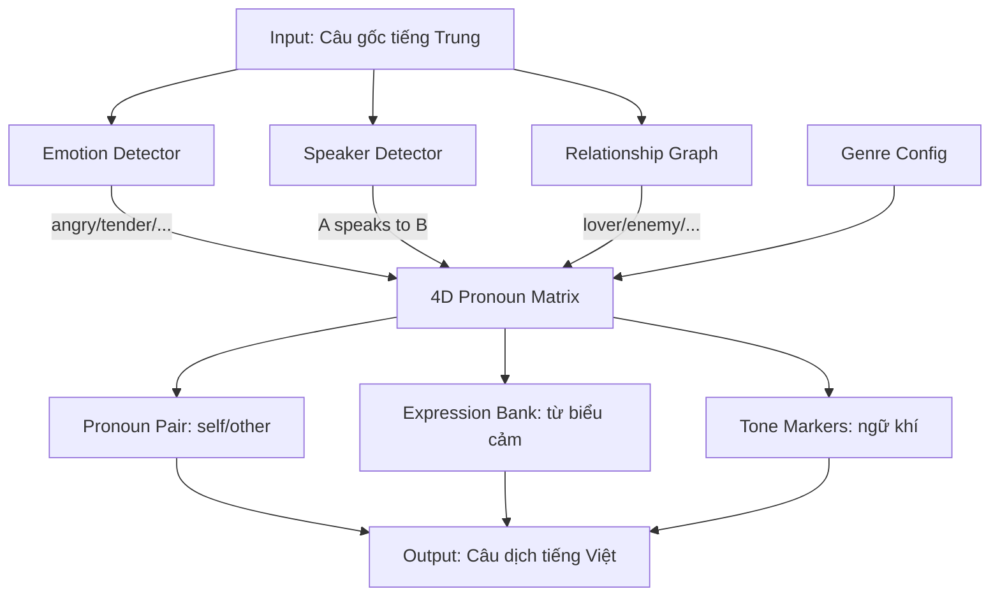
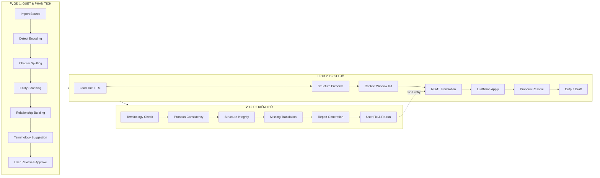

# DrDuc Translator — Phần mềm Dịch Truyện & Tài liệu ZH/EN → VI (Non-LLM) v3

## Bối cảnh & Mục tiêu

Xây dựng phần mềm dịch thuật **không phụ thuộc LLMs**, dịch văn bản dài (truyện, tài liệu) từ **Tiếng Trung** và **Tiếng Anh** sang **Tiếng Việt**, giữ được:
- 🔤 **Ngữ cảnh xuyên suốt** qua hàng trăm chương, đa thế giới quan
- 🗣️ **Xưng hô** đúng theo quan hệ nhân vật (rule-based)
- 📊 **Sơ đồ, bảng biểu** — Bảo toàn cấu trúc
- 🖼️ **Hình ảnh** — Giữ nguyên, OCR nếu có text
- 🧮 **Công thức toán học** — Bảo toàn LaTeX/MathML
- 🧪 **Hóa học, symbols** — Giữ nguyên ký hiệu

> [!IMPORTANT]
> **Ràng buộc cốt lõi**: KHÔNG sử dụng LLMs. Toàn bộ engine dịch dựa trên Rule-Based Machine Translation (RBMT) sử dụng cây Trie đa trọng số. Phần mềm hoạt động **độc lập**, tích hợp **bổ sung** cho Trinity qua Obsidian Vault.

---

## Phân tích lựa chọn công nghệ

### Câu hỏi 1: UI Framework

| Tiêu chí | **PyQt6** | **Tauri + React** | **Electron** |
|----------|-----------|-------------------|-------------|
| **Build size** | ~50MB (PyInstaller) | ~10-15MB ✅ | ~150-200MB ❌ |
| **RAM runtime** | ~80-120MB | ~40-80MB ✅ | ~200-400MB ❌ |
| **Tốc độ khởi động** | ~2s | ~1s ✅ | ~3-5s |
| **UI quality** | Native nhưng cổ điển | Web modern, đẹp ✅ | Web modern, đẹp ✅ |
| **Tích hợp Python** | Trực tiếp ✅ | Cần IPC bridge (Sidecar) | Cần child_process |
| **Cross-platform** | Win/Mac/Linux ✅ | Win/Mac/Linux ✅ | Win/Mac/Linux ✅ |
| **Ecosystem plugins** | Ít, phải tự viết | React ecosystem khổng lồ ✅ | React ecosystem khổng lồ ✅ |
| **Developer experience** | Python thuần, debug dễ ✅ | Rust backend + React frontend | JS/TS thuần, debug dễ ✅ |
| **Hot reload UI** | Không ❌ | Có (Vite) ✅ | Có (Webpack) ✅ |
| **Bảo mật** | Tốt | Rất tốt (Rust sandboxing) ✅ | Yếu (Chromium full) ❌ |

> [!TIP]
> **Đề xuất: Tauri + React** — Nhẹ nhất, UI đẹp nhất, bảo mật tốt nhất. Engine Python chạy như Tauri Sidecar process, giao tiếp qua JSON IPC. Nhược điểm duy nhất: cần build Rust toolchain, nhưng Tauri CLI tự động hóa gần hết.

### Câu hỏi 2: Engine Language

| Tiêu chí | **Python** | **Rust** | **JavaScript** |
|----------|-----------|---------|---------------|
| **Tốc độ Trie build** | ~3-5s (728K entries) | ~0.3s ✅ | ~1-2s |
| **Tốc độ dịch/chương** | ~2-5s | ~0.1-0.3s ✅ | ~1-3s |
| **RAM cho Trie** | ~300-500MB | ~100-200MB ✅ | ~200-400MB |
| **Tích hợp Trinity** | Trực tiếp (Python) ✅ | Cần FFI/subprocess | Viết lại hoàn toàn ❌ |
| **Thư viện NLP** | Rất phong phú (jieba, underthesea) ✅ | Ít | Ít |
| **Dễ phát triển** | Rất dễ ✅ | Khó (ownership, lifetime) ❌ | Dễ |
| **Tái sử dụng code** | Trinity scripts sẵn có ✅ | Viết lại ❌ | Viết lại ❌ |
| **Unicode/CJK** | Tốt ✅ | Tốt ✅ | Tốt ✅ |
| **Packaging** | PyInstaller (dễ) ✅ | Native binary ✅ | Bundler phức tạp |
| **Concurrency** | Threading/asyncio (đủ dùng) | Tokio (mạnh) ✅ | Event loop (đủ dùng) |

> [!TIP]
> **Đề xuất: Python** — Tái sử dụng tối đa code Trinity hiện có (`trinity_cli.py`, `trinity_translation_runtime.py`), ecosystem NLP phong phú, dễ phát triển nhanh. Tốc độ 2-5s/chương là chấp nhận được cho batch overnight. Nếu cần tăng tốc sau này, có thể viết Trie core bằng Rust và gọi từ Python (PyO3).

### Câu hỏi 3: EN-VI → **Nâng cao** ✅

Phạm vi: Phrase matching + basic grammar rules + LacViet/Babylon/CEDICT.

### Câu hỏi 4: Quan hệ Trinity → **Bổ sung độc lập, tích hợp qua Obsidian Vault** ✅

```
DrDuc Translator (RBMT, Non-LLM)
        ↕ Obsidian Vault (sync)
Trinity /translate (LLM-powered)
```

- DrDuc xuất `glossary.json`, `characters.json`, `worldbuilding.json` → Obsidian Vault
- Trinity đọc từ Vault khi cần dịch tinh (LLM)
- Hai hệ thống độc lập, không phụ thuộc nhau

---

## 🔴 CÁCH MẠNG ĐỊNH DẠNG TỪ ĐIỂN: TXT → MARKDOWN

### Vấn đề với format hiện tại

Format `key=value` trong QT là **phẳng, vô ngữ cảnh**:
```
修为=tu vi
修为境界=tu vi cảnh giới
```

Không có thông tin: thuộc thể loại gì? Áp dụng ngữ cảnh nào? Khi nào KHÔNG nên dùng nghĩa này? Có đa nghĩa không? Liên quan đến thuật ngữ nào khác?

### Giải pháp: Markdown Dictionary Entries (MDE)

Mỗi entry quan trọng (tên nhân vật, thuật ngữ thế giới quan, cụm từ đặc biệt) trở thành **1 file Markdown** với YAML frontmatter:

```markdown
---
id: "term_xiu_wei"
source: "修为"
target: "tu vi"
pinyin: "xiū wéi"
priority: 3
category: "cultivation_system"
genre: ["xianxia", "xuanhuan", "wuxia"]
context_tags: ["power_level", "cultivation", "realm"]
aliases:
  source: ["修行", "修炼境界"]
  target: ["tu hành", "cảnh giới tu luyện"]
one_mean: true
locked: true
related_terms: ["境界", "突破", "渡劫"]
worldview: "general_xianxia"
notes: "Chỉ mức độ tu luyện tổng thể, KHÔNG phải cảnh giới cụ thể"
created: "2026-04-14"
source_dict: "VietPhrase"
---

## Định nghĩa
Tu vi (修为) là thuật ngữ chỉ mức độ/trình độ tu luyện tổng thể của một tu sĩ.

## Ngữ cảnh sử dụng
- Khi mô tả sức mạnh tổng quan: "hắn tu vi thâm hậu"
- KHÔNG dùng cho cảnh giới cụ thể (Trúc Cơ, Kim Đan...)

## Phân biệt
| Thuật ngữ | Nghĩa | Dùng khi |
|-----------|-------|----------|
| 修为 (tu vi) | Trình độ tổng thể | Mô tả chung |
| 境界 (cảnh giới) | Cấp bậc cụ thể | Kim Đan, Nguyên Anh... |
| 修炼 (tu luyện) | Hành động luyện tập | Đang tu luyện |
```

### Cấu trúc thư mục từ điển mới

```
data/dictionaries/
├── _compiled/
│   ├── trie_cache.db          # SQLite compiled Trie (auto-build)
│   └── lookup_index.json      # Fast index cho UI search
├── global/                    # Từ điển toàn cục (mọi dự án)
│   ├── phien_am/              # P1: Hán-Việt đơn tự (~12K files hoặc 1 bulk file)
│   │   └── _bulk_phienam.md   # Bulk: YAML table cho 12K entries đơn giản
│   ├── vietphrase/            # P2: VietPhrase chung
│   │   ├── _bulk_vietphrase.md  # Bulk file cho entries đơn giản
│   │   ├── 修为.md            # Rich entry cho thuật ngữ quan trọng
│   │   ├── 突破.md
│   │   └── ...
│   ├── names/                 # P4: Names chung
│   │   ├── countries/
│   │   ├── cities/
│   │   ├── historical_figures/
│   │   └── _bulk_names.md
│   ├── idioms/                # Thành ngữ (TrichDan)
│   ├── grammar/               # LuatNhan templates
│   ├── numbers/               # Pronouns (số Hán → Ả Rập)
│   └── en_vi/                 # Anh-Việt
│       ├── _bulk_lacviet.md
│       └── _bulk_babylon.md
└── projects/                  # Từ điển theo dự án
    └── {project_name}/
        ├── names_rieng.md     # P5: Tên riêng dự án
        ├── vietphrase_rieng.md # P3: VP riêng dự án
        ├── characters/        # Nhân vật (rich MD)
        │   ├── 林动.md
        │   └── 绫清竹.md
        ├── factions/          # Thế lực
        ├── locations/         # Địa điểm
        ├── weapons/           # Vũ khí
        ├── techniques/        # Chiêu thức, công pháp
        ├── items/             # Vật phẩm
        ├── cultivation/       # Hệ thống cảnh giới
        └── relationships.md   # Đồ thị quan hệ
```

### Bulk MD format (cho entries đơn giản)

Với 728K entries VietPhrase, không thể tạo 728K files. Sử dụng **Bulk MD**:

```markdown
---
type: bulk_dictionary
source_language: zh
target_language: vi
priority: 2
category: vietphrase_general
entries_count: 728699
compiled_from: "D:/APP/Quick Translator 2020/Data/VietPhrase.txt"
last_compiled: "2026-04-14"
---

| source | target | one_mean | notes |
|--------|--------|----------|-------|
| 01月01号 | ngày mùng 1 tháng 1 | true | |
| 一个人 | một người | true | |
| 一个人影 | một bóng người | true | |
| ... | ... | ... | ... |
```

> [!NOTE]
> **Chiến lược hybrid**: Entries đơn giản → Bulk MD table. Entries quan trọng (tên nhân vật, thuật ngữ thế giới quan, từ đa nghĩa) → Rich MD riêng lẻ. Compiler tự động merge cả hai khi build Trie.

### Character MD format (Nhân vật)

```markdown
---
id: "char_lin_dong"
type: character
source_name: "林动"
target_name: "Lâm Động"
pinyin: "lín dòng"
gender: male
age_range: "16-25"
status: alive
role: protagonist
faction: "Lâm gia"
aliases:
  source: ["小子", "林家小子"]
  target: ["tiểu tử", "tiểu tử nhà họ Lâm"]
cultivation_realm: "Niết Bàn"
first_appearance: 1
pronoun_rules:
  - to_elders: {self: "vãn bối", other: "tiền bối"}
  - to_peers_friendly: {self: "ta", other: "ngươi"} 
  - to_enemies: {self: "ta", other: "ngươi/tên"}
  - to_lover: {self: "ta", other: "nàng"}
relationships:
  - target: "char_ling_qing_zhu"
    type: "lover"
    intimacy: 85
    since_chapter: 200
  - target: "char_lin_xiao"
    type: "grandfather"
    intimacy: 95
    since_chapter: 1
tags: ["protagonist", "Lâm gia", "Niết Bàn"]
worldview: "wu_dong_qian_kun"
---

## Tiểu sử
Lâm Động là nhân vật chính của Vũ Động Càn Khôn...

## Lịch sử xưng hô
| Chương | Đối tượng | Xưng hô | Lý do |
|--------|----------|---------|-------|
| 1-50 | Lâm Tiêu | cháu/ông | Gia tộc |
| 200+ | Lăng Thanh Trúc | ta/nàng | Yêu đương |
```

---

## 🎭 HỆ THỐNG NGÔN TỪ BIỂU CẢM & XƯNG HÔ THEO CẢM XÚC (EAPEE)

> **Emotion-Aware Pronoun & Expression Engine** — Linh hồn của bản dịch truyện.

### Bài toán

Cùng một cặp nhân vật, cùng mối quan hệ, nhưng **cảm xúc trong ngữ cảnh** thay đổi xưng hô hoàn toàn:

```
# Cùng là vợ chồng, nhưng:

[Bình thường] "chàng ơi, thiếp nhớ chàng lắm" (chàng/thiếp)
[Giận dữ]     "ngươi đừng có hòng! Ta sẽ không tha" (ta/ngươi) 
[Trêu ghẹo]   "anh... anh xấu lắm" (anh/em - nũng nịu)
[Bi thương]   "lang quân... thiếp sai rồi" (lang quân/thiếp)

# Cùng là sư huynh - sư đệ, nhưng:

[Bình thường] "sư đệ, qua đây" (sư huynh nói)
[Giận dữ]     "ngươi! Dám phản bội bổn tọa?!" (bổn tọa/ngươi)
[Thương xót]  "đệ à... huynh xin lỗi" (huynh/đệ)
```

### Kiến trúc: Ma trận 4 chiều

```
Pronoun = f(Genre, Relationship, Emotion, Gender)
```



### Chiều 1: GENRE (Bối cảnh thời đại)

| Genre ID | Tên | Mô tả | Pronoun Base |
|----------|-----|-------|-------------|
| `ancient` | Cổ trang | Cung đình, giang hồ, kiếm hiệp | ta/ngươi, bệ hạ/thần, phu quân/thiếp |
| `xianxia` | Tiên hiệp | Tu luyện, tiên giới | ta/ngươi, tiền bối/vãn bối, sư tôn/đồ nhi |
| `modern` | Hiện đại | Đô thị, học đường, ngôn tình | tôi/anh, em/anh, tao/mày |
| `military` | Quân sự | Chiến tranh, quân đội | mạt tướng/đại nhân, thuộc hạ/chủ nhân |
| `horror` | Kinh dị | Ma quái, linh dị | Giống modern + từ vựng rùng rợn |
| `scifi` | Khoa viễn | Tương lai, không gian | Giống modern + từ vựng kỹ thuật |

### Chiều 2: RELATIONSHIP TYPES

| ID | Quan hệ | Ví dụ | Power Dynamic |
|----|---------|-------|---------------|
| `lover` | Người yêu/vợ chồng | Lâm Động ↔ Lăng Thanh Trúc | Equal |
| `parent_child` | Cha mẹ - con | Cha → Con | Superior → Inferior |
| `grandparent` | Ông bà - cháu | Ông → Cháu | Superior → Inferior |
| `master_disciple` | Sư phụ - đồ đệ | Sư tôn → Đồ nhi | Superior → Inferior |
| `senior_junior` | Sư huynh - sư đệ | Sư huynh → Sư đệ | Slightly superior |
| `lord_subject` | Quân - thần | Hoàng đế → Đại thần | Absolute superior |
| `enemy` | Kẻ thù | Đối đầu | Hostile |
| `stranger` | Người lạ | Gặp lần đầu | Neutral |
| `friend` | Bạn bè | Đồng liêu | Equal |
| `subordinate` | Chủ - tớ | Chủ nhân → Hạ nhân | Superior → Inferior |

### Chiều 3: EMOTION STATES & DETECTION

#### 3.1 Bảng cảm xúc

| Emotion ID | Tên | Intensity | Markers (detect từ source) |
|------------|-----|-----------|---------------------------|
| `neutral` | Bình thường | 0 | Không có marker đặc biệt |
| `angry` | Giận dữ | 1-3 | 怒, 愤怒, 暴怒, 大怒, 咬牙, 冷哼, 怒吼, 气急 |
| `furious` | Cuồng nộ | 4-5 | 暴跳如雷, 杀意, 怒不可遏, 勃然大怒, 震怒 |
| `tender` | Dịu dàng | 1-3 | 柔声, 轻声, 温柔, 微笑, 宠溺, 心疼, 怜惜 |
| `flirty` | Trêu ghẹo / Nũng nịu | 1-3 | 嗔, 娇嗔, 撒娇, 俏皮, 调戏, 戏弄, 脸红 |
| `sad` | Bi thương | 1-3 | 悲伤, 哭泣, 泪, 心痛, 难过, 悲声, 哽咽, 落泪 |
| `desperate` | Tuyệt vọng | 4-5 | 绝望, 崩溃, 嘶吼, 撕心裂肺, 生不如死 |
| `fearful` | Sợ hãi | 1-3 | 害怕, 恐惧, 颤抖, 惊恐, 慌张, 冷汗, 腿软 |
| `terrified` | Khiếp sợ | 4-5 | 魂飞魄散, 肝胆俱裂, 浑身战栗, 面如土色 |
| `mocking` | Chế giễu/Khinh thường | 1-3 | 嘲笑, 冷笑, 嗤, 不屑, 讥讽, 鄙视, 轻蔑 |
| `arrogant` | Kiêu ngạo | 1-3 | 傲然, 高傲, 居高临下, 睥睨, 不可一世 |
| `respectful` | Tôn kính | 1-3 | 恭敬, 敬畏, 行礼, 拜见, 参见, 叩首 |
| `cold` | Lạnh lùng | 1-3 | 冷冷, 淡淡, 冷漠, 面无表情, 冰冷, 冷声 |
| `excited` | Hưng phấn | 1-3 | 激动, 兴奋, 狂喜, 欣喜若狂, 欢呼 |
| `grateful` | Biết ơn | 1-3 | 感激, 感恩, 大恩, 谢, 叩谢 |
| `threatening` | Đe dọa | 1-3 | 威胁, 警告, 杀了你, 找死, 不想活, 敢 |

#### 3.2 Emotion Detection Algorithm (Non-LLM)

```python
# Pseudo-code cho Emotion Detector

def detect_emotion(sentence, prev_context):
    """
    Quét câu gốc (tiếng Trung) để xác định trạng thái cảm xúc.
    Không dùng LLM — hoàn toàn dựa trên keyword matching + heuristics.
    """
    scores = {emotion: 0 for emotion in EMOTIONS}
    
    # 1. Keyword scan (primary)
    for emotion, keywords in EMOTION_KEYWORDS.items():
        for kw in keywords:
            if kw in sentence:
                scores[emotion] += keyword_weight(kw)  # weight theo specificity
    
    # 2. Punctuation boost
    if sentence.count('！') >= 2:      scores['angry'] += 2
    if sentence.count('？') >= 2:      scores['mocking'] += 1
    if '...' in sentence or '……' in sentence:  scores['sad'] += 1
    if '！！！' in sentence:            scores['furious'] += 3
    
    # 3. Dialogue marker boost (verb trước/sau lời thoại)
    # "XX怒道" → angry    "XX柔声道" → tender
    # "XX冷笑道" → mocking  "XX哭道" → sad
    dialogue_verb = extract_dialogue_verb(sentence)
    if dialogue_verb:
        verb_emotion = VERB_EMOTION_MAP.get(dialogue_verb)
        if verb_emotion:
            scores[verb_emotion] += 3  # Strong signal
    
    # 4. Context carry-over (cảm xúc lan tỏa)
    if prev_context.emotion and prev_context.emotion_age < 3:
        scores[prev_context.emotion] += 1  # Emotion inertia
    
    # 5. Determine winner
    top_emotion = max(scores, key=scores.get)
    if scores[top_emotion] < 2:
        return 'neutral', 0  # Không đủ signal
    
    intensity = min(scores[top_emotion], 5)
    return top_emotion, intensity
```

#### 3.3 Dialogue Verb → Emotion Mapping

```
# VERB_EMOTION_MAP (200+ entries)

# Giận dữ
怒道 → angry        怒吼道 → furious       咬牙道 → angry
怒喝道 → furious     暴喝道 → furious       厉声道 → angry
冷喝道 → angry       喝道 → angry           斥道 → angry
骂道 → angry         恶狠狠道 → angry       气道 → angry

# Dịu dàng / Yêu thương
柔声道 → tender      温柔道 → tender         轻声道 → tender
笑道 → tender        微笑道 → tender         宠溺道 → tender
心疼道 → tender      怜惜道 → tender         呢喃道 → tender

# Nũng nịu / Trêu
嗔道 → flirty        娇嗔道 → flirty         撒娇道 → flirty
嘟嘴道 → flirty      俏皮道 → flirty         调笑道 → flirty

# Bi thương
哭道 → sad           悲声道 → sad            哽咽道 → sad
泣道 → sad           含泪道 → sad            惨笑道 → sad
苦笑道 → sad         凄声道 → sad            悲呼道 → desperate
嘶吼道 → desperate

# Sợ hãi
惊道 → fearful       惊呼道 → fearful        颤声道 → fearful
颤抖道 → terrified   惊恐道 → terrified      失声道 → terrified

# Khinh thường / Chế giễu
冷笑道 → mocking      嗤笑道 → mocking        讥讽道 → mocking
不屑道 → mocking      嘲笑道 → mocking        轻蔑道 → mocking

# Kiêu ngạo
傲然道 → arrogant     淡然道 → cold           冷冷道 → cold
冷声道 → cold         面无表情道 → cold       平静道 → neutral

# Tôn kính
恭敬道 → respectful   拜道 → respectful       叩道 → respectful

# Đe dọa
威胁道 → threatening  狞笑道 → threatening     阴声道 → threatening
```

### Chiều 4: GENDER-AWARE RULES

| Speaker Gender | Listener Gender | Ảnh hưởng |
|----------------|----------------|------------|
| Nam | Nữ (lover) | chàng/thiếp, anh/em |
| Nữ | Nam (lover) | chàng/thiếp (cổ) hoặc anh/em (hiện đại) |
| Nam | Nam (peer) | ta/ngươi, tôi/anh, tao/mày |
| Nữ | Nữ (peer) | ta/ngươi, tôi/chị, mình/bạn |
| Bất kỳ | Trẻ em | ta/tiểu gia hỏa, chú/cháu |

---

### MA TRẬN XƯNG HÔ HOÀN CHỈNH

#### Bối cảnh CỔ TRANG (ancient/xianxia)

| Quan hệ \ Cảm xúc | Neutral | Angry | Tender | Flirty | Sad | Mocking | Threatening |
|--------------------|---------|-------|--------|--------|-----|---------|-------------|
| **Vợ chồng (M→F)** | phu quân→thiếp / ta→nàng | ta→ngươi | ta→nàng / hiền thê | nàng→ta / ái phi | thiếp ơi... / nàng | — | — |
| **Vợ chồng (F→M)** | thiếp→chàng / thiếp→phu quân | ta→ngươi | thiếp→chàng | chàng ơi~ / em→anh | lang quân... / chàng à | — | — |
| **Người yêu (M→F)** | ta→nàng | ta→ngươi | ta→nàng | nàng→ta (trêu) | nàng... | — | — |
| **Người yêu (F→M)** | ta→chàng / em→chàng | ngươi→ta | thiếp→chàng | chàng~ / anh~ | chàng à... | — | — |
| **Sư phụ→Đồ đệ** | vi sư→con / ta→ngươi | ta→ngươi! | vi sư→con | — | con à... | — | ta→nghịch đồ |
| **Đồ đệ→Sư phụ** | đệ tử→sư phụ / con→sư phụ | ta→ngươi (phản) | con→sư phụ | — | sư phụ... | — | — |
| **Sư huynh→Sư đệ** | sư huynh→sư đệ | ta→ngươi | huynh→đệ | — | đệ à... | — | ngươi→bổn tọa |
| **Chủ→Tớ** | bổn vương→ngươi / ta→ngươi | ta→tên→chó! | ta→ngươi | — | — | bổn tọa→ngươi | ta→ngươi, chết! |
| **Tớ→Chủ** | thuộc hạ→chủ nhân / nô tỳ→chủ nhân | thuộc hạ→chủ nhân! | nô tỳ→chủ nhân | — | chủ nhân... | — | — |
| **Quân→Thần** | trẫm→khanh / bệ hạ→ái khanh | trẫm→ngươi! | trẫm→ái khanh | — | — | — | trẫm→nghịch tặc |
| **Thần→Quân** | thần→bệ hạ / vi thần→hoàng thượng | thần→bệ hạ! | — | — | bệ hạ... | — | — |
| **Kẻ thù** | ta→ngươi | ta→ngươi/chó! | — | — | — | ta→ngươi (khinh) | ta→ngươi, chết! |
| **Người lạ** | tại hạ→các hạ / ta→ngươi | ta→ngươi | — | — | — | ta→ngươi (khinh) | ta→ngươi |
| **Trưởng bối→Vãn bối** | lão phu→tiểu tử / ta→ngươi | lão phu→tiểu tử! | lão phu→hài tử | — | hài tử à... | lão phu→tiểu quỷ | ta→ngươi |
| **Vãn bối→Trưởng bối** | vãn bối→tiền bối | vãn bối→tiền bối! | vãn bối→tiền bối | — | tiền bối... | — | — |

#### Bối cảnh HIỆN ĐẠI (modern)

| Quan hệ \ Cảm xúc | Neutral | Angry | Tender | Flirty | Sad | Mocking | Threatening |
|--------------------|---------|-------|--------|--------|-----|---------|-------------|
| **Vợ chồng (M→F)** | anh→em | tôi→cô / tao→mày | anh→em (yêu) | anh→em / cưng | em ơi... | — | — |
| **Vợ chồng (F→M)** | em→anh | tôi→anh / tao→mày | em→anh (yêu) | anh ơi~ / anh~ | anh à... | — | — |
| **Người yêu** | anh→em / em→anh | tôi→anh(chị) | anh→em (yêu) | anh~/em~ | anh(em) ơi... | — | — |
| **Bạn bè (thân)** | tao→mày / tôi→cậu | tao→mày! | tao→mày / mày ơi | — | mày à... | tao→mày (trêu) | tao→mày |
| **Bạn bè (lịch sự)** | tôi→anh(chị) | tôi→anh(chị)! | tôi→anh(chị) | — | anh(chị) ơi... | tôi→anh(chị) | — |
| **Cha mẹ→Con** | ba(mẹ)→con | ba(mẹ)→mày! | ba(mẹ)→con (thương) | — | con ơi... | — | ba(mẹ)→mày |
| **Con→Cha mẹ** | con→ba(mẹ) | con→ba(mẹ)! | con→ba(mẹ) | — | ba(mẹ) ơi... | — | — |
| **Ông bà→Cháu** | ông(bà)→cháu | ông(bà)→mày! | ông(bà)→cháu (cưng) | — | cháu ơi... | — | — |
| **Sếp→NV** | tôi→anh(chị) | tôi→anh(chị)! | — | — | — | — | tôi→anh(chị), cút! |
| **Kẻ thù** | tôi→anh(chị) | tao→mày! | — | — | — | tôi→ngươi (khinh) | tao→mày, chết! |
| **Người lạ** | tôi→anh(chị) | tôi→anh(chị)! | — | — | — | — | — |

---

### NGÂN HÀNG TỪ BIỂU CẢM (Expression Bank)

#### Từ chửi / Xỉ vả (theo intensity)

| Source | Intensity | Cổ trang | Hiện đại |
|--------|-----------|----------|----------|
| 混蛋 | 2 | hỗn đản / đồ hỗn | thằng khốn / đồ khốn |
| 畜生 | 3 | súc sinh | súc sinh / đồ súc sinh |
| 贱人 | 3 | tiện nhân | con đ* / đồ thấp hèn |
| 废物 | 2 | phế vật | đồ vô dụng / đồ bỏ đi |
| 狗东西 | 3 | chó đông tây / đồ chó | đồ chó / thằng chó |
| 该死 | 2 | đáng chết | chết tiệt |
| 滚 | 2 | cút / xéo | cút / biến |
| 找死 | 3 | tìm chết | muốn chết hả |
| 不要脸 | 2 | không biết xấu hổ | vô liêm sỉ / mặt dày |
| 狗屁 | 2 | chó rắm | nhảm nhí / bullshit |

#### Từ yêu thương / Âu yếm

| Source | Cổ trang | Hiện đại |
|--------|----------|----------|
| 亲爱的 | hiền thê / nàng | anh yêu / em yêu |
| 心肝 | tâm can | cục cưng |
| 宝贝 | bảo bối | bé yêu / cưng |
| 乖 | ngoan / bé ngoan | ngoan nào |
| 别怕 | đừng sợ, có ta đây | đừng sợ, có anh(em) đây |
| 想你 | nhớ nàng/chàng | nhớ anh/em |
| 爱你 | yêu nàng/chàng | yêu anh/em |

#### Từ ngữ khí / Interjections

| Source | Cổ trang | Hiện đại |
|--------|----------|----------|
| 哼 (cold) | hừ | hừ |
| 哼 (angry) | hừ! | hứ! |
| 嗯 (agree) | ừm | ừ / ờ |
| 嗯？(question) | hừ? | hả? / hử? |
| 啊 (surprise) | a! | á! / ơ! |
| 呸 (disgust) | phì! / khạc! | tch! / phì! |
| 噗 (laugh) | phụt (phì cười) | pfft / phụt |
| 切 (disdain) | xì | xì / tch |
| 哎呀 (exasperation) | ai da! | ối giời ơi! / ôi trời |
| 唉 (sigh) | hải... | haiz... |

---

### DAnh xưng ĐẶC BIỆT THEO VAI TRÒ (Identity Pronouns)

Một số nhân vật dùng **danh xưng đặc biệt** thay cho "ta" dựa trên thân phận:

| Thân phận | Self-pronoun | Điều kiện sử dụng |
|-----------|-------------|--------------------|
| Hoàng đế (nam) | trẫm | Luôn luôn, trừ khi nói riêng với người yêu |
| Hoàng hậu / Phi tần | bổn cung | Khi nói chính thức; "thiếp" khi nói với hoàng đế |
| Vương gia | bổn vương | Chính thức; "ta" khi nói riêng |
| Tông chủ / Môn chủ | bổn tọa | Chính thức; "ta" khi nói riêng |
| Tướng quân | mạt tướng (khiêm) / bổn tướng | Trước vua / trước quân |
| Trưởng lão | lão phu (nam) / lão thân (nữ) | Với vãn bối |
| Hòa thượng | bần tăng | Luôn luôn |
| Đạo sĩ | bần đạo | Luôn luôn |
| Phú gia | lão gia | Chính thức |
| Thái giám | tạp gia / nô tài | Trước hoàng đế |

> [!NOTE]
> **Override rule**: Identity pronouns có **priority cao nhất**, ghi đè emotion-based pronoun. Ví dụ: Hoàng đế dù giận vẫn xưng "trẫm", không chuyển sang "ta" (trừ khi config `identity_override: false`).

---

### EMOTION STATE MACHINE

```python
class EmotionState:
    """
    Theo dõi trạng thái cảm xúc xuyên suốt scene/chapter.
    Cảm xúc có quán tính (inertia) — không biến mất ngay lập tức.
    """
    current_emotion: str = 'neutral'
    intensity: int = 0
    age: int = 0          # Số câu kể từ khi detect emotion
    speaker: str = None   # Ai đang có emotion này
    
    DECAY_RULES = {
        'angry':      5,   # Giận dữ kéo dài 5 câu
        'furious':    8,   # Cuồng nộ kéo dài 8 câu  
        'tender':     4,   # Dịu dàng kéo dài 4 câu
        'flirty':     3,   # Nũng nịu kéo dài 3 câu
        'sad':        6,   # Buồn kéo dài 6 câu
        'desperate':  10,  # Tuyệt vọng kéo dài 10 câu
        'fearful':    4,   # Sợ kéo dài 4 câu
        'terrified':  7,   # Khiếp sợ kéo dài 7 câu
        'mocking':    3,   # Khinh thường kéo 3 câu
        'cold':       5,   # Lạnh lùng kéo 5 câu
        'threatening': 4,  # Đe dọa kéo 4 câu
    }
    
    SCENE_BREAK_PATTERNS = ['***', '---', '===', '※※※']
    
    def update(self, new_emotion, new_intensity, sentence):
        # Reset khi scene break
        if any(p in sentence for p in self.SCENE_BREAK_PATTERNS):
            self.reset()
            return
        
        # Nếu emotion mới mạnh hơn → override
        if new_intensity > self.intensity or new_emotion != 'neutral':
            self.current_emotion = new_emotion
            self.intensity = new_intensity
            self.age = 0
        else:
            self.age += 1
            # Decay theo rule
            max_age = self.DECAY_RULES.get(self.current_emotion, 3)
            if self.age >= max_age:
                self.reset()
    
    def reset(self):
        self.current_emotion = 'neutral'
        self.intensity = 0
        self.age = 0
```

### TỔNG HỢP: PIPE DỊCH VỚI EMOTION

```
Với mỗi câu trong dialogue:

1. [Detect Speaker]     → Ai đang nói? (từ context "X道", "X说")
2. [Detect Listener]    → Nói với ai? (từ context "对X", "向X")
3. [Detect Emotion]     → Emotion nào? (keyword + verb + punctuation)
4. [Lookup Relationship] → A↔B là gì? (từ characters/*.md)
5. [Check Identity]     → A có identity pronoun? (hoàng đế, tông chủ...)
6. [Select Pronoun]     → Tra ma trận: Genre × Relationship × Emotion × Gender
7. [Select Expressions]  → Chọn từ biểu cảm phù hợp từ Expression Bank
8. [Apply Tone Markers]  → Thêm ngữ khí (hừ, phì, haiz...)
9. [Replace 我/你/他/她]  → Thay thế pronoun trong bản dịch
10.[Update State Machine] → Cập nhật emotion state cho câu tiếp theo
```

### Data Files cho EAPEE

```
data/dictionaries/global/
├── expressions/
│   ├── emotion_keywords.md        # 200+ keywords → emotion mapping
│   ├── dialogue_verbs.md          # 200+ verbs → emotion mapping  
│   ├── curses_ancient.md          # Từ chửi cổ trang
│   ├── curses_modern.md           # Từ chửi hiện đại
│   ├── endearments_ancient.md     # Từ yêu thương cổ trang
│   ├── endearments_modern.md      # Từ yêu thương hiện đại
│   ├── interjections.md           # Từ cảm thán
│   ├── identity_pronouns.md       # Danh xưng theo thân phận
│   ├── pronoun_matrix_ancient.md  # Ma trận xưng hô cổ trang
│   ├── pronoun_matrix_modern.md   # Ma trận xưng hô hiện đại
│   └── pronoun_matrix_xianxia.md  # Ma trận xưng hô tiên hiệp
└── projects/{name}/
    └── pronoun_overrides.md       # Override xưng hô theo dự án
```

---

## QUY TRÌNH DỊCH CHI TIẾT: 3 GIAI ĐOẠN

### Tổng quan quy trình



---

### GĐ 1: QUÉT & PHÂN TÍCH (Pre-Translation Automation)

#### 1.1 Import & Detect

```
Input: HTML/TXT/MD/DOCX file(s) hoặc thư mục
  ↓
[Auto-detect encoding: UTF-8, GB2312, GBK, Big5, UTF-16]
  ↓
[Convert to UTF-8 Markdown]
  ↓
[Lưu vào: {project}/source/raw/]
```

#### 1.2 Auto Chapter Splitting

```python
# Nâng cấp từ Tachchuong.py
Patterns detect:
  ZH: 第X章, 第X节, 第X回, 第X卷, 章X, 卷X
  VI: Chương X, Hồi X, Phần X, Quyển X, Tiết X
  EN: Chapter X, Part X, Book X, Section X
  MD: ## heading match

Output:
  {project}/source/chapters/
  ├── 0001_第一章_标题.md
  ├── 0002_第二章_标题.md
  └── ...
  
  {project}/source/chapters_index.json  ← metadata
```

#### 1.3 Auto Entity Scanning (Script tự động)

**Đây là bước quan trọng nhất — quét toàn bộ source, nhận diện thực thể:**

```
[Scan Engine]
  ↓
  ├── Character Detector
  │   ├── Pattern: 2-4 Hán tự liên tiếp + xuất hiện ≥3 lần
  │   ├── Cross-check với Names.txt (P4) → nếu khớp → confirmed name
  │   ├── Context clue: xuất hiện sau 对/向/跟/和 (giới từ chỉ người)
  │   ├── Context clue: xuất hiện trước 说/道/笑/怒 (động từ nói/biểu cảm)
  │   ├── Gender detection: 她=nữ, 他=nam khi làm chủ ngữ trước tên
  │   └── Output: characters_suggested.json
  │
  ├── Location Detector
  │   ├── Pattern: X + 城/山/谷/河/海/洲/国/宫/殿/府/门/宗/派
  │   ├── Context clue: 在X/到X/来到X/前往X (giới từ nơi chốn)
  │   └── Output: locations_suggested.json
  │
  ├── Faction Detector
  │   ├── Pattern: X + 宗/门/派/族/家/帮/盟/教/殿/阁/堂
  │   ├── Leadership clue: X宗主/掌门/族长/帮主
  │   └── Output: factions_suggested.json
  │
  ├── Weapon/Item Detector
  │   ├── Pattern: X + 剑/刀/枪/戟/鼎/丹/珠/玉/符/阵
  │   ├── Context clue: 手持X/祭出X/一把X
  │   └── Output: items_suggested.json
  │
  ├── Technique Detector
  │   ├── Pattern: X + 功/法/术/诀/拳/掌/指/步/阵/印
  │   ├── Context clue: 施展X/修炼X/运转X
  │   └── Output: techniques_suggested.json
  │
  ├── Cultivation Realm Detector
  │   ├── Pattern: X期/X境/X层/X重 sau 突破/晋升/达到
  │   ├── Sequence detection: nếu A→B→C xuất hiện theo thứ tự chương
  │   └── Output: realms_suggested.json
  │
  └── Relationship Builder
      ├── Co-occurrence matrix: 2 tên xuất hiện cùng câu/đoạn
      ├── Dialogue pair detection: A对B说 → A speaks to B
      ├── Kinship clue: A的父亲B, A兄弟C, A师父D
      ├── Faction membership: A + 弟子 of 宗门B
      └── Output: relationships_suggested.json
```

#### 1.4 Terminology Suggestion System

Sau khi scan, hệ thống **đề xuất** (không tự quyết):

```
┌─────────────────────────────────────────────────────────────┐
│ 📋 ĐỀ XUẤT THUẬT NGỮ - Dự án: Vũ Động Càn Khôn           │
├─────────────────────────────────────────────────────────────┤
│                                                             │
│ 👤 NHÂN VẬT (phát hiện 47, đã khớp dict: 12, mới: 35)    │
│ ┌──────┬──────────┬──────────────┬───────┬────────┐        │
│ │ #    │ Gốc      │ Đề xuất dịch │ Giới  │ Freq   │        │
│ ├──────┼──────────┼──────────────┼───────┼────────┤        │
│ │ ✅ 1 │ 林动     │ Lâm Động     │ Nam   │ 2841   │        │
│ │ ⚠️ 2 │ 绫清竹   │ [cần duyệt]  │ Nữ?   │ 856   │        │
│ │ ✅ 3 │ 林青檀   │ Lâm Thanh Đàn │ Nữ   │ 312   │        │
│ └──────┴──────────┴──────────────┴───────┴────────┘        │
│                                                             │
│ 🏰 THẾ LỰC (phát hiện 23, mới: 20)                       │
│ ┌──────┬──────────┬──────────────┬────────┐                │
│ │ #    │ Gốc      │ Đề xuất dịch │ Members│                │
│ ├──────┼──────────┼──────────────┼────────┤                │
│ │ ⚠️ 1 │ 道宗     │ Đạo Tông     │ 5 chars│                │
│ │ ⚠️ 2 │ 元天殿   │ [cần duyệt]  │ 3 chars│                │
│ └──────┴──────────┴──────────────┴────────┘                │
│                                                             │
│ ⬆️ HỆ THỐNG CẢNH GIỚI (phát hiện chuỗi 9 cấp)           │
│  造化境 → 太清境 → 悟道境 → 生死境 → 涅槃境 → ...       │
│                                                             │
│ 🔗 QUAN HỆ (phát hiện 56 cặp)                             │
│  林动 (Lâm Động) ←[ông-cháu]→ 林啸 (Lâm Tiêu)           │
│  林动 (Lâm Động) ←[bạn]→ 小貂 (Tiểu Điêu)               │
│  道宗 (Đạo Tông) ←[thuộc về]→ 林动 (Lâm Động)            │
│                                                             │
│ [✅ Duyệt tất cả] [📝 Chỉnh sửa] [🔄 Quét lại]          │
└─────────────────────────────────────────────────────────────┘
```

#### 1.5 User Review & Approve

- User duyệt/chỉnh sửa từng đề xuất
- Approved entries → tự động tạo Rich MD files vào `projects/{name}/`
- Tạo `translation_config.json` với genre, pronoun_mode, name_setting
- **GĐ 1 HOÀN TẤT** → Project scaffold sẵn sàng

---

### 🌐 QUY TẮC DỊCH TÊN RIÊNG THEO NGUỒN GỐC VĂN HÓA

> [!IMPORTANT]
> Tên riêng KHÔNG phải bối cảnh Trung Quốc cần dịch theo quy tắc romanization của ngôn ngữ gốc, KHÔNG phiên âm Hán-Việt.

#### Bảng quy tắc chính

| Nguồn gốc | Quy tắc dịch tên | Hệ thống | Ví dụ |
|-----------|-------------------|----------|-------|
| **Trung Quốc** | Hán-Việt | Phiên Âm dict | 林动 → Lâm Động |
| **Nhật Bản** | Hepburn romanization | Sino→Romaji lookup | 漩涡鸣人 → Uzumaki Naruto |
| **Hàn Quốc** | Revised Romanization | Sino→Hangul→RR | 金南俊 → Kim Namjoon |
| **Phương Tây** | Giữ nguyên Latin gốc | Sino→Latin lookup | 史塔克 → Stark |
| **Ả Rập / Ấn Độ** | Romanization quốc tế | Transliteration | 阿里 → Ali |
| **Hư cấu (Latin gốc)** | Giữ nguyên Latin | Passthrough | 哥布林 → Goblin |

#### Ví dụ chi tiết theo thể loại

**Naruto (Nhật Bản):**
```
# Tên nhân vật → Hepburn
漩涡鸣人   → Uzumaki Naruto     (KHÔNG dịch: Toàn Oa Minh Nhân)
宇智波佐助 → Uchiha Sasuke       (KHÔNG dịch: Vũ Trí Ba Tá Trợ)
春野樱     → Haruno Sakura       (KHÔNG dịch: Xuân Dã Anh)

# Địa danh → Ưu tiên tiếng Việt đã có tiền lệ
木叶村     → Làng Lá             (tiếng Việt đã phổ biến) 
火影       → Hokage              (giữ Hepburn, thuật ngữ đặc trưng)
忍者       → ninja               (từ quốc tế hóa)

# Quốc gia → Hán-Việt ngắn gọn (vì là worldbuilding)
火之国     → Hỏa Quốc            (Hán-Việt, không dịch "nước Lửa")
风之国     → Phong Quốc          
水之国     → Thủy Quốc

# Chiêu thức → Theo quy tắc tên nhân vật (Hepburn / Hán-Việt tùy precedent)
螺旋丸     → Rasengan            (giữ Hepburn, đã phổ biến)
千鸟       → Chidori              (giữ Hepburn)
影分身之术 → Kage Bunshin no Jutsu (giữ Hepburn)
# HOẶC nếu user config prefer_hanviet:
影分身之术 → Ảnh Phân Thân chi Thuật (Hán-Việt)

# Vật phẩm / Vũ khí → Theo quy tắc tên nhân vật
草薙剑     → Kusanagi no Tsurugi  (Hepburn)
写轮眼     → Sharingan            (Hepburn, đã phổ biến)
```

**Game of Thrones / Harry Potter (Phương Tây):**
```
# Tên nhân vật → Latin gốc
琼恩·雪诺     → Jon Snow
丹妮莉丝·坦格利安 → Daenerys Targaryen  
哈利·波特     → Harry Potter
邓布利多       → Dumbledore

# Địa danh → Latin gốc
临冬城         → Winterfell           (KHÔNG dịch: Lâm Đông Thành)
霍格沃茨       → Hogwarts

# Vật phẩm → Latin gốc  
瓦雷利亚钢     → Valyrian Steel
铁王座         → Iron Throne          (dịch Anh-Việt: Ngai Sắt)
飞天扫帚       → broomstick / chổi bay
```

**Bối cảnh Trung Quốc (Tiên hiệp/Cổ trang):**
```
# Tên nhân vật → Hán-Việt
林动           → Lâm Động
萧炎           → Tiêu Viêm

# Chiêu thức → Hán-Việt
降龙十八掌     → Hàng Long Thập Bát Chưởng
九阳神功       → Cửu Dương Thần Công

# Vật phẩm → Hán-Việt  
倚天剑         → Ỷ Thiên Kiếm
屠龙刀         → Đồ Long Đao

# Đơn vị thời gian → Hán-Việt ngắn gọn
一个时辰       → một canh giờ
一柱香         → một nén hương
一盏茶         → một tuần trà
三更天         → canh ba
```

#### Origin Detection System (Tự động nhận diện nguồn gốc)

```python
def detect_cultural_origin(project_config, entity_name, context):
    """
    Xác định nguồn gốc văn hóa để chọn quy tắc dịch tên.
    """
    # 1. Project-level override (user đã config)
    if project_config.get('cultural_origin'):
        return project_config['cultural_origin']
    
    # 2. Entity-level override (từ character MD)
    if entity.get('origin'):
        return entity['origin']
    
    # 3. Auto-detect từ context clues
    JAPANESE_CLUES = ['忍者', '武士', '侍', '殿', '様', 'の', 
                      '火影', '海贼', '死神', '动漫']
    WESTERN_CLUES  = ['骑士', '城堡', '公爵', '伯爵', '魔法师',
                      '精灵', '矮人', '龙与']
    KOREAN_CLUES   = ['韩国', '首尔', '大韩', '朝鲜']
    CHINESE_CLUES  = ['修仙', '仙侠', '武林', '江湖', '门派',
                      '丹田', '灵气', '修为', '境界']
    
    scores = {'japanese': 0, 'western': 0, 'korean': 0, 'chinese': 0}
    for clue in JAPANESE_CLUES:
        if clue in context: scores['japanese'] += 1
    for clue in WESTERN_CLUES:
        if clue in context: scores['western'] += 1
    for clue in KOREAN_CLUES:
        if clue in context: scores['korean'] += 1
    for clue in CHINESE_CLUES:
        if clue in context: scores['chinese'] += 1
    
    return max(scores, key=scores.get)  # Default: chinese
```

#### Config trong `translation_config.json`

```json
{
  "name_rules": {
    "cultural_origin": "japanese",
    "character_names": "hepburn",
    "location_names": "vietnamese_precedent_first",
    "technique_names": "hepburn",
    "item_names": "hepburn",
    "country_names": "hanviet_short",
    "time_units": "hanviet_short",
    "fallback": "hanviet",
    "precedent_overrides": {
      "木叶村": "Làng Lá",
      "火影": "Hokage",
      "螺旋丸": "Rasengan",
      "写轮眼": "Sharingan"
    }
  }
}
```

#### Hỗ trợ đa thế giới quan (Multi-world)

Một số truyện xuyên không/đa thế giới có nhân vật từ NHIỀU nền văn hóa:

```
# Ví dụ: Truyện xuyên không Naruto
Chương 1-50: Bối cảnh Naruto (Nhật) → Hepburn
  漩涡鸣人 → Uzumaki Naruto
  
Chương 51-100: Xuyên sang Bleach (Nhật) → Hepburn  
  黑崎一护 → Kurosaki Ichigo

Chương 101-150: Xuyên sang Marvel (Phương Tây) → Latin
  钢铁侠 → Iron Man
  托尼·史塔克 → Tony Stark
  
Chương 151+: Xuyên sang Đấu Phá Thương Khung (Trung) → Hán-Việt
  萧炎 → Tiêu Viêm
```

**Giải pháp**: Mỗi worldview trong `worldbuilding.json` có `cultural_origin` riêng:

```json
{
  "worldviews": [
    {"id": "naruto", "origin": "japanese", "chapters": [1, 50]},
    {"id": "bleach", "origin": "japanese", "chapters": [51, 100]},
    {"id": "marvel", "origin": "western", "chapters": [101, 150]},
    {"id": "doupo", "origin": "chinese", "chapters": [151, 999]}
  ]
}
```

Engine tra chapter hiện tại → xác định worldview → áp dụng name_rule tương ứng.

---

### GĐ 2: DỊCH THÔ (RBMT Translation)

#### 2.1 Khởi tạo Engine

```
[Load Phase]
  ├── Build Trie từ dictionaries/ (5 tầng ưu tiên)
  │   ├── P5: projects/{name}/names_rieng.md
  │   ├── P4: global/names/_bulk_names.md
  │   ├── P3: projects/{name}/vietphrase_rieng.md
  │   ├── P2: global/vietphrase/_bulk_vietphrase.md
  │   └── P1: global/phien_am/_bulk_phienam.md
  │
  ├── Load Translation Memory (segments đã dịch trước đó)
  ├── Load LuatNhan patterns (303 + 15K templates)
  ├── Load Character relationship graph
  └── Init Context Window (size=5 câu trước + 5 câu sau)
```

#### 2.2 Pipeline dịch từng chương

```
Với mỗi chapter file:

[1. Structure Preservation]
  - Scan toàn bộ chapter
  - Detect & wrap bất biến:
    → [TABLE_001]...[/TABLE_001]    (bảng biểu)
    → [MATH_001]...[/MATH_001]      (LaTeX, MathML)
    → [CHEM_001]...[/CHEM_001]      (công thức hóa)
    → [IMG_001]...[/IMG_001]         (hình ảnh)
    → [CODE_001]...[/CODE_001]       (code block)
    → [SYM_001]...[/SYM_001]        (ký hiệu đặc biệt)
  - Lưu mapping: placeholder → original content

[2. Sentence Segmentation]
  - Tách thành sentences theo: 。！？；\n
  - Mỗi sentence = 1 translation unit

[3. Translation Memory Lookup]
  - Exact match → reuse (100% confidence)
  - Fuzzy match (Levenshtein ≤ 15%) → reuse + flag review

[4. Trie RBMT Core Translation]
  Với mỗi sentence KHÔNG có TM match:
  
  a) Character Detection
     - Quét tên nhân vật từ characters/*.md
     - Ghi nhận active_characters cho context
  
  b) Dialogue Detection  
     - Pattern: 「...」 "..." "..."
     - Identify speaker từ context (X说, X道)
     - Activate pronoun rules cho speaker↔listener
  
  c) Trie Traversal (core algorithm)
     - Dual-pointer longest-prefix matching
     - Priority override: P5 > P4 > P3 > P2 > P1
     - One-Mean mode: split(";")[0] cho P2/P3
     - Unmatched single chars → P1 fallback (phiên âm)
  
  d) LuatNhan Pattern Apply
     - Scan kết quả cho {0} patterns
     - Replace tên nhân vật vào template
     - Ví dụ: "与{0}说话" + "Lâm Động" → "nói chuyện với Lâm Động"
  
  e) Pronoun Resolution
     - Trong dialogue: 我→speaker.self, 你→speaker.other
     - Lookup relationship graph → chọn cặp xưng hô
     - Fallback: genre default (xianxia → ta/ngươi)
  
  f) Number Conversion
     - 一百二十三 → 123
     - 三千年 → 3000 năm
     - 第一百章 → chương thứ 100

[5. Structure Restoration]
  - Replace [TABLE_001] → dịch nội dung cell, giữ cấu trúc
  - Replace [MATH_001] → giữ nguyên LaTeX
  - Replace [IMG_001] → giữ nguyên, dịch alt text
  
[6. Context Update]
  - Cập nhật context_window (5 câu gần nhất)
  - Cập nhật active_characters
  - Lưu chapter summary vào context.json
  - Lưu segments vào Translation Memory

[7. Output]
  → {project}/output/chapter_XXXX.md (bản dịch)
  → {project}/drafts/chapter_XXXX_draft.md (bản nháp có annotation)
```

#### 2.3 Batch Mode

```
for chapter in chapters:
    translate(chapter)
    update_progress()
    
    if chapter_num % 10 == 0:
        checkpoint()         # Save TM, context, progress
        run_qa_quick()       # Quick consistency check
```

---

### GĐ 3: KIỂM THỬ (QA & Validation)

#### 3.1 Automated QA Checks

```
[QA Engine] chạy SAU mỗi chương hoặc batch:

CHECK 1: Terminology Consistency
  - Scan output cho source terms
  - So sánh với glossary: "修为" luôn = "tu vi"?
  - Nếu term A xuất hiện trong source nhưng KHÔNG có trong output
    → FLAG: "Missing translation at line X"
  - Nếu term A được dịch khác nhau ở 2 nơi
    → FLAG: "Inconsistent: '修为' = 'tu vi' (ch.1) vs 'tu hành' (ch.5)"

CHECK 2: Pronoun Consistency
  - Track xưng hô giữa 2 nhân vật qua các chương
  - Nếu A↔B đổi từ "ta/ngươi" sang "tôi/anh" mà không có event trigger
    → FLAG: "Pronoun change without context at ch.X"

CHECK 3: Structure Integrity
  - Kiểm tra output có đủ paragraphs như source
  - Table: cùng số rows/cols?
  - Math: LaTeX formula giữ nguyên?
  - Image: path/alt intact?

CHECK 4: Untranslated Detection
  - Scan output cho ký tự Hán tự còn sót (regex: /\p{sc=Han}/u)
  - Ngoại trừ: tên riêng đã approved giữ nguyên
  → FLAG: "Untranslated chars at line X: '灵气'"

CHECK 5: Length Ratio
  - Tỷ lệ chars source/target nên nằm trong khoảng 0.6-1.8
  - Nếu ngoài khoảng → khả năng bỏ sót hoặc dịch thừa
  → FLAG: "Suspicious length ratio: 0.3 at paragraph X"
```

#### 3.2 QA Report

```markdown
# 📊 BÁO CÁO KIỂM THỬ — Chương 1-10

## Tổng quan
| Metric | Giá trị |
|--------|---------|
| Chapters processed | 10 |
| Total segments | 2,847 |
| TM reuse rate | 12% |
| Untranslated chars | 23 (0.08%) |
| Pronoun violations | 2 |
| Term inconsistencies | 5 |
| Structure errors | 0 |

## Chi tiết lỗi

### 🔴 Critical (cần fix ngay)
1. Ch.3 Line 45: "灵根" chưa có trong glossary → thêm vào?
2. Ch.7 Line 112: Xưng hô Lâm Động↔Lâm Tiêu đổi từ "cháu/ông" sang "ta/ngươi"

### 🟡 Warning (nên review)
3. Ch.5 Line 67: "元力" dịch thành "nguyên lực" (3 lần) vs "nguyên lượng" (1 lần)
4. Ch.8 Line 200: Length ratio = 0.45 (paragraph quá ngắn)

### 🟢 Info
5. 12 thuật ngữ mới phát hiện, đã tự động thêm vào pending glossary
```

#### 3.3 User Fix & Re-run

- User xem report → fix glossary/characters → chạy lại segment lỗi
- **KHÔNG cần dịch lại toàn bộ** — chỉ re-translate segments bị flag
- TM tự động cập nhật với bản fix

---

## Proposed Changes (Chi tiết theo Phase)

### Phase 1: Foundation — Dictionary Compiler & Trie Engine

#### [NEW] `src/core/md_dictionary_compiler.py`
- Parse Bulk MD (YAML table) + Rich MD (individual files)
- Merge 5 tầng priority vào unified Trie
- Auto-detect priority từ YAML `priority` field
- Compile → SQLite `trie_cache.db` cho fast loading

#### [NEW] `src/core/trie_engine.py`
- Trie với Unicode support (CJK + Latin)
- Longest-prefix match, priority override
- One-Mean mode cho P2/P3
- Hot-reload: watch dictionary folder, rebuild incremental

#### [NEW] `src/core/luat_nhan_engine.py`
- Parse `{0}` pattern templates
- Detect entity in sentence → apply template
- Chain: LuatNhan (303) → LuatNhancu (15K)

#### [NEW] `scripts/migrate_qt_to_md.py`
- **Migration script**: Convert 22 file TXT → MD format
- VietPhrase.txt (728K entries) → `_bulk_vietphrase.md`
- Names.txt → `_bulk_names.md`
- PhienAm → `_bulk_phienam.md`
- Detect "important" entries (freq>100 in sample corpus) → tạo Rich MD riêng

---

### Phase 2: Pre-Translation Pipeline

#### [NEW] `src/pipeline/document_importer.py`
- Encoding detection (chardet)
- HTML→MD (markdownify), DOCX→MD (pandoc), TXT passthrough
- Normalize whitespace, fix broken encoding

#### [NEW] `src/pipeline/chapter_splitter.py`
- Multi-pattern regex (ZH/VI/EN chapter headers)
- Fallback: split by word count (~3000 words) nếu không detect header
- Output: numbered chapter files + index JSON

#### [NEW] `src/pipeline/entity_scanner.py`
- Character/Location/Faction/Weapon/Technique/Realm detectors
- Pattern-based + frequency-based + context-based
- Cross-reference với existing dictionaries
- Output: `*_suggested.json` files

#### [NEW] `src/pipeline/relationship_builder.py`
- Co-occurrence matrix từ entity pairs
- Kinship pattern detection (父/母/兄/弟/妻/夫/子/女/师/徒)
- Faction membership inference
- Output: `relationships_suggested.json` + Mermaid diagram

#### [NEW] `src/pipeline/terminology_suggester.py`
- Auto phiên âm Hán-Việt cho tên mới (dùng PhienAm dict)
- Classify entity type từ suffix patterns
- Confidence scoring (high/medium/low)
- Output: UI-ready suggestion list

---

### Phase 3: Translation Engine

#### [NEW] `src/engine/rbmt_translator.py`
- Core translation pipeline: Structure→Segment→TM→Trie→LuatNhan→Pronoun→Number
- Paragraph-aware: không cắt giữa câu
- Configurable pipeline stages

#### [NEW] `src/engine/structure_preservor.py`
- Placeholder wrapping/unwrapping cho TABLE/MATH/CHEM/IMG/CODE/SYM
- Table cell translation (dịch nội dung, giữ structure)
- Image alt text translation

#### [NEW] `src/engine/context_manager.py`
- Sliding window (configurable size)
- Active character tracking per-scene
- Scene change detection heuristics
- Chapter-level summary accumulation

#### [NEW] `src/engine/pronoun_resolver.py`
- 4D resolution: Genre × Relationship × Emotion × Gender → pronoun pair
- Dialogue speaker/listener identification (X说/X道/对X pattern)
- Identity pronoun override (trẫm, bổn cung, bần tăng...)
- Emotion-aware switching: cùng cặp nhân vật, khác emotion → khác xưng hô
- Emotion state machine with decay rules

#### [NEW] `src/engine/emotion_detector.py`
- Keyword-based emotion scoring (200+ keywords, weighted)
- Dialogue verb → emotion mapping (200+ verbs)
- Punctuation analysis (！！！= furious, ……= sad)
- Context carry-over (emotion inertia across sentences)
- Scene break detection (reset emotion state)

#### [NEW] `src/engine/expression_bank.py`
- Genre-aware expressive vocabulary selection
- Curse/endearment/interjection lookup by emotion × genre
- Tone marker insertion (hừ, phì, haiz... based on context)

#### [NEW] `src/engine/number_converter.py`
- 一百二十三 → 123
- 三尺 → 3 thước
- 第X → thứ X

---

### Phase 4: QA Engine

#### [NEW] `src/qa/terminology_checker.py`
#### [NEW] `src/qa/pronoun_checker.py`
- Track xưng hô consistency per character pair per chapter
- Detect emotion-driven pronoun changes vs unjustified changes
- Flag: "Emotion=neutral but using angry pronouns"
- Flag: "Identity pronoun missing for character with role=emperor"

#### [NEW] `src/qa/emotion_consistency_checker.py`
- Verify emotion transitions are logical (neutral→furious without buildup?)
- Cross-check emotion markers in source vs expression choices in output
#### [NEW] `src/qa/structure_checker.py`
#### [NEW] `src/qa/untranslated_detector.py`
#### [NEW] `src/qa/report_generator.py`

---

### Phase 5: State & Translation Memory

#### [NEW] `src/state/project_manager.py`
- Trinity-compatible state files
- Obsidian Vault sync (bidirectional)

#### [NEW] `src/state/translation_memory.py`
- SQLite TM with exact + fuzzy match
- Batch import from existing 24 projects

#### [NEW] `src/state/obsidian_sync.py`
- Export Rich MD → Obsidian vault path
- Import changes from Obsidian → rebuild Trie
- Watch mode: auto-sync on file change

---

### Phase 6: EN-VI Advanced Engine

#### [NEW] `src/engine/en_vi_translator.py`
- Tokenize (word-level)
- Phrase matching (2-5 word phrases) with priority over single words
- Basic grammar transformation rules:
  - SVO English → SVO Vietnamese (mostly compatible)
  - Adjective position: "red car" → "xe đỏ" (reverse)
  - Possessive: "John's book" → "sách của John"
  - Plural marker removal
  - Tense marker: "was running" → "đã chạy"

---

### Phase 7: Desktop UI (Tauri + React)

#### [NEW] `ui/` — Tauri + React + TypeScript
- Project Manager screen
- Dictionary Manager with search/filter
- Translation Workspace (dual-pane)
- Character & Relationship viewer (graph visualization)
- Entity suggestion reviewer
- Batch processor with progress bar
- QA Report viewer
- Settings & configuration

---

### Phase 8: Export & Packaging

#### [NEW] `src/export/epub_builder.py`
#### [NEW] `src/export/pum_exporter.py`
#### [NEW] `scripts/build_installer.py`

---

## Verification Plan

### Automated Tests
```bash
# Phase 1: Dictionary tests
python -m pytest tests/test_md_compiler.py -v
python -m pytest tests/test_trie_engine.py -v

# Phase 2: Entity scanning tests  
python -m pytest tests/test_entity_scanner.py -v
python -m pytest tests/test_chapter_splitter.py -v

# Phase 3: Translation engine
python -m pytest tests/test_rbmt_translator.py -v
python -m pytest tests/test_pronoun_resolver.py -v

# Benchmark vs existing translations
python scripts/benchmark.py --project Aclinhquocdo --chapters 1-10
```

### Manual Verification
- So sánh RBMT output với 410 chương Ác Linh Quốc Gia đã dịch
- Test entity scanning trên 3+ dự án khác nhau
- Kiểm tra bảo toàn bảng/công thức trên tài liệu PDF khoa học
- Test xưng hô nhất quán qua 50+ chương liên tiếp

### Performance Targets
| Metric | Target |
|--------|--------|
| Tốc độ dịch | < 5s/chương (3000 từ) |
| Entity scanning | < 30s/toàn bộ novel (1M chars) |
| Trie build | < 3s (từ compiled SQLite) |
| Bộ nhớ RAM | < 500 MB |
| Terminology accuracy | > 95% vs bản dịch mẫu |
| QA false positive | < 10% |
