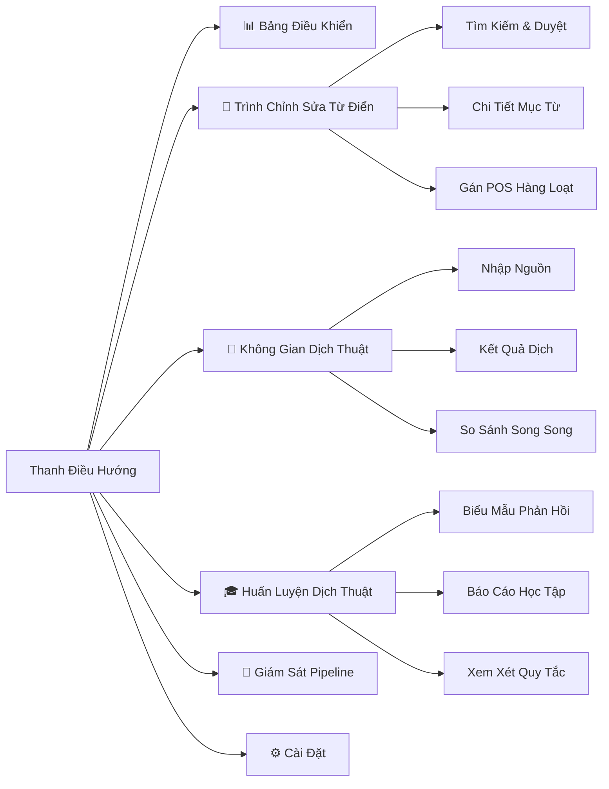

# Tái Cấu Trúc UI: Trạm Dịch Thuật Pipeline

## Mục Tiêu
Tái cấu trúc file [App.tsx](file:///d:/Converter%20by%20DrDuc/desktop/src/App.tsx) nguyên khối (1494 dòng) thành hệ thống UI module hóa, hỗ trợ chỉnh sửa từ điển, theo dõi quy trình dịch, huấn luyện pipeline học tập, và giám sát pipeline thời gian thực — đồng bộ với schema metadata POS 8 cột mới.

## Mockup Trực Quan

````carousel

<!-- slide -->

````

---

## Phân Tích Hiện Trạng

| Khía Cạnh | Hiện Tại | Mục Tiêu |
|---|---|---|
| Kiến trúc | [App.tsx](file:///d:/Converter%20by%20DrDuc/desktop/src/App.tsx) nguyên khối (1494 dòng) | Module hóa (6 screen riêng biệt) |
| Màn hình | 8 tab gộp trong 1 [renderScreen()](file:///d:/Converter%20by%20DrDuc/desktop/src/App.tsx#541-1260) | 6 module tập trung với sub-view |
| Chỉnh sửa từ điển | Chỉ tìm kiếm, chỉ đọc | CRUD đầy đủ với 8 cột metadata |
| Giao diện | Glassmorphism tông ấm sáng | **Giữ nguyên** — đã rất đẹp |
| Metadata POS | Không hiển thị trên UI | Nhãn POS màu, hiển thị Pinyin, chỉ báo Entity |
| Pipeline | Không có khả năng theo dõi | Stepper thời gian thực với tiến độ từng giai đoạn |

> [!IMPORTANT]
> Chúng ta sẽ **giữ nguyên hệ thống thiết kế glassmorphism tông ấm hiện tại** — bảng màu CSS rất tốt. Tái cấu trúc tập trung vào **kiến trúc và tính năng**, không phải thay đổi theme.

---

## Kiến Trúc 6 Màn Hình Đề Xuất



---

## Thay Đổi Chi Tiết

### Tách Component từ App.tsx

Tách hàm [renderScreen()](file:///d:/Converter%20by%20DrDuc/desktop/src/App.tsx#541-1260) nguyên khối (dòng 541–1259) thành các file component riêng:

#### [MỚI] `desktop/src/screens/DashboardScreen.tsx`
- Hàng chỉ số KPI (tổng mục từ, % POS, % Pinyin, số lượng entity)
- Danh sách bản dịch gần đây với nhãn trạng thái
- Stepper giai đoạn pipeline
- Thanh tra cứu từ điển nhanh

#### [MỚI] `desktop/src/screens/DictionaryEditorScreen.tsx`
**Đây là màn hình quan trọng nhất.** Tính năng:
- **Panel Tìm Kiếm** (trái): Bảng có bộ lọc với cột `Nguồn | Đích | POS | Ưu Tiên`
- **Trình Chỉnh Sửa Chi Tiết** (phải): Form chỉnh sửa đầy đủ 8 cột metadata
  - `pos_tag` dropdown (NOUN, VERB, ADJ, ADVERB, PARTICLE, PREPOSITION, PRONOUN, CONJUNCTION, NUMBER)
  - `pos_sub` dropdown (tự động thay đổi theo `pos_tag`)
  - `entity_type` dropdown (person, location, organization, artifact)
  - [pinyin](file:///d:/Converter%20by%20DrDuc/tests/test_translation_regressions.py#46-59) ô nhập text
  - `traditional` ô nhập text
  - `luat_nhan_trigger` công tắc bật/tắt
  - `reorder_role` dropdown (head, modifier, complement)
  - [metadata](file:///d:/Converter%20by%20DrDuc/tests/test_translation_regressions.py#554-589) xem trước JSON
- **Phân trang** với bộ lọc theo category/POS
- **Thao Tác Hàng Loạt**: Gán tag cho nhiều mục, xuất tập đã lọc

#### [SỬA] `desktop/src/screens/TranslationWorkspaceScreen.tsx`
- Tách từ block `case "Translation Workspace"` hiện tại
- Thêm: Panel so sánh nguồn/dịch song song
- Thêm: Lớp phủ chú thích POS trên văn bản nguồn tiếng Trung
- Thêm: Token nhấp được để mở Dictionary Editor cho mục từ đó

#### [SỬA] `desktop/src/screens/CoachScreen.tsx`
- Tách từ block `case "Translation Coach"` hiện tại
- Thêm: Timeline tiến trình học tập
- Thêm: Số liệu hiệu quả quy tắc
- Thêm: Xem xét candidate entry với ngữ cảnh POS

#### [MỚI] `desktop/src/screens/PipelineMonitorScreen.tsx`
- Stepper pipeline trực quan (Nhập → Biên dịch → Gán POS → Dịch → QA → Xuất)
- Trình xem log cho từng giai đoạn
- Nút chạy lại cho từng giai đoạn pipeline
- Số liệu độ phủ theo giai đoạn

#### [SỬA] `desktop/src/screens/SettingsScreen.tsx`
- Tách từ block Settings hiện tại
- Thêm: Thống kê database (số mục, % độ phủ)
- Thêm: Kích hoạt cập nhật CEDICT
- Thêm: Điều khiển chạy lại Seeder

---

### Component Dùng Chung

#### [MỚI] `desktop/src/components/POSBadge.tsx`
Nhãn POS có mã màu: NOUN=xanh dương, VERB=xanh lá, ADJ=cam, ADVERB=tím, PARTICLE=xám

#### [MỚI] `desktop/src/components/EntityBadge.tsx`
Chỉ báo entity với icon: 👤 người, 📍 địa danh, 🏢 tổ chức, ⚔️ vật phẩm

#### [MỚI] `desktop/src/components/MetricRing.tsx`
Vòng tròn tiến trình cho % độ phủ

#### [MỚI] `desktop/src/components/PipelineStepper.tsx`
Stepper dọc hiển thị các giai đoạn pipeline với trạng thái hoàn thành

---

### Mở Rộng Backend API

#### [SỬA] [desktop/src/protocol.ts](file:///d:/Converter%20by%20DrDuc/desktop/src/protocol.ts)
Thêm các kiểu command mới:
- `update_dictionary_entry` — lưu các trường metadata đã chỉnh sửa
- `list_dictionary_entries` — liệt kê phân trang với bộ lọc
- `get_pipeline_status` — giai đoạn hiện tại và số liệu độ phủ
- `run_pipeline_stage` — kích hoạt giai đoạn pipeline cụ thể

---

## Kế Hoạch Kiểm Tra

### Tự Động
- `npm run build` không có lỗi TypeScript
- Tất cả màn hình hiện tại vẫn hiển thị đúng sau khi tách

### Thủ Công
- Dictionary Editor: tìm kiếm, nhấp mục, sửa POS tag, lưu → xác nhận trong SQLite
- Dashboard: KPI khớp với số liệu audit (95.5% POS, 99.0% Pinyin)
- Pipeline Monitor: hiển thị đúng trạng thái giai đoạn
