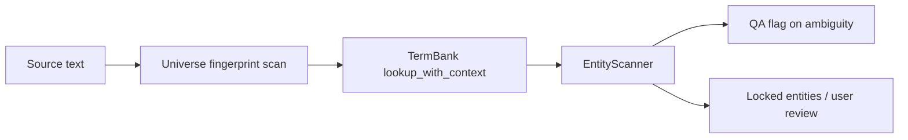

# Cross-Universe Guide

## Overview

The cross-universe layer resolves names and terms that can mean different things in different source works. In v24, one concrete book/work/project is one universe. The Python path loads `data/term_bank/global/*.jsonl`, `data/term_bank/universes/{universe_id}/*.jsonl`, and project-private JSONL before the heuristic entity scanner guesses names.

## Data Format

Each JSONL row supports:

- `source`, `target`, `entity_type`
- `scope`: `global`, `universe`, or `private`
- `universe`, `work`, `franchise`
- `context_markers`, `co_occurring_entities`
- `confidence`, `status`, `version`

Active statuses are `approved`, `locked`, and `active`. Deprecated or rejected rows are ignored by default.

## Resolution

`TermBank.lookup_with_context()` ranks candidates by project-private scope, active universe match, local markers, co-occurring entities, confidence, and source length. When a tie remains, `EntityScanner` keeps the target clean and marks `ambiguity_flag` / `qa_flags`; it does not inject `[universe_tag]` into translation output.

## Extending

Add a new folder under `data/term_bank/universes/{universe_id}/` and create one or more `.jsonl` files. `universe_id` is the stable slug of the story title, for example `dau_pha_thuong_khung` or `quy_bi_chi_chu`. Include at least two fingerprint terms and one canonical character so `detect_universe()` has enough signal.

When a project saves reviewed entities, the default sidecar flow writes to the story universe bank, not a genre bucket. Project-private entries remain available for temporary overrides.

## Troubleshooting

- Wrong universe chosen: add stronger `context_markers` or `co_occurring_entities`.
- Global term overridden too often: lower universe confidence or remove overly generic markers.
- New rows not visible in UI: call `reload_universe()` or restart the sidecar.
