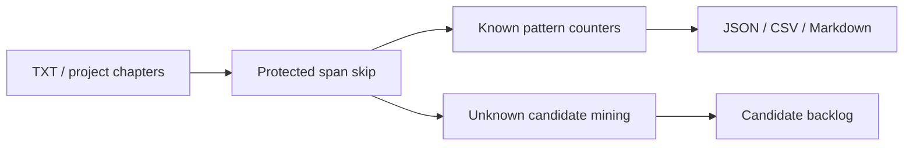

# Grammar Pattern Scanner

## Overview

The grammar scanner is deterministic and non-LLM. It mines known and unknown Chinese grammar patterns from source text and writes review artifacts for the coach workflow.



## Commands

```powershell
python scripts/scan_grammar_patterns.py --input "Template Book" --out-dir reports/grammar_learning/manual
```

Sidecar command: `scan_grammar_learning_patterns`.

## Outputs

- `grammar_learning_report.json`
- `grammar_learning_report.md`
- `grammar_learning_report_known_rules.csv`
- `grammar_learning_report_unknown_candidates.csv`

Unknown candidates are review-only. They are not promoted into grammar rules without human review.

## Extending

Add deterministic patterns in `src/learning/grammar_pattern_scanner.py` and add regression cases in `tests/test_grammar_learning_scanner.py`. Keep protected span behavior intact.

## Troubleshooting

- Missing candidates: check minimum frequency and chapter-count thresholds.
- False positives in system panels: add or adjust protected span detection before scanning.
