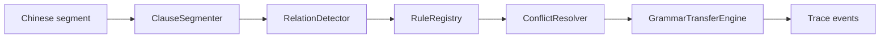

# Grammar Transfer Planner

## Overview

The grammar transfer path rewrites source-side grammar frames before lexical decoding. It is conservative, traceable, and protected-span aware.

## Core Files

- `src/grammar/clause_segmenter.py`
- `src/grammar/relation_detector.py`
- `src/grammar/rule_registry.py`
- `src/grammar/conflict_resolver.py`
- `src/grammar/transfer_engine.py`
- `src/rules/syntax_transfer_rules.py`

## Rule Policy

Rules declare a match, priority, and traceable claim. Conflict resolution is deterministic: higher priority wins, then stable rule id ordering. Protected spans are not rewritten.

## Extending

Add a rule with `match()` and `apply()` behavior, register it in the local rule registry, and add a focused regression in `tests/test_grammar_transfer_pack.py`.

## Troubleshooting

- Rule not firing: inspect the trace event before lexical decode.
- Rule fighting another rule: raise or lower priority and add a conflict regression.
- Protected text changed: add a span fixture to `ClauseSegmenter` tests.
