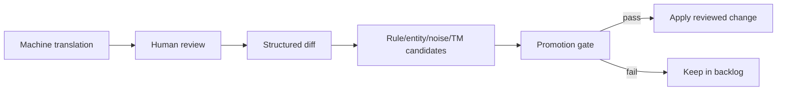

# Learning Loop

## Overview

The learning loop turns human review into candidates. It does not auto-promote machine output into approved memory or dictionaries.

## Current Surfaces

- Translation memory split: `src/state/translation_memory.py`
- Project learning: `src/learning/project_learning_engine.py`
- Natural feedback: `src/learning/natural_feedback_engine.py`
- Entity enrichment: `src/pipeline/entity_enrichment.py`
- Sidecar review commands in `src/ui/sidecar_bridge.py`

## Promotion Rules

Promotion requires human review, active status, deterministic validation, regression gate success, and no conflict with protected spans or approved TM.

## Extending

Keep new candidate types review-only by default. Add save paths that are idempotent and trace the origin of the candidate.

## Troubleshooting

- Candidate not applied: verify review status and regression result.
- Duplicate rows: use `source|universe` as the term-bank primary key.
- Machine output in approved TM: use `store_machine()` first and promote only via reviewed APIs.
