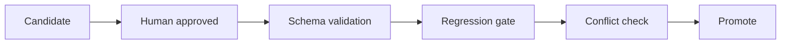

# Promotion Policy

## Overview

Promotion means moving a reviewed candidate into an approved runtime surface: approved TM, term bank, grammar backlog, noise filter, or project config.

## Required Conditions

1. Human review status is `approved`.
2. Candidate has valid schema and active status.
3. Regression gate passes.
4. No conflict with existing approved term/rule/TM entry.
5. Promotion writes atomically and keeps provenance metadata.

## Surfaces

- Term bank: `data/term_bank/**/*.jsonl`; universe records use one story/book/project slug per folder
- Project-private knowledge: `workspace_projects/{project_id}/knowledge/*.jsonl`
- Translation memory: `tm_machine`, `tm_reviewed`, `tm_approved`
- Grammar candidates: project `working/grammar_learning/verified_patterns.json`

## Troubleshooting

- Promotion skipped: check review status first.
- Candidate overwritten: verify primary key and source provenance.
- Regression gate fail: keep the candidate in backlog and add a focused test before retrying.
