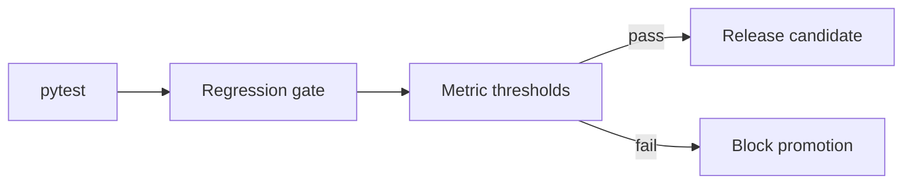

# Regression Policy

## Overview

The regression gate blocks production promotion when deterministic checks fail. The standalone gate is `scripts/run_regression_gate.py`.



## Commands

```powershell
python -m pytest --tb=short
python scripts/run_regression_gate.py --strict
python scripts/benchmark_chapter.py
python scripts/validate_production_ready.py
```

Use `--run-pytest` on `run_regression_gate.py` or `validate_production_ready.py` when the gate should include a full test run.

## Required Metrics

The gate currently checks term-bank JSONL validity, duplicate keys, seed universe accuracy, same-name resolution, TM split, trace foundation, SegmentPacket availability, grammar transfer availability, enrichment workflow, docs, CI wiring, universe-tag cleanliness, and seed performance.

## Gold Data

Gold fixtures should live under `data/tests_gold/` when added. Keep files small and deterministic; expected output should avoid style-only assertions unless the test is about style.

## Troubleshooting

- CI fails only on regression gate: inspect `reports/regression_gate_report.json`.
- Performance fail: run `scripts/benchmark_chapter.py` locally and compare seed timing.
- Term-bank fail: validate recent JSONL edits and duplicate `source|universe|scope` keys.
