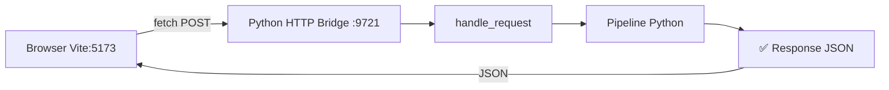

# Fix UI Pipeline: Tauri:dev + HTTP Bridge

Sửa lỗi pipeline UI không hoạt động khi chạy trong browser mode. Hai hướng sửa song song: (A) khôi phục Tauri native build, (B) thêm HTTP bridge transport cho browser development.

## User Review Required

> [!IMPORTANT]
> **Phase A** yêu cầu Rust toolchain (`D:\App\Rust`) và VS Build Tools (`D:\App\BuildTools\VS2022`) phải sẵn sàng trên máy. Nếu toolchain đã bị xoá/hỏng, cần cài lại trước.

> [!WARNING]
> **Phase B** thêm một Python HTTP server chạy song song với Vite dev server. Port mặc định: `9721`. Nếu port này bị chiếm, cần đổi.

---

## Phase A: Khôi phục Tauri:dev

### Mục tiêu
Đảm bảo `npm run tauri:dev` và `npm run tauri:build` hoạt động, tạo binary native có thể gọi Python sidecar.

---

### A1. Verify Rust Toolchain

Kiểm tra các thành phần cần thiết:

```bash
rustup show                    # Rust compiler
rustc --version                # Phải >= 1.70
cargo --version
```

Nếu thiếu, cài:
```bash
rustup update stable
rustup target add x86_64-pc-windows-msvc
```

---

### A2. Rebuild Tauri Binary

```bash
cd d:\Converter by DrDuc\desktop
npm run tauri:build
```

Verify output: `src-tauri/target/release/drduc-translator-desktop.exe`

> [!NOTE]
> Lần build đầu mất ~5 phút do compile toàn bộ dependency tree (Cargo.toml: `tauri 2`, `serde 1`, `rfd 0.15`).

---

### A3–A4. Smoke Test

Chạy native app và test pipeline:
```bash
cd d:\Converter by DrDuc\desktop
npm run tauri:dev
```
Hoặc launch trực tiếp binary:
```bash
.\src-tauri\target\release\drduc-translator-desktop.exe
```

---

## Phase B: HTTP Bridge Transport

### Mục tiêu
Cho phép `npm run dev` (browser mode) gọi Python sidecar qua HTTP thay vì trả lỗi.



---

### Component: Python HTTP Bridge Server

#### [NEW] [http_bridge.py](file:///d:/Converter%20by%20DrDuc/src/ui/http_bridge.py)

Tạo HTTP server sử dụng `http.server` (stdlib, không cần thêm dependency) để wrap `sidecar_bridge.handle_request`:

```python
# Endpoint: POST /api/sidecar
# Request body: CommandRequest JSON
# Response: CommandResponse JSON
# CORS: Allow localhost:5173
# Port: 9721 (configurable via --port)
```

**Thiết kế chi tiết:**
- Dùng `http.server.HTTPServer` + `BaseHTTPRequestHandler` (zero dependencies)
- Parse JSON body → tạo `CommandRequest` → gọi `handle_request()` → trả JSON response
- CORS headers cho `Access-Control-Allow-Origin: *` (dev-only server)
- Chạy bằng: `python -m src.ui.http_bridge --port 9721`
- Thêm `--cors-origin` flag để restrict origin nếu cần
- Health check endpoint: `GET /api/health` → `{"ok": true}`

---

### Component: Frontend HTTP Transport

#### [NEW] [httpTransport.ts](file:///d:/Converter%20by%20DrDuc/desktop/src/httpTransport.ts)

Transport mới gọi Python HTTP bridge qua `fetch()`:

```typescript
// Gửi POST /api/sidecar với JSON body
// Fallback URL: http://localhost:9721/api/sidecar
// Configurable qua VITE_BRIDGE_URL env var
// Mode: "http"
// supportedCommands: same as tauriTransport
```

**Thiết kế chi tiết:**
- `createHttpTransport()`: probe `GET /api/health` trước, nếu fail thì throw
- `send()`: `fetch(bridgeUrl, { method: "POST", body: requestJson })`
- Reuse `SUPPORTED_COMMANDS` list từ `tauriTransport.ts`

---

### Component: Protocol Extension

#### [MODIFY] [protocol.ts](file:///d:/Converter%20by%20DrDuc/desktop/src/protocol.ts)

```diff
-export type TransportMode = "browser" | "demo" | "tauri";
+export type TransportMode = "browser" | "demo" | "http" | "tauri";
```

---

### Component: Transport Cascade Update

#### [MODIFY] [transport.ts](file:///d:/Converter%20by%20DrDuc/desktop/src/transport.ts)

Thêm HTTP bridge vào cascade, thử sau Tauri nhưng trước demo/browser:

```diff
 export async function createPreferredTransport(): Promise<Transport> {
   try {
     return await createTauriTransport();
   } catch {
+    try {
+      return await createHttpTransport();
+    } catch {
+      // HTTP bridge not running, continue to fallback
+    }
     if (import.meta.env.VITE_ENABLE_DEMO === "1") {
       return createDemoTransport();
     }
     return createBrowserTransport();
   }
 }
```

---

### Component: Dev Script

#### [MODIFY] [package.json](file:///d:/Converter%20by%20DrDuc/desktop/package.json)

```diff
 "scripts": {
   "dev": "vite",
   "build": "vite build",
   "tauri:dev": "tauri dev",
-  "tauri:build": "tauri build"
+  "tauri:build": "tauri build",
+  "bridge": "cd .. && python -m src.ui.http_bridge --port 9721",
+  "dev:bridge": "start /B npm run bridge && timeout /t 2 && npm run dev"
 }
```

> [!NOTE]
> `dev:bridge` chạy trên Windows (`start /B`). Trên macOS/Linux sẽ cần `&` thay vì `start /B`.

---

## Verification Plan

### Automated Tests

#### 1. Existing pytest (99 tests)
```bash
cd d:\Converter by DrDuc
python -m pytest tests/ -q
```
Tất cả 99 test phải PASS — đảm bảo Python pipeline không bị break.

#### 2. TypeScript build verification
```bash
cd d:\Converter by DrDuc\desktop
npm run build
```
Phải compile thành công — đảm bảo type changes (`TransportMode` extension) không gây lỗi.

#### 3. New Python HTTP bridge test
Thêm test vào `tests/test_phase7_and_ui.py`:
```python
def test_http_bridge_health_and_sidecar_endpoint():
    """Start HTTP bridge, send list_projects, verify JSON response."""
```
```bash
python -m pytest tests/test_phase7_and_ui.py -k "http_bridge" -v
```

### Manual Verification

#### MV1. Tauri:dev mode
1. Mở terminal tại `d:\Converter by DrDuc\desktop`
2. Chạy `npm run tauri:dev`
3. Cửa sổ Tauri mở → status bar phải hiện "Native Tauri bridge detected"
4. Chọn project-002 → phải thấy 1672 chapters
5. Bấm Translate → phải ra kết quả tiếng Việt

#### MV2. Browser + HTTP bridge mode
1. Terminal 1: `cd d:\Converter by DrDuc && python -m src.ui.http_bridge --port 9721`
2. Terminal 2: `cd d:\Converter by DrDuc\desktop && npm run dev`
3. Mở `http://localhost:5173` trong browser
4. Status bar phải hiện "HTTP bridge" (không phải "Browser preview")
5. Chọn project-002 → phải thấy 1672 chapters
6. Import/Translate phải hoạt động bình thường

---

## File Summary

| Action | File | Purpose |
|--------|------|---------|
| **NEW** | `src/ui/http_bridge.py` | Python HTTP server wrapping sidecar |
| **NEW** | `desktop/src/httpTransport.ts` | Frontend transport via HTTP fetch |
| **MODIFY** | `desktop/src/protocol.ts` | Add `"http"` to `TransportMode` |
| **MODIFY** | `desktop/src/transport.ts` | Insert HTTP into cascade |
| **MODIFY** | `desktop/package.json` | Add `bridge` and `dev:bridge` scripts |
| **MODIFY** | `tests/test_phase7_and_ui.py` | Add HTTP bridge test |
| **VERIFY** | Tauri:dev build | `npm run tauri:build` |
