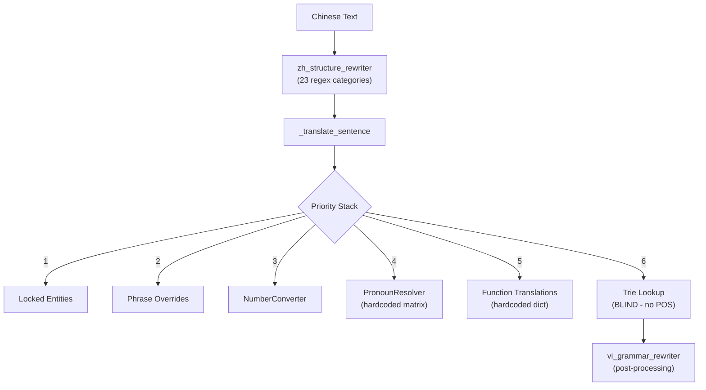

# Metadata-Rich Dictionary Migration Plan

> **Mục tiêu**: Chuyển đổi 724K entries từ cấu trúc phẳng `source→target` sang schema metadata đa tầng, cho phép engine ra quyết định ngữ pháp dựa trên **POS tag**, **morphology**, và **context** thay vì regex cứng.

---

## 1. Phân Tích Hiện Trạng (Architecture Audit)

### 1.1. Schema Hiện Tại — Flat & Blind

```
┌─────────────────────────────────────────────────────┐
│  entries (SQLite)            ← 724,207 rows         │
├─────────────────────────────────────────────────────┤
│  source TEXT PRIMARY KEY     ← "穿", "跑", "大"     │
│  target TEXT                 ← "mặc/xuyên", "chạy"  │
│  priority INT                ← 1-5                   │
│  category TEXT               ← "vietphrase_2char"    │
│  one_mean BOOL               ← false                 │
│  locked BOOL                 ← false                 │
│  metadata_json TEXT          ← "" (LUÔN RỖNG)        │
└─────────────────────────────────────────────────────┘
```

```
TrieNode.__slots__ = ['children', 'target', 'priority', 'one_mean', 'is_end']
```

> **Vấn đề cốt lõi**: Engine không biết "穿" là VERB hay "大" là ADJ. Mọi logic ngữ pháp đều phụ thuộc vào 23 regex categories trong [zh_structure_rewriter.py](file:///d:/Converter%20by%20DrDuc/src/engine/zh_structure_rewriter.py) — cứng, dễ gãy, không mở rộng được.

### 1.2. Phân Bổ Dữ Liệu Hiện Tại

| Category | Entries | % | POS Data? |
|----------|---------|---|-----------|
| `vietphrase_5plus` | 221,367 | 30.6% | ❌ |
| `vietphrase_3char` | 187,410 | 25.9% | ❌ |
| `vietphrase_4char` | 177,808 | 24.5% | ❌ |
| `vietphrase_2char` | 114,955 | 15.9% | ❌ |
| `trichdan_idioms` | 14,179 | 2.0% | ❌ |
| `vietphrase_1char` | 3,424 | 0.5% | ❌ |
| `names_*` | 2,782 | 0.4% | ❌ |
| `phien_am` | 264 | <0.1% | ❌ |

### 1.3. Luồng Xử Lý Runtime Hiện Tại



> Mỗi lần thêm một quy tắc ngữ pháp mới, phải viết thêm regex cứng. Hệ thống KHÔNG TỰ HỌC được vì entries không chứa thông tin ngữ pháp.

---

## 2. Schema Đề Xuất — Metadata-Enriched Entries

### 2.1. Enhanced SQLite Schema

```sql
-- Bảng chính: giữ nguyên hiệu suất, thêm POS
CREATE TABLE entries_v2 (
    source          TEXT PRIMARY KEY,
    target          TEXT NOT NULL,
    priority        INTEGER NOT NULL DEFAULT 2,
    category        TEXT DEFAULT '',
    one_mean        INTEGER DEFAULT 0,
    locked          INTEGER DEFAULT 0,
    
    -- ═══ NEW: Morphology & Syntax ═══
    pos_tag         TEXT DEFAULT NULL,    -- VERB, NOUN, ADJ, ADV, PRON, PREP, CONJ, PART, CLF, NUM, IDIOM
    pos_sub         TEXT DEFAULT NULL,    -- e.g. "transitive", "intransitive", "stative"
    entity_type     TEXT DEFAULT NULL,    -- person, location, organization, weapon, technique
    
    -- ═══ NEW: Translation Behavior Flags ═══
    is_function_word    INTEGER DEFAULT 0,   -- 的, 了, 在, 把, 被 → structural particles
    luat_nhan_trigger   INTEGER DEFAULT 0,   -- triggers grammar pattern matching
    reorder_role        TEXT DEFAULT NULL,    -- "modifier", "head", "complement", "marker"
    
    -- ═══ NEW: Contextual Selection ═══
    cultural_origin TEXT DEFAULT NULL,    -- han_viet, modern_cn, mixed
    genre_affinity  TEXT DEFAULT NULL,    -- JSON: ["xianxia","wuxia"]
    register_level  TEXT DEFAULT NULL,    -- formal, informal, literary, colloquial

    -- ═══ Existing ═══
    notes           TEXT DEFAULT '',
    source_file     TEXT DEFAULT '',
    source_language TEXT DEFAULT 'zh',
    target_language TEXT DEFAULT 'vi',
    entry_role      TEXT DEFAULT 'translation',
    metadata_json   TEXT DEFAULT ''
);
```

### 2.2. POS Tag Taxonomy (Bắt buộc)

Dựa trên hệ thống phân loại chuẩn cho Hán ngữ hiện đại:

| POS Tag | Tên | Ví dụ | Vai trò trong RBMT |
|---------|-----|-------|---------------------|
| `NOUN` | Danh từ | 风衣, 墓碑, 教室 | Head noun trong modifier+的+noun |
| `VERB` | Động từ | 穿, 跑, 吃, 跪 | Triggers Cat.1A/1C inversion |
| `ADJ` | Tính từ | 大, 美丽, 惨白 | Triggers Cat.1B/10 modifier swap |
| `ADV` | Trạng từ | 很, 更, 非常 | Không đảo, giữ nguyên vị trí |
| `PRON` | Đại từ | 我, 你, 他 | PronounResolver integration |
| `PREP` | Giới từ | 在, 从, 向, 对 | Triggers Cat.16/17 locative rules |
| `CONJ` | Liên từ | 和, 但是, 除了 | Triggers Cat.15 correlative |
| `PART` | Trợ từ | 的, 了, 着, 过 | Structural markers (function words) |
| `CLF` | Lượng từ | 个, 座, 块, 根 | Cat.7 classifier mapping |
| `NUM` | Số từ | 一, 两, 三 | NumberConverter integration |
| `IDIOM` | Thành ngữ | 九死一生, 坐以待毙 | Lock nguyên cụm, không tách |
| `COMP` | Bổ ngữ | 出来, 起来, 下去 | Cat.6 result complement |
| `SUFFIX` | Hậu tố | 似的, 一样, 一般 | Cat.23 simulative inversion |
| `LOC` | Phương vị từ | 上, 下, 里, 外, 前, 后 | Cat.11 postposition inversion |

### 2.3. Enhanced TrieNode

```python
class TrieNode:
    __slots__ = [
        'children', 'target', 'priority', 'one_mean', 'is_end',
        # NEW metadata
        'pos_tag',          # str | None
        'is_function_word', # bool
        'reorder_role',     # str | None  ("modifier", "head", "complement")
        'entity_type',      # str | None
    ]
```

### 2.4. Enhanced TrieMatch

```python
@dataclass
class TrieMatch:
    source: str
    target: str
    priority: int
    length: int
    one_mean: bool
    # NEW
    pos_tag: str | None = None
    is_function_word: bool = False
    reorder_role: str | None = None
    entity_type: str | None = None
```

---

## 3. Thuật Toán Chuyển Đổi Ngữ Pháp Dựa Trên POS

### 3.1. Thay Thế Regex Cứng Bằng POS-Driven Rules

**Trước (regex cứng):**
```python
# Cat.1A: hardcoded verb list + 的 + person list
re.compile(r"((?:穿着?|戴着?|背着?)[\u4e00-\u9fff]+?)的(男子|女子|...)")
```

**Sau (POS-driven):**
```python
def rewrite_modifier_noun(tokens: list[TrieMatch]) -> list[TrieMatch]:
    """Dynamically detect [VERB...的NOUN] and reorder."""
    i = 0
    while i < len(tokens):
        # Find 的 (PART marker)
        if tokens[i].pos_tag == 'PART' and tokens[i].source == '的':
            # Look back: collect modifier chain (VERB, ADJ, etc.)
            mod_start = find_modifier_start(tokens, i)
            # Look forward: find head noun
            head = tokens[i + 1] if i + 1 < len(tokens) and tokens[i+1].pos_tag == 'NOUN' else None
            
            if mod_start is not None and head:
                # REORDER: Head + Modifier (Vietnamese right-branching)
                reorder_modifier_head(tokens, mod_start, i, head)
        i += 1
```

### 3.2. Rule Engine Architecture

```python
class POSRewriteEngine:
    """Replaces zh_structure_rewriter.py with data-driven rules."""
    
    RULES = [
        # (condition_fn, action_fn, priority)
        (is_verb_de_noun,           swap_modifier_head,     100),  # Cat.1A/1B/1C
        (is_possessive_de,          insert_cua_marker,      90),   # Cat.2
        (is_color_noun,             swap_color_after_noun,  80),   # Cat.3
        (is_ba_construction,        restore_svo,            110),  # Cat.4
        (is_bei_passive,            insert_bi_marker,       110),  # Cat.5
        (is_result_complement,      rewrite_complement,     70),   # Cat.6
        (is_demonstrative_pattern,  reorder_demonstrative,  85),   # Cat.8
        (is_simulative_suffix,      invert_simulative,      95),   # Cat.23
        (is_locative_postposition,  swap_loc_head,          75),   # Cat.11
        (is_prep_action,            swap_prep_verb,         80),   # Cat.16/17
    ]
    
    def rewrite(self, tokens: list[TrieMatch]) -> list[TrieMatch]:
        for condition, action, priority in sorted(self.RULES, key=lambda r: -r[2]):
            tokens = self._apply_rule(tokens, condition, action)
        return tokens
```

### 3.3. Ví Dụ Cụ Thể — Trước & Sau

| Input | Token POS Sequence | Rule Fired | Output |
|-------|-------------------|------------|--------|
| `穿黑色风衣的男子` | `VERB ADJ NOUN PART NOUN` | `is_verb_de_noun` → `swap` | `男子 穿黑色风衣` |
| `惨白腐烂的双手` | `ADJ ADJ PART NOUN` | `is_verb_de_noun` → `swap` | `双手 惨白腐烂` |
| `发疯似的` | `VERB SUFFIX` | `is_simulative_suffix` → `invert` | `như 发疯` |
| `两座墓碑面前` | `NUM CLF NOUN LOC` | `is_locative_postposition` → `swap` | `LOC NUM CLF NOUN` |
| `在课桌下面摸找着` | `PREP NOUN LOC VERB PART` | `is_prep_action` → `swap` | `VERB PREP NOUN LOC` |

---

## 4. Kế Hoạch Migration (3 Phases)

### Phase A: Schema Migration & POS Seeding (Non-Breaking)

> [!IMPORTANT]
> Phase A KHÔNG thay đổi runtime behavior. Chỉ mở rộng schema và seed dữ liệu POS.

#### A1. Mở rộng SQLite schema
- Thêm các cột `pos_tag`, `pos_sub`, `is_function_word`, `reorder_role`, [entity_type](file:///d:/Converter%20by%20DrDuc/src/pipeline/entity_scanner.py#405-419), `cultural_origin`, `genre_affinity`, `register_level` vào [entries](file:///d:/Converter%20by%20DrDuc/src/core/runtime_support.py#309-393)
- Migration script: `ALTER TABLE entries ADD COLUMN ...`

#### A2. Auto-POS Seeding cho 1-char entries (3,424 entries)
- Script tự động gán POS dựa trên bảng phân loại Hán tự chuẩn
- Nguồn: CC-CEDICT + Unihan database + hardcoded high-frequency list

```python
AUTO_POS_SEED = {
    # Function words (PART)
    "的": ("PART", "structural"),
    "了": ("PART", "aspect"),
    "着": ("PART", "progressive"),
    "过": ("PART", "experiential"),
    "吗": ("PART", "question"),
    "吧": ("PART", "suggestion"),
    
    # Prepositions (PREP)
    "在": ("PREP", "locative"),
    "从": ("PREP", "source"),
    "向": ("PREP", "directional"),
    "对": ("PREP", "target"),
    "把": ("PREP", "ba_construction"),
    "被": ("PREP", "passive"),
    
    # Common verbs
    "穿": ("VERB", "transitive"),
    "跑": ("VERB", "intransitive"),
    "吃": ("VERB", "transitive"),
    "写": ("VERB", "transitive"),
    "看": ("VERB", "transitive"),
    "说": ("VERB", "transitive"),
    "走": ("VERB", "intransitive"),
    "跪": ("VERB", "intransitive"),
    
    # Adjectives
    "大": ("ADJ", "scalar"),
    "小": ("ADJ", "scalar"),
    "好": ("ADJ", "evaluative"),
    "快": ("ADJ", "scalar"),
    "慢": ("ADJ", "scalar"),
    "白": ("ADJ", "color"),
    "黑": ("ADJ", "color"),
    "红": ("ADJ", "color"),
    
    # Classifiers
    "个": ("CLF", "general"),
    "座": ("CLF", "buildings"),
    "块": ("CLF", "flat_objects"),
    "根": ("CLF", "long_thin"),
    "只": ("CLF", "animals"),
    "把": ("CLF", "handled"),
    "双": ("CLF", "pairs"),
    
    # Locatives
    "上": ("LOC", "above"),
    "下": ("LOC", "below"),
    "里": ("LOC", "inside"),
    "外": ("LOC", "outside"),
    "前": ("LOC", "front"),
    "后": ("LOC", "back"),
}
```

#### A3. Batch-tag 2-char entries bằng heuristics
- `_名` → NOUN (person name suffix)
- Entries trong `names_*` categories → auto-tag [entity_type](file:///d:/Converter%20by%20DrDuc/src/pipeline/entity_scanner.py#405-419)
- `trichdan_idioms` → auto-tag `IDIOM`
- `vietphrase_2char` viết với target chứa "chia" hoặc "ra" → VERB heuristic

#### A4. Cập nhật Markdown dictionary format
Thêm cột `pos_tag` vào bulk MD tables:

```markdown
| source | target | pos_tag | pos_sub | notes |
|--------|--------|---------|---------|-------|
| 穿 | mặc/xuyên | VERB | transitive | |
| 大 | lớn/đại | ADJ | scalar | |
| 似的 | như | SUFFIX | simulative | Cat.23 trigger |
```

---

### Phase B: TrieNode Enhancement & POS-Aware Lookup

#### B1. Extend [TrieNode](file:///d:/Converter%20by%20DrDuc/src/core/trie_engine.py#47-57) với POS slots
#### B2. Extend [TrieMatch](file:///d:/Converter%20by%20DrDuc/src/core/trie_engine.py#33-41) trả về POS metadata
#### B3. Update [load_from_sqlite](file:///d:/Converter%20by%20DrDuc/src/core/trie_engine.py#126-164) đọc POS columns
#### B4. [_translate_sentence](file:///d:/Converter%20by%20DrDuc/src/engine/rbmt_translator.py#410-554) truyền POS cho downstream modules

---

### Phase C: POS-Driven Rewrite Engine

#### C1. Tạo `POSRewriteEngine` thay thế `zh_structure_rewriter`
#### C2. Migrate tất cả 23 regex categories sang POS-condition rules
#### C3. Tích hợp [PronounResolver](file:///d:/Converter%20by%20DrDuc/src/eapee/pronoun_resolver.py#14-78) vào metadata (genre_affinity, register_level)
#### C4. Tích hợp CulturalOriginDetector vào `cultural_origin` field

---

## 5. Verification Plan

### Phase A Verification
```powershell
# Verify schema migration
python -c "import sqlite3; db=sqlite3.connect('data/dictionaries/_compiled/trie_cache.db'); c=db.cursor(); c.execute('PRAGMA table_info(entries)'); print([r for r in c.fetchall()])"

# Verify POS seeding count
python -c "import sqlite3; db=sqlite3.connect('data/dictionaries/_compiled/trie_cache.db'); c=db.cursor(); c.execute('SELECT pos_tag, COUNT(*) FROM entries WHERE pos_tag IS NOT NULL GROUP BY pos_tag'); print(c.fetchall())"
```

### Phase B/C Verification
```powershell
# Regression test all 5 chapters
python run_full_pipeline.py --skip-pretranslation
# Compare output diff with previous translations
```

---

## 6. Rủi Ro & Biện Pháp

| Rủi ro | Mức độ | Biện pháp |
|--------|--------|-----------|
| POS tagging sai cho đa nghĩa (e.g. "好" = ADJ/ADV/VERB) | Cao | Dùng `pos_sub` + context rules; giữ ADJ làm default |
| Performance regression khi Trie thêm slots | Thấp | `__slots__` vẫn O(1); chỉ thêm 4 pointers |
| Breaking change trong 724K entries | Cao | Phase A là additive-only (thêm cột, không xóa) |
| Effort để seed POS cho 721K bulk entries | Rất cao | Chỉ seed 1-char (3,424) + high-freq 2-char trước; rest = NULL |

> [!CAUTION]
> Phase A PHẢI hoàn thành trước khi bắt tay vào Phase B/C. Nếu không có POS data trong DB thì engine mới sẽ không có gì để dùng. Ưu tiên seed top 5,000 high-frequency entries trước.
