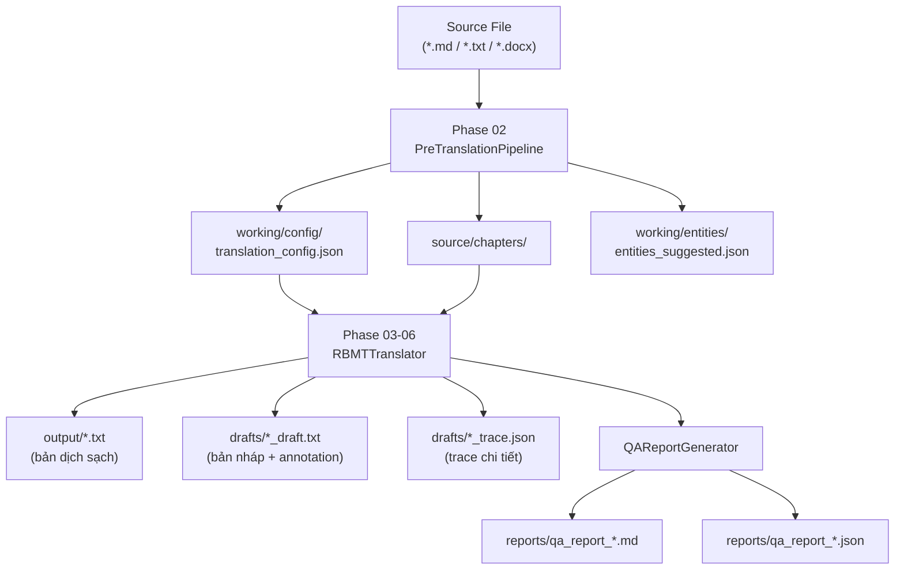

# 🔧 Hướng Dẫn Chạy Pipeline Dịch DrDuc Bằng Terminal

> **Project**: `D:\Converter by DrDuc`
> **Runtime**: Python ≥ 3.11 | Non-LLM RBMT (ZH → VI)

---

## 📋 Mục Lục

1. [Cài đặt môi trường](#1-cài-đặt-môi-trường)
2. [Phase 01 — Compile Dictionary + Benchmark](#2-phase-01--compile-dictionary--benchmark)
3. [Phase 02 — Pre-translation Pipeline](#3-phase-02--pre-translation-pipeline)
4. [Phase 03-06 — Dịch đơn lẻ (Single Chapter)](#4-phase-03-06--dịch-đơn-lẻ-single-chapter)
5. [Dịch hàng loạt (Batch Translation)](#5-dịch-hàng-loạt-batch-translation)
6. [Sidecar CLI (Desktop Bridge)](#6-sidecar-cli-desktop-bridge)
7. [Chạy Tests](#7-chạy-tests)
8. [Cấu trúc thư mục output](#8-cấu-trúc-thư-mục-output)
9. [Troubleshooting](#9-troubleshooting)

---

## 1. Cài đặt môi trường

```powershell
# Di chuyển đến project root
cd "D:\Converter by DrDuc"

# Tạo virtual environment (khuyến nghị)
python -m venv .venv
.\.venv\Scripts\Activate.ps1

# Cài đặt dependencies
pip install -r requirements.txt
```

> [!IMPORTANT]
> Yêu cầu **Python ≥ 3.11**. Kiểm tra bằng `python --version`.

### Kiểm tra nhanh

```powershell
# Verify imports hoạt động
python -c "from src.core.trie_engine import TrieEngine; print('OK')"
```

---

## 2. Phase 01 — Compile Dictionary + Benchmark

Phase 01 compile các file dictionary Markdown trong `data/dictionaries/` thành SQLite (`trie_cache.db`) và chạy benchmark.

### 2a. Chỉ Benchmark (dùng DB đã compile sẵn)

```powershell
python scripts/benchmark.py
```

Output mẫu:
```
Benchmark summary
  trie_entries: 728000
  reading_fallbacks: 12500
  luatnhan_rules: 350
  lookup_us: 2.5
  translation_ms: 15.3
  report: data\dictionaries\_phase1_benchmark.json
```

### 2b. Rebuild Dictionary + Benchmark

```powershell
python scripts/benchmark.py --rebuild
```

> [!WARNING]
> `--rebuild` xóa `trie_cache.db` cũ và compile lại toàn bộ. Mất ~30-60 giây tùy máy.

### Tham số tuỳ chỉnh

| Tham số | Mặc định | Mô tả |
|---------|----------|-------|
| `--dict-root` | `data/dictionaries` | Thư mục gốc chứa dictionary MD |
| `--db` | `data/dictionaries/_compiled/trie_cache.db` | Đường dẫn SQLite output |
| `--rebuild` | `false` | Rebuild DB trước khi benchmark |
| `--lookup-rounds` | `10000` | Số vòng benchmark lookup |
| `--translation-rounds` | `1000` | Số vòng benchmark dịch |

---

## 3. Phase 02 — Pre-translation Pipeline

Pre-translation chuẩn bị project workspace: import tài liệu, tách chương, scan entity, build relationship, generate config.

### Chạy bằng file script (Khuyến nghị cho Windows)

Thay vì chạy lệnh trực tiếp dài dòng, bạn hãy tạo một file `run_prepare.py` tại thư mục gốc của project với nội dung:

```python
import sys
sys.path.insert(0, '.')
from pathlib import Path
from src.pipeline.pretranslation_pipeline import PreTranslationPipeline

# --- CẤU HÌNH ---
# Bạn có thể thay đổi đường dẫn thành 1 file .md hoặc 1 THƯ MỤC chứa nhiều file .md
SOURCE = r'D:\path\to\source' 
PROJECT = r'D:\path\to\project_output'

if __name__ == "__main__":
    pipeline = PreTranslationPipeline()
    result = pipeline.prepare(SOURCE, PROJECT)
    pipeline.close()

    print(f'Format: {result.imported.detected_format}')
    print(f'Chapters: {[c.chapter_id for c in result.chapters]}')
    print(f'Config style: {result.config.get("style_profile")}')
```

Sau đó chạy script trên bằng Command Prompt / PowerShell:
```powershell
python run_prepare.py
```

### Output của Phase 02

```
project_output/
├── source/
│   ├── raw/             # Bản gốc
│   └── chapters/        # Các chương đã tách + chapters_index.json
├── working/
│   ├── entities/        # entities_suggested.json
│   ├── relationships/   # relationships.json
│   └── config/          # translation_config.json  ← QUAN TRỌNG
├── drafts/
├── output/
├── reports/
└── state/
```

> [!TIP]
> File `working/config/translation_config.json` chứa `locked_entities`, `genre_hints`, `style_profile`, `high_ambiguity_terms` — dùng cho Phase dịch tiếp theo.

---

## 4. Phase 03-06 — Dịch đơn lẻ (Single Chapter)

Dịch một đoạn/chương, export kết quả và chạy QA.

### Script dịch đơn lẻ

Tạo file `run_translate_ch01.py` với nội dung sau:

```python
import sys, json
sys.path.insert(0, '.')
from pathlib import Path
from src.engine.rbmt_translator import RBMTTranslator
from src.qa.report_generator import QAReportGenerator
from src.state.project_manager import ProjectManager

# --- CẤU HÌNH ---
PROJECT_DIR = r'D:\path\to\project_output'   # Thư mục từ Phase 02
CHAPTER_FILE = 'chapter-001'                  # ID chương cần dịch

if __name__ == "__main__":
    project_dir = Path(PROJECT_DIR)

    # Load config từ Phase 02
    config_path = project_dir / 'working' / 'config' / 'translation_config.json'
    config = json.loads(config_path.read_text(encoding='utf-8'))

    # Load source text
    chapter_path = project_dir / 'source' / 'chapters' / f'{CHAPTER_FILE}.txt'
    source_text = chapter_path.read_text(encoding='utf-8')

    # Dịch
    translator = RBMTTranslator(tm_db_path=project_dir / 'state' / 'tm.sqlite')
    result = translator.translate_text(source_text, config=config)
    translator.export(result, project_dir, artifact_stem=CHAPTER_FILE)
    translator.close()

    # QA
    qa = QAReportGenerator()
    report = qa.run(source_text=source_text, translation_result=result, config=config)
    qa.write(report, project_dir, report_stem=f'qa_report_{CHAPTER_FILE}')

    print(f'Output: {project_dir / "output" / f"{CHAPTER_FILE}.txt"}')
    print(f'Draft:  {project_dir / "drafts" / f"{CHAPTER_FILE}_draft.txt"}')
    print(f'QA issues: {report["summary"]["issues"]}')
    print('--- Bản dịch (200 ký tự đầu) ---')
    print(result.clean_text[:200])
```

Và chạy bằng:
```powershell
python run_translate_ch01.py
```

### Output

| File | Vị trí | Nội dung |
|------|--------|----------|
| `translated.txt` | `output/` | Bản dịch sạch (clean) |
| `translated_draft.txt` | `drafts/` | Bản nháp có annotation ambiguity |
| `translated_trace.json` | `drafts/` | Trace chi tiết từng segment |
| `qa_report.md` | `reports/` | Báo cáo QA dạng Markdown |
| `qa_report.json` | `reports/` | Báo cáo QA dạng JSON |

---

## 5. Dịch hàng loạt (Batch Translation)

### 5a. Sử dụng script `run_batch_project_eval.py` (KHUYẾN NGHỊ)

Script có sẵn thực hiện full pipeline: prepare → translate → QA → learning cho nhiều chương liên tiếp.

```powershell
python scripts/run_batch_project_eval.py `
    --source-dir "D:\path\to\source_chapters" `
    --start 1 `
    --count 10 `
    --workspace-base "workspace_projects" `
    --artifact-base "artifacts/batch_output"
```

| Tham số | Mặc định | Mô tả |
|---------|----------|-------|
| `--source-dir` | *(bắt buộc)* | Thư mục chứa `chapter_XXX.md` |
| `--start` | `3` | Số chương bắt đầu |
| `--count` | `10` | Số chương cần dịch |
| `--workspace-base` | `workspace_projects` | Thư mục workspace |
| `--artifact-base` | `artifacts/manual_sidecar_tests` | Thư mục output tổng hợp |
| `--project-id` | *(auto-generate)* | ID project tuỳ chỉnh |

**Ví dụ cụ thể** — Dịch chương 1-20:

```powershell
python scripts/run_batch_project_eval.py `
    --source-dir "D:\Novels\MyNovel\source" `
    --start 1 `
    --count 20 `
    --project-id "mynovel-batch-001-020"
```

### 5b. Script batch tự viết (linh hoạt hơn)

Nếu cần kiểm soát chi tiết hơn, dùng script sau:

Tạo file `run_custom_batch.py`:

```python
import sys, json, time
sys.path.insert(0, '.')
from pathlib import Path
from src.pipeline.pretranslation_pipeline import PreTranslationPipeline
from src.engine.rbmt_translator import RBMTTranslator
from src.qa.report_generator import QAReportGenerator
from src.state.project_manager import ProjectManager

# === CẤU HÌNH ===
SOURCE_DIR  = Path(r'D:\path\to\source_chapters')
WORKSPACE   = Path(r'D:\path\to\workspace')
PROJECT_ID  = 'my-batch-project'
START_CH    = 1
END_CH      = 20    # inclusive

if __name__ == "__main__":
    # === KHỞI TẠO ===
    manager = ProjectManager(str(WORKSPACE))
    project = manager.create_project(PROJECT_ID)
    project_dir = Path(project.project_dir)

    pipeline = PreTranslationPipeline()
    translator = RBMTTranslator(tm_db_path=project_dir / 'state' / 'tm.sqlite')
    qa = QAReportGenerator()

    total_start = time.perf_counter()
    success, fail = 0, 0

    for ch_num in range(START_CH, END_CH + 1):
        stem = f'chapter_{ch_num:03d}'
        source = SOURCE_DIR / f'{stem}.txt'
        
        if not source.exists():
            print(f'[SKIP] {stem} — not found')
            fail += 1
            continue
        
        t0 = time.perf_counter()
        
        # Phase 02: Prepare
        result = pipeline.prepare(source, project_dir)
        chapter_id = result.chapters[0].chapter_id if result.chapters else 'chapter-001'
        manager.set_active_chapter(PROJECT_ID, chapter_id)
        
        # Load config
        config_path = project_dir / 'working' / 'config' / 'translation_config.json'
        config = json.loads(config_path.read_text(encoding='utf-8'))
        source_text = source.read_text(encoding='utf-8')
        
        # Phase 03-06: Translate + QA
        tr = translator.translate_text(source_text, config=config)
        translator.export(tr, project_dir, artifact_stem=stem)
        
        report = qa.run(source_text=source_text, translation_result=tr, config=config)
        qa.write(report, project_dir, report_stem=f'qa_report_{stem}')
        
        elapsed = time.perf_counter() - t0
        issues = report['summary']['issues']
        print(f'[OK] {stem} | {elapsed:.1f}s | {len(source_text)} chars | QA issues: {issues}')
        success += 1

    pipeline.close()
    translator.close()

    total = time.perf_counter() - total_start
    print(f'\n=== DONE: {success} OK, {fail} FAIL, {total:.1f}s total ===')
    print(f'Output dir: {project_dir / "output"}')
```

Sau đó chạy script:
```powershell
python run_custom_batch.py
```

### 5c. Output batch

```
workspace/my-batch-project/
├── output/
│   ├── chapter_001.txt
│   ├── chapter_002.txt
│   └── ...
├── drafts/
│   ├── chapter_001_draft.txt
│   ├── chapter_001_trace.json
│   └── ...
├── reports/
│   ├── qa_report_chapter_001.md
│   ├── qa_report_chapter_001.json
│   └── ...
└── state/
    ├── project_state.json
    └── tm.sqlite          # Translation Memory tích lũy
```

---

## 6. Sidecar CLI (Desktop Bridge)

Sidecar bridge nhận lệnh JSON, dùng cho desktop app hoặc automation nâng cao.

```powershell
# Liệt kê projects
python -m src.ui.sidecar_bridge --request-json '{\"command\":\"list_projects\",\"payload\":{}}'

# Tạo project mới
python -m src.ui.sidecar_bridge --request-json '{\"command\":\"create_project\",\"payload\":{\"project_id\":\"test-novel\"}}'

# Prepare (import + scan + config)
python -m src.ui.sidecar_bridge --request-json '{\"command\":\"prepare\",\"payload\":{\"project_id\":\"test-novel\",\"source_path\":\"D:\\\\path\\\\to\\\\source.md\"}}'

# Translate
python -m src.ui.sidecar_bridge --request-json '{\"command\":\"translate\",\"payload\":{\"project_id\":\"test-novel\"}}'

# Run QA
python -m src.ui.sidecar_bridge --request-json '{\"command\":\"run_qa\",\"payload\":{\"project_id\":\"test-novel\"}}'
```

> [!NOTE]
> Output là JSON. Pipe qua `| python -m json.tool` để format đẹp.

---

## 7. Chạy Tests

```powershell
# Toàn bộ test suite (98 tests)
python -m pytest

# Chỉ test pipeline
python -m pytest tests/test_phase2_pipeline.py -v

# Chỉ test translation + QA
python -m pytest tests/test_phase3_to6_pipeline.py -v

# Test regression dịch
python -m pytest tests/test_translation_regressions.py -v

# Với coverage
python -m pytest --cov=src --cov-report=term-missing
```

---

## 8. Cấu trúc thư mục output



---

## 9. Troubleshooting

| Lỗi | Nguyên nhân | Giải pháp |
|-----|-------------|-----------|
| `ModuleNotFoundError: src.*` | Chạy ngoài project root | `cd "D:\Converter by DrDuc"` trước |
| `trie_cache.db not found` | Chưa compile dictionary | `python scripts/benchmark.py --rebuild` |
| `FileNotFoundError: source` | Sai đường dẫn source | Kiểm tra path, dùng raw string `r'...'` |
| `UnicodeDecodeError` | File không phải UTF-8 | Chuyển encoding sang UTF-8 trước |
| `PermissionError: trie_cache.db` | DB đang bị lock | Tắt các process Python khác |

> [!TIP]
> Luôn chạy lệnh từ project root `D:\Converter by DrDuc` để đảm bảo import path đúng.
