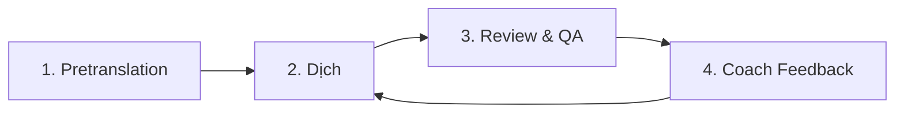

# 🔄 Pipeline Coach Learning — Quy Trình Hoàn Chỉnh

## Tổng quan

Pipeline dịch có 4 giai đoạn, lặp lại để cải thiện dần:



---

## Bước 1: Chuẩn bị & Dịch lần đầu

```powershell
cd "D:\Converter by DrDuc"

# Quét entity/terminology từ source
python run_pretranslation.py

# Dịch 1 chương
python run_full_pipeline.py --chapter chapter-001

# Hoặc dịch tất cả
python run_full_pipeline.py --all
```

**Output:**
- `output/chapter-001.txt` — bản dịch sạch
- `drafts/chapter-001_draft.txt` — bản nháp có chú thích
- `reports/qa_report_chapter-001.json` — báo cáo QA

---

## Bước 2: Review bản dịch

Mở file `output/chapter-001.txt`, đọc và ghi nhận:
- Tên nhân vật sai/thiếu
- Địa danh chưa dịch
- Thuật ngữ cần khóa
- Phong cách dịch cần điều chỉnh

---

## Bước 3: Coach Feedback (Dạy pipeline)

### 3a. Thêm nhanh thuật ngữ

```powershell
# Khóa tên nhân vật
python run_coach_feedback.py --term "张陈" "Trương Trần" --lock
python run_coach_feedback.py --term "小白" "Tiểu Bạch" --lock

# Thêm phrase override (không khóa)  
python run_coach_feedback.py --term "水体" "thủy thể"
```

### 3b. Interactive — nhập feedback tự do

```powershell
python run_coach_feedback.py
```

Ví dụ các loại feedback:

| Nhập | Hiệu quả |
|---|---|
| `张陈 -> Trương Trần` | Khóa tên nhân vật |
| `金溪县 -> Kim Khê huyện` | Thêm phrase override |
| `Dịch tự nhiên hơn, bớt Hán Việt` | Đổi style → `modern_novel_adaptive` |
| `Rút gọn hơn, đỡ dài dòng` | Bật `compact_sentences` |
| `Đây là truyện kinh dị u ám` | Set genre=horror, tone=gloomy |

### 3c. Batch feedback từ file

Tạo file `feedback_batch.json`:
```json
[
  {"feedback": "张陈 -> Trương Trần", "source": "张陈", "preferred": "Trương Trần"},
  {"feedback": "Dịch thoáng hơn, tự nhiên hơn"},
  {"feedback": "小白 -> Tiểu Bạch", "source": "小白", "preferred": "Tiểu Bạch"}
]
```

```powershell
python run_coach_feedback.py --file feedback_batch.json
```

---

## Bước 4: Dịch lại (sau khi coach)

```powershell
# Dịch lại với learned terms mới (skip pretranslation vì entity không đổi)
python run_full_pipeline.py --chapter chapter-001 --skip-pretranslation
```

> Lặp lại **Bước 2 → 3 → 4** cho đến khi hài lòng với bản dịch.

---

## Dịch hàng loạt

```powershell
# Dịch nhiều chương
python run_full_pipeline.py --batch chapter-001 chapter-002 chapter-003

# Dịch tất cả
python run_full_pipeline.py --all

# Dịch lại tất cả (bỏ qua pretranslation)
python run_full_pipeline.py --all --skip-pretranslation
```

---

## File quan trọng

| File | Vai trò |
|---|---|
| `working/config/translation_config.json` | Cấu hình dịch (style, naturalization) |
| `working/config/learned_terms.json` | Thuật ngữ đã học (phrase + locked entity) |
| [working/config/terminology_suggestions.json](file:///d:/Converter%20by%20DrDuc/workspace_projects/New%20folder/working/config/terminology_suggestions.json) | Gợi ý thuật ngữ từ pretranslation |
| `working/entities/entities_suggested.json` | Entity quét được |
| `output/*.txt` | Bản dịch sạch |
| `reports/qa_report_*.json` | Báo cáo QA |

---

## Ví dụ quy trình hoàn chỉnh

```powershell
# === LẦN 1: Dịch thô ===
python run_full_pipeline.py --chapter chapter-001

# === REVIEW: Đọc output, phát hiện lỗi ===
# → Tên "张陈" chưa dịch, style quá cứng

# === COACH: Dạy pipeline ===
python run_coach_feedback.py --term "张陈" "Trương Trần" --lock
python run_coach_feedback.py --term "贾心" "Giả Tâm" --lock
python run_coach_feedback.py --term "萧蓝" "Tiêu Lam" --lock

# === LẦN 2: Dịch lại (pipeline đã học) ===
python run_full_pipeline.py --chapter chapter-001 --skip-pretranslation

# === REVIEW: Bản dịch cải thiện, thêm feedback style ===
python run_coach_feedback.py
# > Dịch thoáng hơn, tự nhiên hơn
# > done

# === LẦN 3: Dịch lại lần cuối ===
python run_full_pipeline.py --chapter chapter-001 --skip-pretranslation
# → Pipeline đã hoàn thiện qua 3 vòng coach!
```
