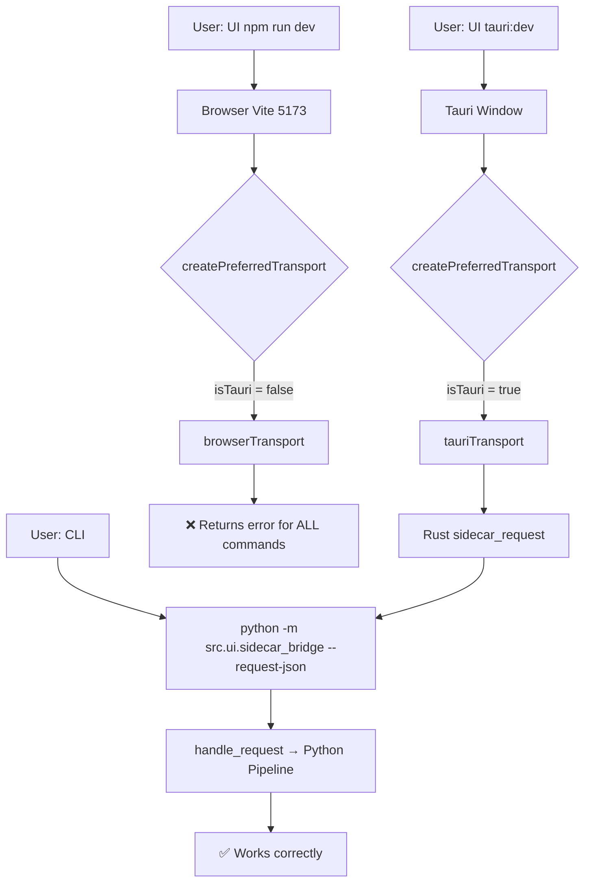

# Debug Report: Pipeline Works via Command but Fails via UI

## Root Cause

**Transport layer mismatch**: UI falls back to non-functional `browserTransport`.

### Architecture



### Verified Facts

| Check | Result |
|-------|--------|
| [list_projects](file:///d:/Converter%20by%20DrDuc/src/state/project_manager.py#116-126) via Python CLI | ✅ Returns 2 projects |
| [get_project_overview](file:///d:/Converter%20by%20DrDuc/src/state/project_manager.py#147-203) for `project-002` | ✅ 1672 chapters loaded |
| [translate](file:///d:/Converter%20by%20DrDuc/index.js#52-133) for `chapter-001` | ✅ 7 segments, correct Vietnamese output |
| `chapters_index.json` has [text](file:///d:/Converter%20by%20DrDuc/src/pipeline/pretranslation_pipeline.py#155-161) field | ✅ 3901 chars per chapter |
| Database ([project_state.db](file:///d:/Converter%20by%20DrDuc/workspace_projects/project-002/state/project_state.db)) | ✅ Schema OK, project record exists |
| Tauri binary (`target/release/*.exe`) | ❌ **NOT BUILT** |
| `npm run dev` transport mode | ❌ Falls back to `browserTransport` |

### The Problem Chain

1. User runs `npm run dev` → Vite starts on `localhost:5173`
2. [createPreferredTransport()](file:///d:/Converter%20by%20DrDuc/desktop/src/transport.ts#6-16) in [transport.ts](file:///d:/Converter%20by%20DrDuc/desktop/src/transport.ts) tries [createTauriTransport()](file:///d:/Converter%20by%20DrDuc/desktop/src/tauriTransport.ts#30-53) first
3. `isTauri()` returns `false` (not in Tauri webview)
4. Falls back to [createBrowserTransport()](file:///d:/Converter%20by%20DrDuc/desktop/src/browserTransport.ts#8-36) which [returns failure](file:///d:/Converter%20by%20DrDuc/desktop/src/browserTransport.ts#L8-L35) for every command:
   > "Browser preview does not have access to the Python sidecar."
5. UI shows the error → all operations appear broken

### Database State (`project-002`)

| Table | Rows | Note |
|-------|------|------|
| [projects](file:///d:/Converter%20by%20DrDuc/src/state/project_manager.py#116-126) | 1 | Project created correctly |
| [chapters](file:///d:/Converter%20by%20DrDuc/src/pipeline/pretranslation_pipeline.py#235-253) | 0 | Schema exists, never populated via DB (index in JSON) |
| [segments](file:///d:/Converter%20by%20DrDuc/src/state/project_manager.py#235-270) | 0 | No translations recorded |
| [candidate_entries](file:///d:/Converter%20by%20DrDuc/src/state/project_manager.py#328-370) | 0 | No candidates |
| `runtime_stats` | 0 | No stats |
| [active_chapter](file:///d:/Converter%20by%20DrDuc/src/state/project_manager.py#207-219) | `NULL` | Never set |

Yet `source/chapters/` has 1672 chapter files and `chapters_index.json` validated.

## Fix Options

### Option A: Run via Tauri (recommended)

```bash
cd d:\Converter by DrDuc\desktop
npm run tauri:dev
```

> [!WARNING]
> Requires Rust toolchain installed (`rustup`). First build may take 5+ minutes.

### Option B: Enable demo mode for UI testing

```bash
cd d:\Converter by DrDuc\desktop
set VITE_ENABLE_DEMO=1 && npm run dev
```

This activates [demoBackend.ts](file:///d:/Converter%20by%20DrDuc/desktop/src/demoBackend.ts) with mock data — useful for UI testing but no real pipeline.

### Option C: Add HTTP bridge (for browser mode with real backend)

Add a lightweight Python HTTP server that wraps [sidecar_bridge.py](file:///d:/Converter%20by%20DrDuc/src/ui/sidecar_bridge.py), then update [browserTransport.ts](file:///d:/Converter%20by%20DrDuc/desktop/src/browserTransport.ts) to call it instead of returning errors. This would allow `npm run dev` to work with real data.
