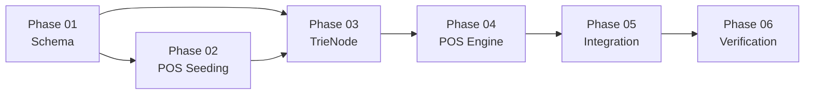

# Plan: Metadata-Enriched Dictionary Migration (Phase 09)

Created: 2026-04-22T14:46:00+07:00
Status: 🟡 In Progress

## Overview

Chuyển đổi 724,207 entries từ cấu trúc phẳng `source→target` sang schema metadata đa tầng với POS tags, morphology, entity types, và context-aware selection. Mục tiêu: thay thế 23 regex categories cứng trong `zh_structure_rewriter.py` bằng POS-driven rule engine có thể mở rộng tự động.

## Tech Stack
- **Database**: SQLite (giữ nguyên, mở rộng schema)
- **Engine**: Python TrieEngine + POSRewriteEngine (mới)
- **POS Source**: CC-CEDICT + heuristics + manual seed
- **Research**: NotebookLM ZH-VI Trans (34 sources)

## Key Research Findings (NotebookLM)

1. **VietPhrase.txt thiếu POS** → gốc rễ mọi vấn đề ngữ pháp
2. **Động từ ly hợp (离合词)** → cần `pos_sub=separable` (e.g. 生气, 毕业)
3. **Bổ ngữ 3 tầng** → Resultative + Potential + Directional cần `COMP` subtypes
4. **LuatNhan phá vỡ khi tách từ sai** → metadata giúp phân từ chính xác hơn

## Phases

| Phase | Name | Status | Tasks | Progress |
|-------|------|--------|-------|----------|
| 01 | Schema Design & Migration | ⬜ Pending | 6 | 0% |
| 02 | POS Auto-Seeding Pipeline | ⬜ Pending | 8 | 0% |
| 03 | TrieNode/TrieMatch Enhancement | ⬜ Pending | 5 | 0% |
| 04 | POS-Driven Rewrite Engine | ⬜ Pending | 7 | 0% |
| 05 | Integration & Legacy Migration | ⬜ Pending | 5 | 0% |
| 06 | Verification & Regression Testing | ⬜ Pending | 5 | 0% |

**Tổng:** 36 tasks | Ước tính: 4-6 sessions

## Dependency Graph

## Session Breakdown (Ước tính)

| Session | Phases | Mục tiêu |
|---------|--------|----------|
| S1 | 01 + 02 (Tầng 1-2) | Schema + hardcoded + category seeds |
| S2 | 02 (Tầng 3-4) + 03 | CC-CEDICT parse + TrieNode extension |
| S3 | 04 (R01-R06) | Rewrite engine core rules |
| S4 | 04 (R07-R11) + 05 | Remaining rules + RBMT integration |
| S5 | 05 + 06 | Fallback strategy + regression testing |

## Risk Matrix

| Risk | Impact | Likelihood | Mitigation |
|------|--------|------------|------------|
| POS đa nghĩa (好=ADJ/ADV) | Trung bình | Cao | Gán dominant POS + alternatives trong `pos_sub` |
| Performance drop khi thêm slots | Thấp | Thấp | `__slots__` vẫn O(1), benchmark sau Phase 03 |
| CC-CEDICT không cover hết VietPhrase | Trung bình | Cao | Tầng 4 Vietnamese heuristics bù đắp |
| Regression trên bản dịch hiện có | Cao | Trung bình | Dual-engine fallback; legacy giữ nguyên cho đến Phase 06 PASS |
| 721K bulk entries không thể tag manual | Cao | Chắc chắn | Chấp nhận NULL cho entries ít dùng; POS engine fallback khi NULL |

## Quick Commands
- Start Phase 1: `/code phase-01`
- Check progress: `/next`
- Save context: `/save-brain`

## Files Modified/Created

### Core Changes
- `src/core/md_dictionary_compiler.py` — Extended schema
- `src/core/trie_engine.py` — POS-aware TrieNode/TrieMatch
- `src/engine/pos_rewrite_engine.py` — **[NEW]** POS-driven rules
- `src/engine/rbmt_translator.py` — Integrate POS pipeline
- `src/tools/pos_seeder.py` — **[NEW]** Auto-POS seeding script
- `src/tools/cedict_parser.py` — **[NEW]** CC-CEDICT cross-ref
- `tests/test_pos_rewrite_engine.py` — **[NEW]** Rule tests
- `tests/test_pos_regression.py` — **[NEW]** Regression suite

### Dictionary Files
- `data/dictionaries/global/vietphrase/*.md` — +pos_tag column
- `data/dictionaries/_compiled/trie_cache.db` — Enhanced schema
- `data/external/cedict_ts.u8` — **[NEW]** CC-CEDICT data
