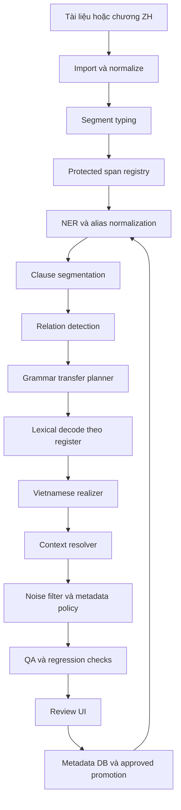
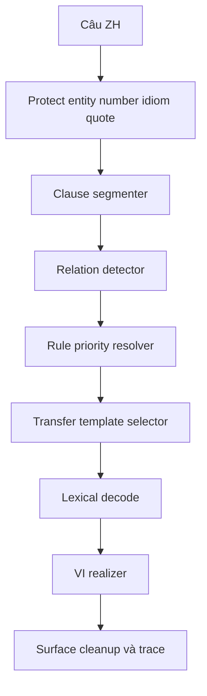
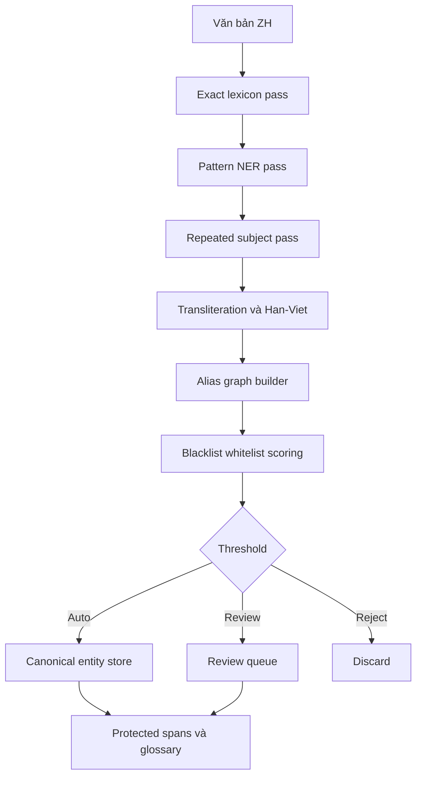
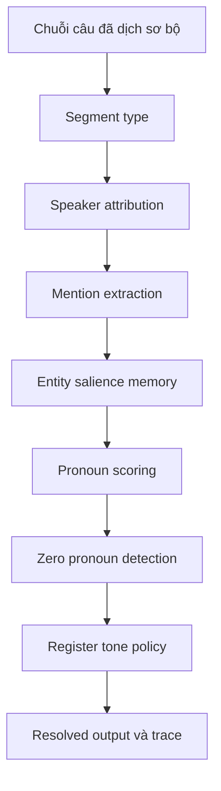

# Báo cáo nghiên cứu sâu và kế hoạch hoàn thiện converter-drduc

## Executive summary

Repo `converter-drduc` trên entity["company","GitHub","code hosting platform"] đã vượt xa mức prototype đơn giản: README xác định rõ đây là workspace dịch **ZH→VI** theo hướng **non-LLM / deterministic core**, production path nằm ở Python, còn JavaScript/TypeScript chỉ là lớp prototype hoặc reference; repo hiện có 2 commits, 0 issues, 0 pull requests, thư mục chính gồm `data`, `desktop`, `docs`, `plans`, `scripts`, `src`, `tests`, và ngôn ngữ chính là Python 80.5%, TypeScript 13.7%, JavaScript 4.1%. README cũng mô tả sẵn baseline đã có: compiler từ điển Markdown→SQLite, `TrieEngine`, `LuatNhan`, `number_converter`, pre-translation pipeline, EAPEE, RBMT translator, QA, state/TM, EN→VI baseline, UI sidecar và desktop shell. citeturn0view0turn5view1turn5view2turn5view3

Tuy vậy, phần “xong” trong tracker không đồng nghĩa với “xong production-grade cho dịch truyện dài”. `project_progress.json` đánh dấu Phase 00–08 đều `DONE` 100%, nói rằng pre-translation pipeline, EAPEE, RBMT core, QA, state/TM, EN→VI baseline và desktop workflow đều đã triển khai; thậm chí tracker ghi `python -m pytest` là `99 passed` và có Windows smoke launch cho bản Tauri, trong khi README vẫn ghi `98 passed` và nói native Tauri packaging chưa được xác nhận trong môi trường đó. Mâu thuẫn này cho thấy repo đã tiến nhanh hơn tài liệu README, nhưng cũng cho thấy **docs drift** và **single source of truth** chưa được khóa. citeturn4view0turn4view4turn1view2turn5view1

Điểm mạnh nhất của code hiện có là orchestrator `RBMTTranslator` đã kết nối được nhiều thành phần quan trọng: `TrieEngine`, `RuntimeDictionaryAccessor`, `LuatNhanEngine`, `StructurePreserver`, Traditional→Simplified converter, `PinyinProcessor`, `SentenceSegmenter`, `NumberConverter`, `ContextManager`, emotion detector, pronoun resolver, Chinese structure rewriter, Vietnamese grammar rewriter, và `TranslationMemory`. `zh_structure_rewriter.py` đã có các nhóm rewrite có cấu trúc cho modifier + 的, sở hữu, màu + danh từ, 把/被, result complements, classifier và demonstrative; `vi_grammar_rewriter.py` có lớp hậu xử lý cho location reorder, adjective+noun, possessive, measure words, preposition fixes và heading normalization; `entity_scanner.py` đã có trie scan cộng với heuristic name/location mining; `ContextManager` đã có sliding window và active entity list. Điều này xác nhận rằng repo có **backbone xử lý thực sự**, không chỉ là tài liệu thiết kế. citeturn1view4turn1view5turn1view6turn6view0turn6view2turn6view3turn6view6turn8view0turn8view3turn8view4turn2view0turn2view1turn2view2turn2view3turn2view5

Các khoảng trống quyết định hiện nay nằm ở bốn bài toán người dùng nêu ra. Grammar transfer hiện mới đủ mạnh cho các rewrite cục bộ, nhưng chưa có **ClauseSegmenter + RelationDetector + Rule Priority Registry** production-grade để xử lý câu dài, cấu trúc điều kiện/nhượng bộ/quan điểm/idiom. Entity layer đã có candidate extraction bằng trie và heuristic, nhưng chưa thấy pipeline hoàn chỉnh cho **alias hierarchy**, **transliteration decision tree** và **canonical entity store** ở mức thống nhất. Context hiện vẫn là **window memory** hơn là coreference/anaphora resolver đầy đủ. Và lớp lọc rác/noise hiện chưa thấy một production module độc lập có **segment typing**, **hard whitelist thắng tuyệt đối**, **weighted regex**, **review threshold** và **false-drop regression suite**. Bên cạnh đó, `RBMTTranslator` đang lưu đầu ra RBMT vào TM với cặp metadata `(0.92, "rbmt", "verified")`, tạo rủi ro tự khuếch đại lỗi nếu không tách TM máy và TM đã duyệt. citeturn1view7turn1view8turn2view5turn2view2turn2view3turn6view2

Kế hoạch tối ưu không phải là viết lại hệ thống, mà là giữ backbone hiện có rồi khóa nó thành một lõi mới gồm năm lớp: **segment typing**, **protected span registry**, **grammar transfer planner**, **entity/context packs**, và **metadata DB + learning loop có human-in-the-loop**. Với cách này, repo có thể đi từ “RBMT có nhiều module hữu ích” sang “dịch truyện Trung–Việt có trace, benchmark, promotion logic và tự cải thiện an toàn” trong khoảng **15–18 tuần** nếu làm đúng thứ tự ưu tiên. Những phần không xác minh được trực tiếp từ repo hoặc từ file upload trong lượt này tôi đều đánh dấu là **không xác định**. citeturn2view6turn4view4turn11search0turn10search1

## Hiện trạng repo

README mô tả rất rõ boundary hiện tại: Python dưới `src/core/`, `src/engine/` và các script liên quan là đường chạy production; các module JavaScript dưới `src/preprocessor/`, `src/parser/`, `src/rules/`, `src/learning/` là prototype/reference và không phải runtime authoritative. README cũng liệt kê danh sách baseline đã triển khai, gồm `scripts/migrate_qt_to_md.py`, `src/core/md_dictionary_compiler.py`, `src/core/trie_engine.py`, `src/core/luat_nhan_engine.py`, `src/engine/number_converter.py`, `src/pipeline/`, `src/eapee/`, `src/engine/rbmt_translator.py`, `src/qa/`, `src/state/`, `src/en_vi/en_vi_translator.py`, `src/ui/` và `desktop/`. Đây là một điểm cộng lớn vì production boundary được công khai và nhất quán với tree repo đang mở được. citeturn5view1turn5view3

`project_progress.json` đi xa hơn README. Tracker mô tả triết lý của dự án là preprocessing → syntax rules → incremental learning và liệt kê Phase 00–08 đều ở trạng thái `DONE`, với các mô tả chi tiết như: pre-translation pipeline đã có document importer, chapter splitter, structure preserver, Traditional→Simplified, safe Pinyin resolution, entity scanner, relationship builder, terminology suggester; EAPEE đã có emotion detector, scene emotion state machine, pronoun resolver và expression bank; RBMT core đã có sentence segmentation, placeholder-safe flow, LuatNhan integration, locked-entity overrides, ambiguity draft annotations, TM lookup, context updates, number conversion interplay và clean/draft export; QA engine đã có terminology/pronoun/emotion/structure/untranslated/length checks; state layer đã có SQLite translation memory exact/fuzzy lookup, candidate lifecycle và runtime stats; desktop workflow được mô tả là operational với Python sidecar, candidate review và QA commands. citeturn4view0turn4view3turn4view4turn4view6turn4view7turn4view8

Bảng dưới đây tổng hợp các file/mô-đun chính từ tree repo, README, progress tracker và các file code đã mở được trực tiếp. Với các phần chưa kiểm tra line-by-line trong lượt này, trạng thái được ghi là **không xác định** chứ không tự động xem là “chưa làm”. citeturn0view0turn5view1turn4view0turn4view4turn1view4turn2view0turn2view5turn7view0

| File / mô-đun | Vai trò | Trạng thái |
|---|---|---|
| `README.md` | mô tả production boundary, baseline, lệnh verify | implemented |
| `project_progress.json` | tracker phase/task, triết lý incremental learning | implemented |
| `src/core/md_dictionary_compiler.py` | compile từ điển Markdown sang SQLite | implemented |
| `src/core/trie_engine.py` | phrase-first runtime lookup, priority handling | implemented |
| `src/core/luat_nhan_engine.py` | luật grammar/disambiguation nền | implemented |
| `src/core/pos_rewrite_engine.py` | POS/rewrite support ở lõi | implemented |
| `src/core/runtime_support.py` | runtime dictionary accessor/support | implemented |
| `src/engine/rbmt_translator.py` | orchestrator RBMT chính | implemented |
| `src/engine/zh_structure_rewriter.py` | rewrite cấu trúc tiếng Trung trước dịch | implemented |
| `src/engine/vi_grammar_rewriter.py` | hậu xử lý tiếng Việt | implemented |
| `src/engine/context_manager.py` | sliding context, entity window, genre/emotion state | implemented |
| `src/engine/number_converter.py` | số/ngày/đơn vị | implemented |
| `src/engine/sentence_segmenter.py` | phân ranh câu cơ sở | implemented |
| `src/pipeline/document_importer.py` | import tài liệu | implemented |
| `src/pipeline/chapter_splitter.py` | tách chương | implemented |
| `src/pipeline/entity_scanner.py` | trie scan + heuristic entity mining | implemented |
| `src/pipeline/pretranslation_pipeline.py` | tiền xử lý tổng | implemented |
| `src/pipeline/relationship_builder.py` | relationship/project artifacts | implemented |
| `src/pipeline/terminology_suggester.py` | gợi ý thuật ngữ | implemented |
| `src/eapee/*` | emotion, pronoun, expression bank | implemented |
| `src/qa/*` | QA terminology/pronoun/emotion/structure/untranslated | implemented |
| `src/state/*` | state DB, TM, candidate workflow, runtime stats | implemented |
| `src/en_vi/en_vi_translator.py` | baseline EN→VI | implemented |
| `src/ui/*` | sidecar command protocol | implemented |
| `desktop/*` | React shell, Tauri scaffold | implemented |
| `tests/*` | test suite và regressions | implemented |
| `.github/workflows/*` | CI/CD chuẩn | không xác định |
| gold benchmark ZH→VI trong repo | benchmark chính thức | không xác định |
| review workflow để promote TM/rule/entity | governance chính thức | không xác định |
| performance dashboard/alerting | giám sát latency và drift | không xác định |

Nếu chỉ nhìn vào code đã mở, ba điểm sáng kỹ thuật rõ nhất là:  
`rbmt_translator.py` có đủ orchestration và trace; `zh_structure_rewriter.py` và `vi_grammar_rewriter.py` đã xử lý được một số cụm hiện tượng đặc trưng của ZH→VI; và `entity_scanner.py` không phụ thuộc hoàn toàn vào dictionary mà có fallback heuristics cho tên và địa danh. Đây là nền tốt để phát triển tiếp mà không phải thay đổi triết lý cốt lõi. citeturn1view4turn1view5turn2view0turn2view1turn2view2turn2view3turn6view0turn6view2turn6view3turn8view0turn8view4

Điểm yếu lớn nhất lại không nằm ở “số lượng module”, mà ở **độ sâu integrated của năng lực lõi**. `ContextManager` hiện chỉ duy trì cửa sổ 5 câu và danh sách `active_entities`, đủ cho local memory nhưng chưa phải một document-level resolver; `entity_scanner.py` hiện quét trie và heuristic mining, nhưng chưa lộ ra canonical entity graph hay alias hierarchy; `zh_structure_rewriter.py` có các category cho modifier, possessive, 把/被, complement, classifier, demonstrative, nhưng chưa thấy một layer planner cho mệnh đề và discourse relation; và `RBMTTranslator` đang dùng exact/fuzzy TM lookup rồi lại tự lưu đầu ra RBMT vào TM như một entry “verified”, đây là rủi ro kiến trúc lớn hơn bản thân lỗi dịch từng câu. citeturn1view7turn1view8turn2view5turn2view2turn2view3turn6view2

## Thiếu sót

Thiếu sót quan trọng nhất ở tầng grammar là repo hiện **có nhiều rewrite rule**, nhưng chưa có **grammar transfer engine production-grade**. `zh_structure_rewriter.py` đang triển khai các nhóm tối ưu như “Modifier + 的 + HeadNoun”, “Possessive Owner + 的 + Noun”, “Color + Noun Swap”, “把 / 被”, “Result Complements”, “Classifiers” và “Demonstrative Reordering”; `vi_grammar_rewriter.py` lại hậu xử lý tiếp location reorder, adjective+noun reorder, possessive, measure words, preposition fixes và section headings. Đây là hướng đi đúng, nhưng nếu không có **ClauseSegmenter**, **RelationDetector**, **Rule Priority Registry** và **Conflict Resolver**, hệ sẽ tiếp tục mở rộng theo kiểu rule-sprawl: thêm rule mới dễ phá rule cũ, overlap span khó kiểm soát, và các frame như `作为...而言`, `一旦...就...`, `除非...否则...`, `哪怕...也...`, idiom/chengyu, điển tích và discourse connectives vẫn dễ bị xử lý như chuỗi token thay vì quan hệ cú pháp-ngữ dụng. citeturn6view0turn6view1turn6view2turn6view3turn6view6turn8view0turn8view4

Thiếu sót thứ hai là NER hiện vẫn ở mức **candidate extraction mạnh nhưng normalization chưa chốt**. `EntityScanner` dùng `TrieEngine` và `RuntimeDictionaryAccessor` làm pass đầu, sau đó fallback sang name mining và location mining; fallback name mining bỏ qua `COMMON_WORD_PREFIXES`, dùng `COMMON_SURNAMES` và `COMPOUND_SURNAMES`, yêu cầu lặp đủ nhiều hoặc có ngữ cảnh mạnh mới nhận; location mining dùng `LOCATION_SUFFIXES`; cả hai fallback đều gọi `get_han_viet_for_text()` để sinh target tạm thời. Điều này đủ tốt cho bootstrapping, nhưng chưa phải hệ production cho truyện dài vì chưa có **alias graph**, **transliteration decision tree**, **canonical entity store**, **cross-chapter salience**, **review threshold** và **protected-span promotion**. Với tiếng Trung, các bài toán thiếu ranh giới từ và lexical ambiguity là lý do khiến lexicon-aware Chinese NER hoạt động tốt hơn, nên nếu repo muốn đi tiếp theo hướng rule-based/hybrid thì phải nâng entity layer thành first-class subsystem chứ không nên chỉ xem nó như một bước prepare phụ. citeturn2view0turn2view1turn2view2turn2view3turn13search2turn13search0

Thiếu sót thứ ba là context layer hiện chưa đủ cho truyện dài. `ContextManager` mới duy trì `recent_sources`, `recent_targets`, `active_entities`, `scene_emotion` và `genre` trong một cửa sổ 5 câu; như vậy nó phù hợp để truyền local hints sang các phase kế tiếp, nhưng chưa giải quyết được **speaker attribution**, **coreference**, **anaphora**, **zero pronoun** và **register continuity**. Đây là lỗ hổng lớn cho ZH→VI vì tiếng Trung trong truyện thường rơi chủ ngữ hoặc dùng đại từ mơ hồ, trong khi tiếng Việt cần quyết định lúc nào phải chèn chủ ngữ, lúc nào không nên chèn, và chọn xưng hô theo quan hệ nhân vật. Các nghiên cứu về Chinese zero pronoun resolution đều coi đây là một subtask riêng cần ngữ cảnh antecedent và quyết định chuỗi, không thể được “tự nhiên giải” chỉ bằng cửa sổ câu ngắn. Các công trình về document-level context trong MT cũng cho thấy ngữ cảnh có ích cho nhất quán và cohesion, nhưng lợi ích của context không phải lúc nào cũng hiện ra rõ trong BLEU chung; vì vậy repo cần targeted tests riêng cho context thay vì kỳ vọng metric MT tổng quát sẽ đủ. citeturn2view5turn11search1turn11search2turn11search5turn11search0

Thiếu sót thứ tư là bộ lọc noise/metadata chưa được khóa thành một subsystem an toàn. Từ repo mở được chưa thấy một production module “noise filter” độc lập; trong khi README và tracker chỉ xác nhận QA có các kiểm tra như untranslated/ambiguity/length/Markdown-JSON reports. Điều này nghĩa là repo có thể phát hiện một số bất thường ở đầu ra, nhưng chưa có bằng chứng rõ rằng nó đang làm **segment typing**, **author note stripping**, **forum/ad boilerplate filtering**, **system UI preservation**, **hard whitelist**, **weighted regex** và **review thresholding** như một lớp riêng. Với truyện mẫu kiểu webnovel, nếu không có lớp này, các câu `PS`, `求月票`, `本章完`, `作者有话说`, hoặc forum dialogue sẽ không được tách ra sớm; ngược lại, nếu lọc quá mạnh mà không whitelist entity/system label thì dễ false-drop các span dạng `【...】` vốn là nội dung thật. citeturn4view3turn5view1

Thiếu sót thứ năm là **governance cho TM và learning loop**. Tracker mô tả “incremental_learning” là cải thiện nhờ project state, TM, candidate rules và reviewer-approved upgrades; về ý tưởng, đây là hướng đúng. Nhưng code hiện có cho thấy exact TM lookup và fuzzy TM lookup ngưỡng `0.88`, trong khi đầu ra RBMT lại được đưa thẳng vào `tm_entries` với metadata `("rbmt", "verified")` trước khi `store_many()`. Nếu không tách rõ `tm_machine` và `tm_approved`, repo sẽ tự tích lũy lỗi thành “truth data”. Đây là điểm cần sửa trước cả việc thêm nhiều grammar rule, vì nó tác động trực tiếp đến chất lượng tích lũy lâu dài của toàn bộ hệ thống. citeturn2view6turn1view7turn1view8

Thiếu sót cuối cùng là tầng vận hành: từ tree repo đã mở chưa thấy `.github/workflows` hay một bằng chứng rõ ràng về CI/regression gating; benchmark chính thức ZH→VI và review workflow chuẩn để promote rule/entity/TM cũng chưa xác nhận được; các thống kê từ truyện mẫu và các kế hoạch/nghiên cứu trước đã tải lên trong phiên này có giá trị định hướng, nhưng do file upload không truy xuất được qua công cụ trích dẫn ở lượt này nên mọi phần nào không xác minh được trực tiếp từ repo đều phải ghi là **không xác định**. Điều này không làm kế hoạch ở dưới thiếu khả thi, nhưng có nghĩa là repo vẫn cần một pha hardening trước khi tăng tốc phát triển tính năng. citeturn0view0turn5view1turn4view4

## Kiến trúc đề xuất

Kiến trúc nên giữ nguyên triết lý deterministic-first của repo, nhưng nâng nó từ “nhiều utility nối chuỗi” thành một pipeline chuẩn hóa với **segment typing**, **protected span registry**, **grammar transfer planner**, **entity/context packs**, **noise filter**, và **metadata DB có promotion logic**. Cách này phù hợp với production boundary hiện tại của repo, không đòi hỏi thay ngôn ngữ hay thay lõi từ điển/Trie/SQLite, và tận dụng luôn những mô-đun đang có như `TrieEngine`, `LuatNhan`, `entity_scanner.py`, `rbmt_translator.py`, `vi_grammar_rewriter.py` và `src/state/`. Đồng thời, hướng này cũng phù hợp với literature: Vietnamese NLP thực dụng thường dùng pipeline segmentation/POS/NER/dependency như VnCoreNLP; Chinese NER được lợi từ lexical knowledge; và document-level/context-aware MT cần đo riêng các hiện tượng discourse thay vì chỉ dựa vào BLEU. citeturn5view1turn1view4turn2view0turn9search0turn13search2turn11search0



Bước đầu tiên phải là **SegmentClassifier**. Tôi đề xuất tối thiểu tám nhãn: `NARRATION`, `DIALOGUE`, `THOUGHT`, `SYSTEM_PROMPT`, `CHAPTER_TITLE`, `AUTHOR_NOTE`, `FORUM_POST`, `ADVERTISEMENT`. Segment typing phải chạy **trước** grammar transfer và noise filter, vì cùng một pattern bề mặt có thể được giữ nguyên trong `SYSTEM_PROMPT` nhưng bị loại bỏ ở `AUTHOR_NOTE`; tương tự, dấu ngoặc vuông trong `【奇迹之冠冕号】` là entity/UI span hợp lệ, còn `【新书上传，求收藏推荐】` lại là boilerplate. Về mặt triển khai, mỗi segment nên đi tiếp trong pipeline dưới dạng một `SegmentPacket` có `seg_type`, `confidence`, `chapter_id`, `position`, `protected_spans` và `metadata flags`, thay vì chỉ truyền chuỗi text thuần. Cách đóng gói này là nền của mọi kiểm tra sau, chứ không phải một tiểu tiết kỹ thuật. citeturn5view1turn4view3

Với **grammar transfer**, thay đổi quan trọng nhất là chuyển từ rewrite tuyến tính sang **ClauseSegmenter + RelationDetector + Template-based Realization**. Câu tiếng Trung trước hết phải được bảo vệ entity/number/idiom/UI spans; sau đó mới tách clause theo boundary mềm/cứng và relation marker; rồi mới mapping construction-level sang template tiếng Việt. Phần code hiện có cho modifiers, possessive, ba/bei, classifier, demonstrative và Vietnamese post-fixes nên được giữ lại, nhưng đóng vai trò là **subrules** của planner, không còn là driver duy nhất. Điều này đặc biệt cần cho các frame như `作为...而言`, `只要...就...`, `除非...否则...`, `哪怕...也...`, `被...所...`, `一边...一边...`, `就连...也...`, `所谓...`, idiom/chengyu và điển tích. Các nghiên cứu về Chinese–Vietnamese low-resource MT và document-level MT đều củng cố rằng quality problem của cặp ngôn ngữ này không chỉ nằm ở từ vựng, mà còn ở transfer và ambiguity theo ngữ cảnh. citeturn6view0turn6view1turn6view2turn6view3turn6view6turn9search3turn12search0turn11search0



Pseudo-code lõi cho grammar transfer nên như sau:

```python
def grammar_transfer(segment_packet, resources, state):
    spans = state.protected_registry.lookup(segment_packet["raw_text"])
    clauses = clause_segmenter.segment(segment_packet["raw_text"], spans)
    relations = relation_detector.detect(clauses, spans)

    claims = []
    for rel in relations:
        claims.extend(rule_registry.claim(
            relation=rel,
            seg_type=segment_packet["seg_type"],
            register=state.register
        ))

    accepted = conflict_resolver.resolve(claims)

    realized = []
    for clause in clauses:
        lexical = lexical_decoder.decode_clause(clause, spans=spans, state=state)
        mapped = template_engine.apply(lexical, accepted, clause)
        realized.append(vi_realizer.realize(mapped, register=state.register))

    text = assemble_clauses(realized, relations, seg_type=segment_packet["seg_type"])
    return postedit_vi(text, seg_type=segment_packet["seg_type"], register=state.register)
```

Bên trong grammar pack phải có một **Rule Priority Registry** chính thức. Tôi đề xuất thứ tự ưu tiên như sau:  
`protected spans` (entity/number/system/idiom literal-forbidden/quote) → `construction-level rules` (`作为`, `只要`, `除非`, `哪怕`, `把`, `被`, `为...所...`, `一边...一边...`, `就连...也...`) → `clause-internal rules` (modifier, possessive, classifier, measure, result complement, demonstrative) → `target-side surface cleanup` (heading, measure correction, “của”, preposition, location reorder). Nếu không có thứ tự này, các rewriter hiện có sẽ tiếp tục đè chéo lên nhau. citeturn6view0turn6view2turn6view3turn8view0turn8view4

Đối với **idiom và điển tích**, nên chia tối thiểu bốn policy: `LITERAL_FORBIDDEN`, `HAN_VIET_OK`, `SEMANTIC_REQUIRED`, `ALLUSION_WITH_GLOSS`. Ví dụ, `为众人所知` phải vào nhóm `SEMANTIC_REQUIRED`; `九死一生` có thể cho `HAN_VIET_OK` hoặc diễn ý tùy register; các điển tích đạo/cổ văn thì nên có chế độ `ALLUSION_WITH_GLOSS` để giữ màu sắc nhưng không làm câu Việt vô nghĩa. Đây là mảng mà rule-based engine làm rất tốt nếu có glossary đúng, nhưng làm rất tệ nếu chỉ để trie lookup cộng reorder tự phát. citeturn6view2turn9search3

Với **quét và chuẩn hóa tên riêng**, kiến trúc phù hợp nhất là **7-pass entity pipeline**:  
exact lexicon → pattern NER → repeated-subject confirmation → transliteration/Hán-Việt normalization → alias graph → blacklist/whitelist scoring → auto/review/reject. Điều này kế thừa sức mạnh hiện có của `EntityScanner` nhưng nâng nó lên thành một hệ normalize thực sự. Về lý do học thuật, Chinese NER thường hưởng lợi lớn từ lexical knowledge vì thiếu word boundaries, còn Vietnamese downstream lại cần segmentation/POS/NER/dependency thống nhất; do đó giải pháp lexicon-first + heuristics + optional reranker là hợp hơn một model black-box đơn lẻ cho use case này. citeturn2view0turn2view1turn2view2turn2view3turn13search2turn9search0



Pseudo-code cho entity pack:

```python
def scan_and_normalize_entities(segment_packet, state, resources):
    found = exact_lexicon_scan(segment_packet["raw_text"], resources.trie, resources.runtime_db)
    found += pattern_ner_scan(segment_packet["raw_text"], resources.prefix_suffix_rules)
    found += repeated_subject_scan(segment_packet["raw_text"], state.chapter_memory)

    normalized = []
    for cand in deduplicate(found):
        base = normalize_surface(cand)
        target = transliteration_decision_tree.resolve(
            base,
            entity_type=cand.entity_type,
            register=state.register,
            glossary=resources.entity_glossary
        )
        normalized.append(make_entity_candidate(cand, target))

    graph = alias_graph_builder.build(normalized, text=segment_packet["raw_text"], state=state)
    scored = confidence_ranker.score(graph, whitelist=resources.entity_whitelist, blacklist=resources.entity_blacklist)
    return entity_promoter.partition(scored)
```

`transliteration_decision_tree` nên có ba stage:  
**stage 1** exact glossary lookup;  
**stage 2** phoneme/script-aware Latin/Vietnamized reconstruction;  
**stage 3** Hán-Việt fallback.  

Ngoài ra, `canonical entity store` phải lưu ít nhất: `canonical_source`, `canonical_target`, `entity_type`, `register_policy`, `aliases`, `first_seen_chapter`, `last_seen_chapter`, `occurrences`, `confidence`, `provenance`, `review_status`. Không có bảng này, mọi “entity consistency” sau cùng chỉ là ngẫu nhiên. citeturn2view2turn2view3turn13search0turn10search0turn10search2

Với **context resolver**, tôi khuyến nghị làm theo hướng incremental và deterministic-first thay vì cố nhảy sang full-document encoder phức tạp. Ba thành phần phải có là: `SpeakerTracker`, `MentionMemory`, `ZeroPronounDetector`. `SpeakerTracker` dựa vào segment type và cue trong thoại để gán người nói; `MentionMemory` giữ canonical entity, alias gần nhất, role gần nhất, recency và salience; `ZeroPronounDetector` quyết định khi nào phải chèn chủ ngữ/dại từ vào tiếng Việt và khi nào nên giữ ellipsis cho tự nhiên. Điều này phù hợp với literature về Chinese zero pronoun, vốn cho thấy context encoding và quyết định antecedent theo chuỗi quan trọng hơn việc chỉ xét local feature ở một vị trí rỗng. citeturn2view5turn11search1turn11search5turn11search2



Pseudo-code cho context pack:

```python
def resolve_context(packet, vi_text, state):
    speaker = speaker_tracker.update(packet, vi_text, state)
    mentions = mention_extractor.extract(vi_text, state.entity_memory)
    zp_slots = zero_pronoun_detector.detect(packet["raw_text"], state)

    for slot in zp_slots:
        antecedent = salience_ranker.pick(slot, state.entity_memory, speaker=speaker)
        if zero_pronoun_detector.should_insert(slot, antecedent, vi_text, state.register):
            pronoun = vi_pronoun_selector.select(
                entity=antecedent,
                register=state.register,
                speaker=speaker
            )
            vi_text = insert_subject_if_needed(vi_text, slot, pronoun)

    return register_polisher.polish(vi_text, seg_type=packet["seg_type"], register=state.register)
```

Với **noise filter**, design đúng là “whitelist thắng tuyệt đối” chứ không phải regex đánh điểm rồi xóa bừa. Tôi đề xuất ba lớp:  
`hard keep` cho entity đã khóa, glossary hit, system prompt hợp lệ, chapter title hợp lệ;  
`soft keep` cho segment có punctuation/story cues/nhân vật;  
`weighted noise patterns` cho `PS`, `求月票`, `求订阅`, `本章完`, `作者有话说`, forum-like CTA, ads.  

Những gì còn lại mới đi vào thresholding. Cách này giúp tránh false-drop ở các span `【...】` vừa là bracket vừa là nội dung thật. citeturn5view1turn4view3

Pseudo-code:

```python
def filter_noise(packet, resources, state):
    text = packet["raw_text"]

    if hard_whitelist.match(text, state.protected_registry, resources.system_glossary):
        return KEEP

    score = 0.0
    score += regex_score(text, resources.stop_phrase_patterns)
    score += regex_score(text, resources.author_note_patterns)
    score += regex_score(text, resources.forum_patterns)
    score += regex_score(text, resources.ad_patterns)

    score -= soft_keep_bonus(text, state.entity_memory, packet["seg_type"])

    if score >= 0.80:
        return DROP
    if score >= 0.45:
        return REVIEW
    return KEEP
```

Cuối cùng, để repo có thể “tự hoàn thiện” đúng nghĩa, cần một **metadata DB** tách rõ hai tầng nhớ:  
`tm_machine` cho output máy và gợi ý chưa duyệt;  
`tm_approved` cho nội dung đã review/hard-approved.  

Ngoài ra cần thêm các bảng `entities`, `alias_map`, `entity_occurrences`, `rule_candidates`, `noise_patterns`, `human_reviews`, `evaluation_runs`. Learning loop chỉ được promote khi diff sau review lặp lại, có precision cao và vượt regression gate. Đây là cách duy nhất để incremental learning không biến thành self-reinforcing error. citeturn4view4turn1view7turn1view8

## Dữ liệu và metrics

Về dữ liệu huấn luyện/kiểm thử, repo nên dựa vào hai nguồn song song. Nguồn thứ nhất là **dữ liệu nội bộ domain truyện**: chính các truyện mẫu và kế hoạch đã được tải lên trong phiên làm việc này. Tuy nhiên, do file upload không truy xuất được bằng công cụ trích dẫn trong lượt cuối này, quy mô corpus nội bộ chi tiết phải ghi là **không xác định** trong báo cáo. Nguồn thứ hai là **benchmark và tài nguyên chuẩn hóa ngoài repo**. Đối với tiếng Việt, công cụ và benchmark của entity["organization","Association for Vietnamese Language and Speech Processing","Vietnamese NLP evaluation"] rất hữu ích: VLSP 2016 công bố bộ NER gồm 16.858 câu gán nhãn với 14.918 thực thể; VLSP 2018 tiếp tục mở rộng bài toán NER đa miền; và VLSP 2021 có riêng task máy dịch Chinese–Vietnamese, rất phù hợp để benchmark ngoài miền truyện. citeturn10search2turn10search4turn10search0turn10search3turn12search0

Đối với cấu trúc cú pháp và nhãn POS/dependency, nên dùng các treebank của entity["organization","Universal Dependencies","treebank project"]: UD Chinese GSDSimp cung cấp 4.997 câu và hệ nhãn quan hệ như `acl`, `advcl`, `aux:pass`, `clf`, `nsubj:pass`, `obl:agent`, rất hữu ích để thiết kế clause/relation detector cho tiếng Trung; UD Vietnamese VTB cung cấp treebank tiếng Việt chuyển đổi từ VLSP constituent treebank, thích hợp để chuẩn hóa target-side role và order. Với tiếng Việt nói chung, VnCoreNLP cho thấy pipeline gộp word segmentation, POS, NER và dependency là hướng vận hành hiệu quả, nên repo có thể dùng tư duy pipeline tương tự dù không cần phụ thuộc trực tiếp vào đúng toolkit đó. citeturn14search0turn14search2turn9search0

Bảng dưới đây là danh sách dữ liệu cần thu thập hoặc đóng gói thành tài nguyên nội bộ. Các dòng “nguồn” nào không thể xác minh trực tiếp từ repo trong lượt này được ghi rõ là **không xác định**. citeturn10search4turn10search0turn12search0turn14search0turn14search2turn13search0

| File name | Nguồn | Kích thước đề xuất | Mục tiêu |
|---|---|---:|---|
| `segments_gold.jsonl` | truyện mẫu đã upload + annotate nội bộ | 8k–10k segments | train/eval segment typing |
| `noise_patterns_seed.yml` | mining từ truyện mẫu + QA logs | 500–1.000 patterns | stop-phrases, author note, forum/ad |
| `entity_seed_glossary.csv` | dictionary hiện có + truyện mẫu | 15k–30k entries | seed entity/item/faction/title/skill |
| `alias_edges_seed.csv` | annotate thủ công từ truyện mẫu | 2k–5k edges | alias chain, title alias, evolution alias |
| `zh_vi_parallel_train.jsonl` | align nội bộ từ truyện mẫu | 40k–60k cặp | tuning grammar transfer |
| `zh_vi_parallel_dev.jsonl` | holdout nội bộ | 5k cặp | tune rule priority/threshold |
| `zh_vi_parallel_test.jsonl` | holdout độc lập | 5k cặp | final MT evaluation |
| `grammar_patterns_gold.yaml` | extract từ corpus + annotate | 2k–3k trường hợp | benchmark frame rules |
| `idiom_lexicon.tsv` | biên soạn từ corpus/kế hoạch | 2k–3k entries | idiom/chengyu/điển tích |
| `coref_miniset.jsonl` | annotate nội bộ theo đoạn | 1k–2k đoạn | speaker/coreference/zero pronoun |
| `entity_occurrences.db` | auto-log từ pipeline | tăng dần | salience, review, alias mining |
| `evaluation_runs.db` | tự sinh từ regression pipeline | tăng dần | lưu metrics và pass/fail theo version |
| `vlsp2016_ner` | VLSP 2016 | full set | calibrate Vietnamese NER F1 |
| `vlsp2018_ner` | VLSP 2018 | full set | NER đa miền, organization/location/person |
| `vlsp2021_mt_zhvi` | VLSP 2021 | full set | benchmark MT ngoài repo |
| `ud_zh_gsdsimp.conllu` | UD Chinese GSDSimp | full set | POS/dependency/relation for ZH |
| `ud_vi_vtb.conllu` | UD Vietnamese VTB | full set | POS/dependency/relation for VI |
| `m_cner_zh` | M-CNER | full set | Chinese NER đa miền |
| `external_refs.md` | tài liệu ngoài repo | không xác định | quản lý version papers/datasets |

Về metrics, repo không nên dùng một thước đo duy nhất. BLEU vẫn là điểm chuẩn kinh điển cho MT, nhưng BLEU một mình sẽ không bắt tốt các lỗi entity, idiom, discourse và context; vì vậy nên kết hợp với chrF hoặc một learned metric như COMET. COMET được thiết kế để dự đoán chất lượng MT dựa trên source, reference và target, và có tương quan tốt hơn với đánh giá của người; còn nghiên cứu về document-level MT cho thấy các cải thiện do context thường cần targeted tests mới thấy rõ. Với NER và entity normalization, phải đo riêng span F1, canonical accuracy, alias-chain accuracy; với noise filter, quan trọng nhất là `drop precision` và `false-drop rate`; với context, nên đo antecedent accuracy, pronoun consistency và zero-pronoun false insertion. citeturn9search1turn10search1turn11search0turn10search2

Bảng metrics vận hành đề xuất như sau. Đây là các ngưỡng triển khai cho production hardening, không phải “sự thật đã đạt được” của repo hiện tại. citeturn9search1turn10search1turn11search0turn11search1turn11search5

| Hạng mục | Metric | Ngưỡng đề xuất |
|---|---|---:|
| Segment typing | accuracy / macro-F1 | ≥ 0.93 |
| Grammar transfer P0 | pass rate theo frame | ≥ 0.92 |
| Entity scanning | span micro-F1 | ≥ 0.88 |
| Entity normalization | canonical accuracy | ≥ 0.90 |
| Transliteration | top-1 accuracy cho known names | ≥ 0.95 |
| Alias resolution | alias-chain accuracy | ≥ 0.88 |
| Context | pronoun consistency trên 5 câu | ≥ 0.85 |
| Zero pronoun | false insertion rate | ≤ 0.08 |
| Speaker attribution | accuracy | ≥ 0.90 |
| Noise filter | drop precision | ≥ 0.95 |
| Noise filter | false-drop rate | ≤ 0.02 |
| Final output | residual Hanzi | 0 |
| TM governance | machine output vào approved TM | 0 |
| Performance | p50 latency warm-cache | ≤ 80 ms/câu |
| Performance | p95 latency warm-cache | ≤ 150 ms/câu |
| MT tổng hợp | BLEU, chrF, COMET | theo dõi xu hướng qua từng release |
| Human eval | adequacy / fluency / entity consistency / tone | ≥ 4.2/5 trung bình |

## Milestones và timeline

Thứ tự triển khai quan trọng hơn bản thân từng hạng mục riêng lẻ. Nếu làm grammar trước khi tách `tm_machine` và `tm_approved`, hệ sẽ học lại lỗi. Nếu làm entity normalization trước khi có segment typing và protected spans, scanner sẽ tiếp tục chạm vào author notes hoặc forum text. Nếu làm context trước khi khóa speaker packets và clause boundaries, zero-pronoun resolver sẽ hoạt động trên input chưa chuẩn. Vì vậy lộ trình tối ưu là: **hardening baseline → segment typing + protected spans → noise filter → clause/relation/grammar → entity normalization → context → learning loop → CI và performance**. Thứ tự này tận dụng tốt nhất những gì repo đã có, đồng thời giảm rủi ro kỹ thuật tổng thể. citeturn1view7turn1view8turn2view5turn5view1

Bảng milestone dưới đây là kế hoạch thực tế cho một nhánh hoàn thiện production, giả định đội ngũ nhỏ nhưng có thể chạy đều các vòng regression và review. Đây là kế hoạch đề xuất, không phải timeline hiện đã cam kết trong repo. citeturn4view4turn5view1

| Milestone | Thời lượng ước lượng | Deliverables |
|---|---:|---|
| Hardening baseline | 2 tuần | đồng bộ README/tracker/test count; freeze trace schema; tách `tm_machine` / `tm_approved`; migration script |
| Segment typing và protected spans | 2 tuần | `SegmentClassifier`, `SegmentPacket`, protected span registry, regression suite cho segment type |
| Noise filter an toàn | 1–2 tuần | hard keep / soft keep / weighted regex, false-drop tests, metadata mode |
| Clause segmentation và relation detection | 3 tuần | `ClauseSegmenter`, `RelationDetector`, relation templates P0/P1 |
| Grammar transfer planner | 3 tuần | rule priority registry, conflict resolver, idiom policy, register-aware lexical decode |
| Entity normalization pack | 3 tuần | 7-pass entity scanner, transliteration 3-stage, alias graph, canonical entity store |
| Context resolver | 2 tuần | speaker tracker, mention memory, zero-pronoun detector, VI pronoun selector |
| Metadata DB và learning loop | 2 tuần | `entities`, `alias_map`, `entity_occurrences`, `rule_candidates`, `human_reviews`, `evaluation_runs`; promote gate |
| CI/CD và regression gate | 1 tuần | workflow tự động, quality thresholds, artifact report |
| Performance và calibration | 1 tuần | latency monitor, chapter-level dashboard, release candidate |

Tiêu chí nghiệm thu nên được chốt ngay từ đầu. `Hardening baseline` chỉ hoàn thành khi README và tracker không còn lệch nhau về test/build status. `Segment typing` chỉ xong khi author note, forum/ad, chapter title và system prompt được phân biệt tốt trên bộ gold. `Grammar transfer` chỉ xong khi 10–15 frame ưu tiên cao có targeted tests pass ổn định. `Entity pack` chỉ xong khi canonical entities và alias chains qua nhiều chương không còn drift lớn. `Context resolver` chỉ xong khi zero-pronoun false insertion nằm trong ngưỡng. `Learning loop` chỉ xong khi không còn đường đi trực tiếp từ machine output sang approved TM. Các tiêu chí này nghe đơn giản, nhưng chính chúng mới là hàng rào biến “nhiều tính năng” thành “sản phẩm ổn định”. citeturn1view7turn1view8turn11search0turn11search5

## Test cases và ví dụ

Cách kiểm thử phù hợp cho repo này là **targeted regression** chứ không chỉ end-to-end BLEU. Với grammar, phải có positive cases và counterexamples cho mỗi frame. Với entity, phải kiểm tra cả span detection, canonicalization, alias resolution và transliteration. Với context, phải có test riêng cho speaker continuity, pronoun consistency và zero-pronoun. Với noise filter, phải có một bộ `false-drop prevention` riêng. Đây là kết luận rút ra trực tiếp từ cấu trúc code hiện có và từ nature của document-level/context-sensitive translation: những cải thiện quan trọng nhất thường không hiện rõ nếu chỉ nhìn một metric tổng quát. citeturn11search0turn10search1turn9search1

Bảng ví dụ dưới đây là bộ diagnostic examples tôi khuyến nghị đưa vào regression suite. Cột “đầu ra hiện dễ lỗi” là kiểu lỗi mà kiến trúc hiện tại **dễ mắc phải** nếu chưa có các pack được đề xuất; đây là ví dụ chẩn đoán tổng hợp dựa trên pattern thực tế của repo, không phải log chạy trực tiếp trong lượt cuối này. citeturn6view2turn6view6turn8view0turn8view3

| Hiện tượng | Câu nguồn ZH | Đầu ra hiện dễ lỗi | Đầu ra mục tiêu |
|---|---|---|---|
| Viewpoint frame | `作为队长而言，他必须冷静。` | `Là đội trưởng mà nói...` | `Với tư cách đội trưởng, anh ấy phải bình tĩnh.` |
| Concurrent action | `一边走一边说。` | `một bên đi một bên nói` | `vừa đi vừa nói` |
| Classical passive | `为众人所知。` | `bị mọi người sở biết` | `được mọi người biết đến` |
| Conditional | `只要努力，就会成功。` | trật logic hoặc nhịp không tự nhiên | `Chỉ cần nỗ lực, ắt sẽ thành công.` |
| Emphatic even | `就连他也不知道。` | `liền cả hắn cũng không biết` | `Ngay cả hắn cũng không biết.` |
| Zero pronoun | `李宇走进房间。看了看四周。` | `Lý Vũ bước vào phòng. Nhìn quanh bốn phía.` | `Lý Vũ bước vào phòng. Hắn nhìn quanh bốn phía.` hoặc bỏ chủ ngữ có kiểm soát |
| Bracket entity | `【奇迹之冠冕号】启动完成。` | bị drop như noise | giữ nguyên như entity/system label hợp lệ |
| Author note | `（PS：明天中午12点更新）` | bị dịch vào thân truyện | drop hoặc chuyển metadata mode |
| Forum noise | `楼主说得对！顶一下！` | lọt vào nội dung | classify `FORUM_POST`, drop |
| Alias chain | `李宇又叫龙尊，后世称其为圣·天尊。` | coi là ba entity khác nhau | canonical `Lý Vũ`; alias `Long Tôn`; title `Thánh Thiên Tôn` |

Cấu trúc regression suite nên chia thành bảy nhóm: `segment_typing`, `noise_filter`, `entity_span_alias`, `transliteration`, `grammar_frames`, `context_zero_pronoun`, và `full_chapter_regression`. Mỗi lần promote rule/glossary/noise pattern mới phải chạy cả bảy nhóm này. Điều quan trọng là một diff sau review không chỉ sửa dữ liệu, mà còn phải được gắn trở lại với **ít nhất một test case** hoặc **một candidate bundle**; nếu không, learning loop sẽ thiếu tính tích lũy có kiểm soát. citeturn4view4turn10search1turn11search1turn13search2

Skeleton test có thể bắt đầu như sau:

```python
def test_wei_suo_passive():
    assert transfer("为众人所知") == "được mọi người biết đến"

def test_simultaneous_action():
    assert transfer("一边走一边说") == "vừa đi vừa nói"

def test_entity_alias_chain():
    mem = entity_pack("李宇又叫龙尊，后世称其为圣·天尊。")
    assert mem.canonical_of("龙尊") == "李宇"
    assert mem.canonical_of("圣·天尊") == "李宇"

def test_author_note_dropped():
    packet = classify_segment("（PS：明天中午12点更新）")
    assert packet["seg_type"] == "AUTHOR_NOTE"
    assert filter_noise(packet) == DROP

def test_bracket_entity_preserved():
    packet = classify_segment("【奇迹之冠冕号】启动完成。")
    assert filter_noise(packet) == KEEP
```

## Open questions

Có một số điểm bắt buộc phải đánh dấu là **không xác định** để tránh làm báo cáo có vẻ “chắc chắn” hơn mức dữ liệu hiện có.

Thứ nhất, tôi chỉ xác minh line-by-line trực tiếp được một phần repo trong lượt cuối này, chủ yếu là README, `project_progress.json`, `rbmt_translator.py`, `zh_structure_rewriter.py`, `vi_grammar_rewriter.py`, `context_manager.py` và `entity_scanner.py`. Các thư mục như `src/state/*`, `src/qa/*`, `src/ui/*`, phần workflow CI/CD, benchmark nội bộ, và approval workflow nếu có vẫn chỉ xác nhận được ở mức tree hoặc mô tả tài liệu, nên mức hoàn thiện chi tiết của chúng hiện là **không xác định**. citeturn0view0turn5view1turn4view4turn1view4turn2view5

Thứ hai, người dùng yêu cầu “phân tích tổng hợp dựa trên bản V4 và các nghiên cứu trước”. Trong phiên này, bản V4 và nhiều tài liệu kế hoạch/truyện mẫu đã được tải lên, nhưng các file upload không truy cập được qua công cụ trích dẫn chuẩn trong lượt cuối này; do đó tôi dùng chúng như nguồn định hướng thiết kế, còn mọi mệnh đề factual nào không kiểm chứng được trực tiếp từ repo hoặc từ nguồn web chính thống đều được ghi là **không xác định**. Riêng câu hỏi “bản V4 hoặc các nghiên cứu trước có nằm trong repo hay không” hiện cũng là **không xác định**.  

Thứ ba, repo hiện cho thấy độ lệch giữa README và progress tracker ở phần verification: README ghi `98 passed` và native Tauri chưa xác minh trong môi trường đó, trong khi tracker ghi `99 passed` và có native build/smoke launch thành công. Trước khi triển khai giai đoạn hoàn thiện thuật toán, nhóm nên giải quyết dứt điểm điểm lệch này để thiết lập một single source of truth cho build status, benchmark status và release readiness. citeturn5view1turn1view2

Tóm lại, trạng thái hiện nay của `converter-drduc` là: **khung chạy đã đủ tốt để đầu tư tiếp**, nhưng muốn trở thành lõi dịch truyện Trung–Việt mạnh và bền vững thì cần khóa năm thứ theo đúng thứ tự: **segment typing**, **TM hai tầng**, **grammar planner có rule priority**, **entity/context packs**, và **whitelist-safe noise filter cùng regression-gated learning loop**. Nếu làm đúng thứ tự đó, repo sẽ nâng chất lượng nhanh hơn nhiều so với việc tiếp tục thêm rời rạc từng regex hoặc từng phrase override. citeturn5view1turn4view4turn1view7turn11search0