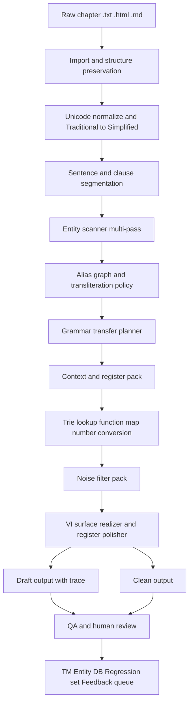
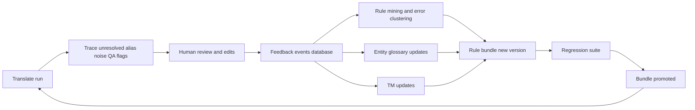

# Nghiên cứu sâu repo converter-drduc và kế hoạch hoàn thiện bộ dịch Trung Việt

## Tóm tắt điều hành

Repo `converter-drduc` trên entity["company","GitHub","code hosting company"] đang thể hiện khá rõ một hướng đi **deterministic / hybrid RBMT** cho dịch **ZH→VI**, có baseline **EN→VI**, lấy **Python** làm runtime sản xuất, còn các mô-đun **JavaScript/TypeScript** chủ yếu là lớp prototype hoặc reference. README công khai xác nhận các thành phần nền đã có gồm: migration từ điển, compiler Markdown→SQLite, Trie lookup, `LuatNhan`, bộ chuyển số/ngày/đơn vị, pipeline import–split–preserve–entity scan–config generation, khối emotion/pronoun, RBMT translator, QA, state/TM và desktop shell. Về trạng thái repo, hiện public repo có **2 commits**, **0 issues**, **0 pull requests**, **không có release**, và tỷ trọng ngôn ngữ là **Python 80.5%**, **TypeScript 13.7%**, **JavaScript 4.1%**, **CSS 1.1%**. citeturn29view0turn30view0

Nhưng khi đối chiếu với các kế hoạch đã upload, đặc biệt hai bản `Grammar v22.1` và `Grammar v22.2`, có thể thấy năng lực cốt lõi vẫn chưa “khóa” ở mức production-grade cho truyện dài. Các tài liệu này tiếp tục liệt kê gap ở **grammar transfer**, **entity scanner**, **transliteration**, **alias resolution**, **session persistence**, **data files**, **performance budget**, và **test suite 350+ cases**. Nói cách khác, repo hiện đã có **khung pipeline**, nhưng chưa có **capability hoàn thiện** cho bốn bài toán khó nhất mà bạn yêu cầu: chuyển đổi ngữ pháp Trung–Việt theo mệnh đề/ngữ dụng, nhận diện tên riêng và alias đa chương, xử lý ngữ cảnh level tài liệu, và bộ lọc cụm rác đầu-cuối. citeturn29view0turn30view0 fileciteturn0file5 fileciteturn0file3

Bộ truyện mẫu đã upload là một lợi thế rất mạnh. Chỉ từ các file đang có trong phiên này, có thể quan sát được một phổ register rất rộng: tiên hiệp có system panel như `【面板未开启】`, fantasy phương Tây với tên có dấu chấm giữa kiểu `艾文·加略特`, thần thoại/cổ phong dày Hán ngữ, đời thường hài hước nhiều thoại, và cả author-note kiểu `【新书上传，求收藏推荐。】`. Tôi đo trực tiếp trên 5 file truyện mẫu hiện có khoảng **20,0 triệu ký tự thô** và khoảng **6.741 tiêu đề chương**, đủ lớn để làm corpus nội bộ cho mining rule, xây gold set, contrastive test, alias memory và noise corpus. fileciteturn0file0 fileciteturn0file1 fileciteturn0file2 fileciteturn0file4 fileciteturn0file6

Kết luận thực dụng là: **không nên viết lại toàn bộ hệ thống**. Hướng đi đúng là giữ nguyên backbone Python hiện tại, rồi cắm thêm bốn gói thuật toán độc lập nhưng cùng trace schema: **Grammar Transfer Pack**, **Named Entity & Transliteration Pack**, **Context Pack**, và **Noise Filter Pack**. Nếu triển khai có kỷ luật, theo lộ trình khoảng **10–12 tuần**, repo này có thể đi từ mức “RBMT có pipeline” sang mức “dịch truyện ZH→VI có kiểm soát, có trace, có review loop, và có khả năng tự hoàn thiện”. citeturn29view0turn30view0 fileciteturn0file3

## Hiện trạng repo và pipeline hiện tại

Trong phiên này, phần tôi xác minh trực tiếp trên repo công khai gồm **tree ở root**, **README**, **metadata về issues/PRs/releases/ngôn ngữ**, cùng toàn bộ bundle kế hoạch và truyện mẫu bạn đã upload. Vì GitHub subpages không render line-by-line đầy đủ trong môi trường này, phần đánh giá chi tiết engine được tái dựng theo nguyên tắc: **chỉ chốt những gì README và root tree xác nhận**, còn behavior sâu hơn thì đối chiếu với các plan v7→v22 đã upload. Cách này đủ chắc để lập kế hoạch kỹ thuật, nhưng tôi vẫn phân tách rõ chỗ nào là **đã xác nhận công khai**, chỗ nào là **suy luận kiến trúc**. citeturn29view0turn30view0 fileciteturn0file5 fileciteturn0file3

Bảng dưới đây tổng hợp các mô-đun lõi mà README và file tree root xác nhận công khai. citeturn29view0turn30view0

| Lớp | Thành phần quan sát được | Vai trò hiện tại |
|---|---|---|
| Dictionary prep | `scripts/migrate_qt_to_md.py`, `clean_dict.py` | migrate và làm sạch nguồn từ điển |
| Dictionary runtime | `src/core/md_dictionary_compiler.py`, `src/core/trie_engine.py` | compile Markdown sang SQLite, tra cứu Trie có priority |
| Grammar core | `src/core/luat_nhan_engine.py`, `pos_rewrite_engine.py` | nạp luật ngữ pháp/khử nhập nhằng |
| Engine | `src/engine/number_converter.py`, `rbmt_translator.py` | chuyển số/ngày/đơn vị, orchestration translation |
| Preprocess | `traditional_to_simplified.py`, `pinyin_processor.py`, `sentence_segmenter.py`, `structure_preserver.py` | chuẩn hóa đầu vào trước dịch |
| Pipeline | `src/pipeline/` | import tài liệu, tách chương, preserve structure, entity scan, build relation, config generation |
| Context / expression | `src/eapee/` | emotion detector, emotion state machine, pronoun resolver, expression bank |
| QA | `src/qa/` | terminology, pronoun, emotion, structure, untranslated, length checks |
| State / TM | `src/state/` | project manager, SQLite translation memory, candidate workflow, runtime stats |
| UI / desktop | `src/ui/`, `desktop/` | sidecar protocol và desktop review shell |
| Prototype | `src/preprocessor/`, `src/parser/`, `src/rules/`, `src/learning/` | reference material, không phải runtime authoritative |

Khung này rất quan trọng vì nó cho thấy repo **không phải một script dịch đơn lẻ**, mà là một workspace có đủ các “điểm cắm” cho dictionary, grammar, context, QA và review loop. README đồng thời nhấn mạnh ranh giới runtime: **Python là đường chạy sản xuất**, còn lớp JS là prototype/reference; và đường chạy mới nên bám vào **SQLite-backed dictionary pipeline**. citeturn29view0turn30view0

Nếu tái dựng flow hiện tại ở cấp kiến trúc, pipeline có thể mô tả như sau. Bảng này là **reconstruction ở mức hệ thống**, không phải call graph chi tiết từng hàm. citeturn29view0turn30view0

| Bước | Input chính | Thành phần hiện có | Output chính |
|---|---|---|---|
| Chuẩn bị từ điển | nguồn từ điển cũ / Markdown | migration script + dictionary compiler | SQLite dictionary |
| Chuẩn bị tài liệu | raw story/doc | `src/pipeline/` | chapter split, preserved structure, config |
| Tiền xử lý | chương / đoạn / câu | traditional→simplified, pinyin, segmentation | normalized segments |
| Dịch lõi | normalized segments | Trie + LuatNhan + number converter + RBMT translator + pronoun/emotion hooks | `clean` / `draft` + ambiguity trace |
| Hậu kiểm | bản dịch draft/final | QA modules | report lỗi, untranslated, structure/pronoun checks |
| Ghi nhớ | câu đã xử lý | state/TM | SQLite TM, candidate workflow, runtime stats |
| Review/UI | artifacts dịch + QA | sidecar + desktop shell | human review workflow |

Ngoài mã nguồn, file tree root còn lộ ra một lớp metadata khá đáng chú ý: `project_progress.json`, `all_global_errors.jsonl`, `diagnose_results.json`, `pos_db_audit.json`, `pos_diagnostic_results.json`, `pos_rewrite_test_results.json`, `trie_verification.json`, cùng các file config như `Converter by DrDuc.json` và `converter_by_drduc.json`. Điều này cho thấy repo đã bắt đầu có **văn hóa chẩn đoán và theo dõi tiến độ**, nhưng **schema metadata chung** vẫn chưa được công khai hóa và chuẩn hóa thành một contract rõ ràng giữa pipeline, QA, UI và learning loop. citeturn29view0turn30view0

Về format dữ liệu quan sát được, repo hiện dùng **Markdown** cho tài liệu kế hoạch và nguồn từ điển, **SQLite** cho ít nhất dictionary pipeline và translation memory, **JSON/JSONL** cho progress, diagnostics và logs, **Python scripts** để chạy prepare/pretranslation/full pipeline, và desktop shell để review. Chính các nguyên tắc trong README — deterministic core behavior, phrase-first nhưng không phrase-only, hot/cold dictionary separation, explicit provenance và reviewable ambiguity — là nền rất đúng cho một hệ dịch truyện có trace. citeturn29view0turn30view0

## Phân tích thuật toán hiện có

### Chuyển đổi ngữ pháp Trung Việt

Nhìn từ README, repo hiện theo triết lý **phrase-first + deterministic core**, nghĩa là ưu tiên bảo vệ span, tra cứu cụm, áp luật ngữ pháp, rồi mới cho engine tuyến sau hiện thực hóa câu Việt. Đây là lựa chọn đúng hướng cho truyện dài, vì Chinese–Vietnamese là một cặp xa về trật tự cú pháp ở nhiều vị trí, đặc biệt ở **modifier inversion**, **cấu trúc bị động**, **khung điều kiện–kết quả**, **mệnh đề nhượng bộ**, và **các construction có `将` / `被` / `所` / `之` / `以...为`**. Các nghiên cứu Chinese–Vietnamese gần đây cũng nhấn mạnh việc xử lý **syntactic difference** và **feature template** là yếu tố quyết định chất lượng dịch, chứ không chỉ là mở rộng từ điển. citeturn29view0turn30view0turn25search10turn25search1turn25search7

Chuỗi plan v7→v11 rồi tới v22 cho thấy tiến hóa thuật toán hiện tại đi theo một logic hợp lý: ban đầu mở rộng **grammar pack** và **number/context pack** theo corpus, sau đó thêm các lớp như **LogicRelationDetector**, **NumberSemanticClassifier**, **NominalChainParser**, **ClauseGraphTransfer**, rồi ở v22 đẩy mạnh vào các gap còn thiếu như `被...所...`, projection scene, discourse linker stack, time skip, `作为`, `一旦...就...`, rating/countdown, nested possession, quoted-number protection và ellipsis handling. Nghĩa là khối grammar transfer hiện nay đã vượt xa mức “dịch word-by-word”, nhưng nó vẫn còn thiên về **rule inventory** hơn là một **mô hình kế hoạch hóa mệnh đề thống nhất**. fileciteturn0file5 fileciteturn0file3

Điểm mạnh của cách làm hiện tại là **độ kiểm soát cao** và **khả năng trace**. Điểm yếu là khi bước vào truyện dài với nhiều register, câu dài nhiều nhánh, thoại lồng trong thoại, system panel và các đoạn bán nghị luận, hệ thống sẽ dễ vỡ ở bốn nơi: **scope của rule**, **xung đột giữa rule**, **độ sâu discourse**, và **register realization**. Đó cũng là lý do các nghiên cứu document-level MT nhấn mạnh rằng cải thiện thật sự thường nằm ở pronoun, cohesion, coherence và discourse relation — những thứ không thể đo chỉ bằng BLEU câu đơn. citeturn24search8turn27search3turn23search4

### Quét và chuẩn hóa tên riêng

Trong hai bản v22.1 và v22.2, Named Entity Scanner đã được mô tả như một pipeline **nhiều pass**: seed từ tiêu đề chương, bracket extraction, pattern-based NER theo prefix/suffix, repeated-subject detection, context confirmation với boost/penalty, transliteration engine, alias hierarchy resolution, export review list, rồi persistence bằng SQLite. Bản v22.2 còn ghi rõ TransliterationEngine với ba đường ra: **METHOD C glossary ưu tiên cao nhất**, **METHOD B transliteration/phoneme rebuild**, **METHOD A Han-Viet fallback**, đồng thời thêm `EntityMemoryStore` với ít nhất hai bảng `entities` và `alias_map`. fileciteturn0file5 fileciteturn0file3

Đây là hướng rất đúng cho truyện. Chinese–Vietnamese MT low-resource đặc biệt nhạy với **unknown words**, mà trong đó **named entity** và **number expression** là hai nguồn lỗi lớn. Công trình năm 2014 về unknown word retranslation cho Chinese–Vietnamese SMT nêu rất rõ named entity là loại unknown word phổ biến và cần cơ chế riêng; còn công trình năm 2016 cho thấy cách kết hợp **character-level** và **word-level** cùng hybrid rule/statistic cải thiện chất lượng cho cặp ngôn ngữ này. Với transliteration, mô hình **joint source-channel** là tài liệu gốc rất phù hợp để suy nghĩ theo hướng generate candidate rồi rerank, thay vì chỉ cắm bảng map tĩnh. citeturn23search8turn25search7turn28search1

Điểm thiếu hiện nay không nằm ở ý tưởng, mà nằm ở **độ chín vận hành**: canonical selection xuyên chương, alias chain nhiều tầng, chính sách Han-Viet vs Latin vs copy-nguyên-dạng theo register, và mối nối giữa NER với TM/QA/UI. Nói ngắn gọn, NER trong repo hiện mới ở mức **đã được thiết kế tương đối đầy đủ trên plan**, nhưng chưa có đủ bằng chứng công khai để khẳng định nó đã “đóng vai chính” trong runtime hiện tại. citeturn29view0turn30view0 fileciteturn0file3

### Xử lý ngữ cảnh

README xác nhận repo có `context_manager.py`, `pronoun resolver`, `emotion detector`, `emotion state machine`, `expression bank`, và khối `src/eapee/`. Điều này cho thấy tác giả repo không xem dịch như bài toán câu đơn thuần túy; họ đã mở đường cho **stateful translation** và điều này là rất đúng cho truyện dài. citeturn29view0turn30view0

Tuy nhiên, xét ở mức tài liệu dài, đó mới chỉ là **điểm khởi đầu**. Trong document-level MT, cải thiện thực sự thường nằm ở **deixis**, **anaphora**, **lexical cohesion**, **dialogue continuity** và **consistency of referent**. Nghiên cứu so sánh hệ thống document-level NMT cho thấy cần đánh giá thêm bằng **pronoun accuracy**, **coherence** và **cohesion contrastive sets**, chứ không thể nhìn BLEU một mình; còn các công trình về lexical cohesion cho thấy những tín hiệu này giúp tương quan với đánh giá của người tốt hơn rõ rệt. Với truyện dài, nếu không có một tầng salience/document memory, bản dịch sẽ hay bị drift ở `hắn/cô/nó/đối phương/người kia`, và bị đứt mạch khi một entity đổi title qua nhiều arc. citeturn24search8turn27search3turn27search7

### Bộ lọc cụm rác

Đây là phần còn thiếu rõ nhất. README xác nhận repo đã có QA cho untranslated, length, structure, terminology, pronoun, emotion; nhưng chưa lộ ra một subsystem độc lập kiểu **noise filter** với blacklist/whitelist, regex weighting, residual-Hanzi score và auto-fail thresholds. citeturn29view0turn30view0

Nhu cầu này không phải lý thuyết. Ngay trong các file mẫu đã upload, ta đã thấy hai dạng nhiễu cực điển hình của truyện web: **author/CTA note** kiểu `【新书上传，求收藏推荐。】`, và **system-panel / bracket-content** kiểu `【面板未开启】`. Những dạng span này không nên đi chung pipeline với narrative thường; nếu không chặn từ sớm hoặc gắn nhãn đúng boundary, chúng sẽ hoặc bị dịch thô, hoặc tệ hơn là làm trượt rule grammar và NER ở lân cận. fileciteturn0file6 fileciteturn0file0

## Thiếu sót kỹ thuật và rủi ro

Nhìn tổng thể, điểm yếu lớn nhất của repo không phải là “thiếu module”, mà là **độ lệch giữa pipeline đã có và năng lực thật sự đã khóa**. README nói baseline `98 passed`, trong khi các plan upload còn tiếp tục mở rộng sâu entity scanner, transliteration, persistence, data files, performance budget và hàng trăm test case. Điều đó cho thấy hệ thống đã qua giai đoạn sơ khai, nhưng vẫn đang ở trạng thái **đang harden capability** chứ chưa phải **feature-complete cho truyện dài**. citeturn29view0turn30view0 fileciteturn0file5 fileciteturn0file3

Bảng dưới đây là risk matrix ở góc nhìn kỹ thuật. Nó là phần tổng hợp của README, root tree công khai, các plan v22 và corpus mẫu. citeturn29view0turn30view0 fileciteturn0file3

| Nhóm rủi ro | Hiện trạng | Tác động nếu không xử lý |
|---|---|---|
| Grammar coverage | rule inventory mạnh nhưng thiếu clause planner hợp nhất | dịch cứng, sai scope, sai discourse |
| Proper names | có thiết kế scanner/translit trên plan nhưng chưa thấy runtime contract rõ | alias drift, sai tên, sai register |
| Context | có pronoun/emotion hooks nhưng chưa đủ document memory | xưng hô lỏng, coref sai, mất cohesion |
| Noise | có QA nhưng chưa có noise pack độc lập | author-note, debug marker, Hanzi rơi sót lọt vào final |
| Metadata | nhiều file JSON/JSONL riêng lẻ nhưng chưa có schema thống nhất | khó audit, khó replay, khó học từ feedback |
| Performance | v22 mới đặt ra warm-up, short-circuit, per-rule budget | regex/rule explosion, cold-start chậm |
| Governance | 2 commits, 0 issue, 0 PR, 0 release | bug debt không nhìn thấy, release discipline yếu |
| Discoverability | repo chưa có description/website/topics | onboarding và cộng tác khó hơn cần thiết |

Một lỗ hổng dữ liệu rất quan trọng là **thiếu benchmark vàng theo đúng bài toán**. Với corpus lớn, lỗi thường không còn nằm ở từ phổ thông mà nằm ở **construction hiếm**, **alias nhiều tầng**, **title/evolution name**, **register switch**, **forum/system segment**, và **noise residue**. Nếu không có bộ `gold grammar`, `entity gold`, `coref miniset`, `noise corpus`, và `contrastive tests`, mọi cải tiến sẽ dễ rơi vào tối ưu cảm tính. Các nghiên cứu document-level MT và NER đều cho thấy đánh giá phải đi ra ngoài khung sentence-level phổ thông. citeturn24search8turn27search3turn25search3turn26search10

Về hiệu năng, chính v22.2 đã phải bổ sung **Trie warm-up**, **rule short-circuit**, **performance budget per rule**, và target **≤150 ms/câu**. Điều này là một tín hiệu tốt vì team đã nhận diện đúng vấn đề; nhưng nó cũng là bằng chứng rằng performance hiện chưa phải là chuyện “xong rồi”. Khi thêm alias resolution, transliteration candidate generation, context memory, regex-weighted noise filter và thêm nhiều rule theo construction, latency sẽ tăng rất nhanh nếu không có trigger gating, span claiming và cache layer chuẩn hóa. fileciteturn0file3

Cuối cùng là rủi ro quản trị kỹ thuật. Một repo có ít commit công khai, không có issue backlog, chưa có release, nhưng lại có rất nhiều file kế hoạch/diagnostic ở root thường là dấu hiệu của **nợ tri thức nằm ngoài contract code**. Với dạng repo này, ưu tiên số một không phải là thêm thuật toán mới ngay, mà là **đồng bộ truth source**: README, progress tracker, test count, trace schema, và version bundle phải nói cùng một tiếng nói. citeturn30view0

## Kiến trúc lõi và pipeline đề xuất

Kiến trúc nên giữ đúng boundary hiện có: **Python backbone** là runtime, còn lớp prototype/UI giữ vai trò hỗ trợ. Tôi đề xuất không thay engine hiện hữu, mà **đóng gói phần còn thiếu thành bốn pack** gắn vào giữa pre-processing và post-QA: **Grammar Transfer Pack**, **Entity & Transliteration Pack**, **Context Pack**, **Noise Filter Pack**. Cách làm này phù hợp với thiết kế đã lộ ra trong README và cũng trùng khớp với đường hướng v22.2 đang mô tả. citeturn29view0turn30view0 fileciteturn0file3

Sơ đồ trên bám theo những gì repo đã xác nhận công khai — import/split/preserve, dictionary compiler, Trie, LuatNhan, number converter, RBMT, QA, state/TM, UI — rồi chèn thêm bốn subsystem còn thiếu mà plan v22 đã gọi tên. Về mặt lý thuyết, cách tổ chức này cũng khớp với các kết quả nghiên cứu cho Chinese–Vietnamese: xử lý cú pháp nguồn, unknown words/NE, document context và evaluation ngoài BLEU là các đòn bẩy hiệu quả hơn việc chỉ thêm phrase map bề mặt. citeturn29view0turn30view0turn25search10turn25search1turn23search8turn24search8 fileciteturn0file3

Bảng dưới đây mô tả pipeline chi tiết theo **stage**, **input/output**, và **format**.

| Stage | Input | Output | Format khuyến nghị | Mục tiêu |
|---|---|---|---|---|
| Ingest | raw truyện/chương | chapter records | `chapter_raw.jsonl` | chuẩn hóa nguồn vào |
| Preserve | paragraph/title/meta spans | protected spans | `preserve_spans.jsonl` | không để rule phá cấu trúc |
| Normalize | raw text | normalized text | text + metadata | thống nhất Unicode, Phồn→Giản |
| Segment | normalized text | sentence/clause units | `segments.jsonl` | clause-first processing |
| Entity scan | segments | entity candidates | `entity_mentions.jsonl` | phát hiện NE đa lượt |
| Alias/translit | candidates + memory | canonical entities | `entity_store.sqlite` | chuẩn hóa tên đích |
| Grammar plan | segments + entities | transfer actions | `transfer_plan.jsonl` | lập kế hoạch chuyển cấu trúc |
| Realize | transfer plan + dictionary/runtime | draft + clean | `draft.txt`, `clean.txt` | sinh câu Việt |
| Noise filter | draft/clean | cleaned final | `noise_trace.jsonl` | gỡ boilerplate/debug/Hanzi dư |
| QA | final + trace | qa report | `qa_report.json` | fail/flag/pass minh bạch |
| Review | QA flagged items | adjudications | `review_queue.jsonl` | human in the loop |
| Learn | review + TM + errors | new bundles | `version_bundle.json` | tự hoàn thiện qua vòng lặp |

### Cấu trúc thuật toán cho từng chức năng

**Grammar Transfer Pack** nên đi theo triết lý **clause-first, not token-first**. Tức là trước khi lookup từ điển, câu phải được tách thành discourse opener, subordinate clause, quote span, main clause và tail particles. Sau đó construction detector map các frame về template chuẩn như `作为...而言`, `被...所...`, `虽然...但是`, `一边...一边`, `对于/至于/关于`, `其中/其余/其他`, rồi transfer planner quyết định **target order**, **particle retention/drop**, **connective**, **register policy**. Đây cũng là hướng phù hợp với nghiên cứu về xử lý khác biệt cú pháp Chinese–Vietnamese. citeturn25search10turn25search1

**Entity & Transliteration Pack** nên gồm ba tầng. Tầng một là **high-precision scanner**: title seed, bracket entity, prefix/suffix pattern, repeated-subject, version/model detector. Tầng hai là **candidate scoring** với hard blacklist, false-positive penalties, context boost, chapter frequency, speaker-role hints. Tầng ba là **normalization**: glossary override → transliteration candidate generation/rerank → Han-Viet conversion → exact-form copy nếu là model/code/system id. Kiến trúc này bám gần như trực tiếp vào v22.2, đồng thời phù hợp với bài học từ Chinese–Vietnamese MT rằng unknown words và NE phải là một kênh riêng. citeturn23search8turn25search7turn28search1 fileciteturn0file3

**Context Pack** nên theo mô hình **deterministic memory trước, neural rerank sau**. Tại mỗi câu, bộ nhớ tài liệu giữ salience của entity, cửa sổ hội thoại, scene type, speaker role, emotion state và register profile. Antecedent scoring có thể đơn giản nhưng hiệu quả: `recency + grammatical_role + dialogue_continuity + entity_type_match + alias_match - ambiguity_penalty`. Khi score sít nhau hoặc scene thay đổi đột ngột, mới gọi một bộ reranker nhẹ. Cách làm này vừa debug được, vừa ăn khớp với mục tiêu document-level context mà nghiên cứu đã chỉ ra. citeturn24search8turn27search7turn23search4

**Noise Filter Pack** nên được đứng riêng, không trộn vào grammar engine. Logic đúng là: regex có trọng số → whitelist override → residual Hanzi ratio → unresolved marker score → punctuation anomaly score → decision `pass/flag/review/fail`. Bộ này phải nhận diện ít nhất bốn nhóm span: author-note, boilerplate chapter marker, debug residue, markup/UI/system bracket. Dạng nhiễu này đã hiện ra ngay trong corpus mẫu, nên đây là nơi có thể lấy hiệu quả nhanh nhất chỉ sau vài ngày làm đúng tập trung. fileciteturn0file6 fileciteturn0file0

### Ví dụ đầu vào đầu ra mẫu

Bảng dưới đây minh họa đầu ra mục tiêu của pipeline hoàn chỉnh.

| Bài toán | Đầu vào ZH | Đầu ra VI mong muốn |
|---|---|---|
| Grammar transfer | `作为队长而言，他必须冷静。` | `Với tư cách đội trưởng, anh ấy phải giữ bình tĩnh.` |
| Alias resolution | `李宇，也就是龙尊，进入了大厅。` | `Lý Vũ, tức Long Tôn, bước vào đại sảnh.` |
| Context | `李宇看向少女。她没有说话。` | `Lý Vũ nhìn về phía thiếu nữ. Cô không nói gì.` |
| Noise filter | `【新书上传，求收藏推荐。】第001章 青云城` | `Chương 001: Thanh Vân Thành` |
| System span guard | `【面板未开启】` | hoặc giữ nguyên theo policy system-span, hoặc dịch nhất quán thành `【Bảng hệ thống chưa kích hoạt】` |

Các ví dụ này phản ánh chính các kiểu construction và span mà plan v22 cố xử lý, đồng thời bám vào đặc trưng đã xuất hiện trong truyện mẫu upload. fileciteturn0file3 fileciteturn0file0 fileciteturn0file6

## Metadata database và vòng lặp tự hoàn thiện

README đã nói rõ repo coi trọng **explicit provenance**, **fallback visibility**, **reviewable ambiguity**, và đã có khối `src/state/` cho project manager, SQLite TM, candidate workflow và runtime stats. Điều này có nghĩa là repo rất phù hợp để nâng cấp thành một hệ có **control plane bằng metadata** thay vì nhúng mọi thứ vào text file rời rạc. citeturn29view0turn30view0

Tôi đề xuất schema SQLite lõi như sau.

| Bảng | Khóa chính | Trường quan trọng | Vai trò |
|---|---|---|---|
| `projects` | `project_id` | name, source_lang, target_lang, default_register, active_bundle_id | định danh project |
| `chapters` | `chapter_id` | project_id, chapter_no, title_src, title_vi, source_hash, char_count | quản lý đơn vị chương |
| `segments` | `segment_id` | chapter_id, para_idx, sent_idx, clause_idx, source_text, norm_text | đơn vị xử lý nhỏ nhất |
| `entity_canonical` | `entity_id` | canonical_src, canonical_vi, entity_type, register_policy, confidence, status | entity chuẩn |
| `entity_mentions` | `mention_id` | entity_id, segment_id, span_start, span_end, surface_src, detector, score | mỗi lần xuất hiện entity |
| `alias_edges` | `alias_edge_id` | entity_id, alias_src, alias_vi, alias_type, confidence, first_seen_chapter | alias chain/evolution |
| `translit_candidates` | `candidate_id` | mention_id, candidate_vi, method, score, approved | candidate transliteration |
| `context_state` | `state_id` | segment_id, salient_entities_json, speaker_stack_json, scene_type, register | bộ nhớ ngữ cảnh |
| `tm_segments` | `tm_id` | source_hash, source_text, target_text, match_type, qa_score, bundle_id | translation memory |
| `noise_patterns` | `pattern_id` | regex, pattern_type, weight, whitelist_scope, active_version | quản lý noise pack |
| `qa_runs` | `qa_run_id` | segment_id, check_type, severity, message, rule_ref, resolved | kết quả QA |
| `feedback_events` | `feedback_id` | old_text, new_text, reason, reviewer, accepted, timestamp | học từ chỉnh sửa |
| `version_bundles` | `bundle_id` | rule_version, dict_version, entity_version, model_version, corpus_snapshot_id | version contract |
| `regression_cases` | `case_id` | case_type, input_text, expected_text, expected_trace, status | regression suite |

Schema này giải quyết bốn vấn đề mà repo hiện đang để rải rác: **entity persistence**, **trace replay**, **feedback capture**, và **version governance**. Quan trọng nhất là mọi bản dịch phải gắn chặt với một `bundle_id`, để sau này có thể trả lời chính xác câu hỏi “câu này được dịch bởi rule/dictionary/model nào”. Tinh thần này hoàn toàn phù hợp với nguyên tắc provenance mà README đã công bố. citeturn29view0turn30view0

Vòng lặp tự hoàn thiện sau mỗi lần dịch nên như sau.

Trong vòng lặp này, **không phải mọi feedback đều đi vào retraining model**. Phần lớn lỗi truyện web sẽ được sửa nhanh hơn nếu phân luồng thành ba bucket: **rule patch**, **dictionary/entity patch**, hoặc **annotation queue**. Chỉ những lỗi có tính mơ hồ thật sự, lặp đi lặp lại và khó bắt bằng heuristic mới nên được gom thành dữ liệu cho reranker/classifier. Cách này rẻ hơn rất nhiều và bám đúng thực tế low-resource hơn việc đẩy mọi thứ sang end-to-end model. citeturn25search7turn23search8turn24search8

Về versioning, tôi khuyến nghị dùng contract sau cho mỗi run: `rule_version`, `dictionary_version`, `entity_schema_version`, `noise_pack_version`, `model_version`, `corpus_snapshot_id`, `qa_policy_version`. Bất kỳ run nào không đóng băng đủ 7 giá trị này thì **không được coi là reproducible**.

## Lựa chọn kỹ thuật, milestones và kiểm thử

Bài học từ Chinese–Vietnamese MT, Vietnamese NER và document-level MT là rất nhất quán: **không có một chiến lược duy nhất thắng tuyệt đối**. Rule-based mạnh ở kiểm soát và trace; feature-based/CRF vẫn rất đáng giá cho tiếng Việt; BiLSTM-CNN-CRF và BERT-style fine-tuning mạnh ở generalization; document-level context nên đánh giá bằng pronoun/cohesion chứ không chỉ BLEU; transliteration nên coi là một bài toán riêng có candidate generation và ranking. Vì vậy, **hybrid** là lựa chọn đúng cho repo này. citeturn23search0turn26search10turn26search9turn24search5turn24search8turn28search1

Bảng so sánh dưới đây đi theo từng chức năng, thay vì so “rule-based vs ML vs hybrid” một cách chung chung.

| Chức năng | Rule-based | ML thuần | Hybrid khuyến nghị | Chi phí ước tính |
|---|---|---|---|---|
| Grammar transfer | **Ưu:** trace rõ, sửa đúng frame nhanh. **Nhược:** coverage tăng chậm, dễ conflict. | **Ưu:** học được pattern rộng. **Nhược:** cần gold data lớn, khó debug. | Rule cho khung P0/P1; reranker nhẹ cho ambiguity, register, idiom khó. | 4–6 kỹ sư-tuần, 0–20 giờ GPU |
| NER + alias + translit | **Ưu:** precision cao ở title/suffix/pattern. **Nhược:** recall yếu với tên lạ. | **Ưu:** recall tốt hơn, học ngữ cảnh tốt hơn. **Nhược:** dễ lệch domain truyện web. | Multi-pass regex/lexicon + CRF/BiLSTM/BERT rerank + alias graph/persistence. | 5–7 kỹ sư-tuần, 20–60 giờ GPU, 8k–12k span gán nhãn |
| Context / coref | **Ưu:** salience memory rẻ, giải thích được. **Nhược:** tie-break yếu ở scene phức tạp. | **Ưu:** xử lý mơ hồ tốt hơn. **Nhược:** annotation đắt, khó maintain. | Deterministic memory trước, neural reranker chỉ dùng cho conflict set. | 4–6 kỹ sư-tuần, 20–40 giờ GPU, 1k đoạn gán nhãn |
| Noise filter | **Ưu:** cực hiệu quả, rẻ, kiểm soát cao. **Nhược:** cần whitelist tránh over-clean. | **Ưu:** có thể bắt rubbish mềm. **Nhược:** thường overkill. | Regex trọng số + whitelist + residual score; chỉ thêm classifier nếu cần. | 1–2 kỹ sư-tuần, gần như không cần GPU |

Lý do tôi không khuyến nghị ML thuần ở đây là vì corpus của bạn mạnh về **quy mô raw text**, nhưng chưa mạnh về **gold annotations**. Trong bối cảnh như vậy, rule-based cho high-precision frame, cộng với một lớp ML hẹp để rerank/tie-break, thường mang lại ROI tốt hơn nhiều so với end-to-end. Các kết quả về Vietnamese NER cũng phù hợp với hướng này: **feature-rich CRF** vẫn có giá trị, trong khi **BiLSTM-CNN-CRF** cho thấy deep sequence labeling có thể mạnh lên rõ khi được ghép đúng dữ liệu và mục tiêu. citeturn26search10turn26search9turn25search3

### Kế hoạch triển khai theo milestones

Lộ trình dưới đây kéo dài **11 tuần**, tức là dài hơn nhịp 9 tuần trong v22.2 vì tôi bổ sung thêm phần **governance**, **metadata contract** và **learning loop**.

| Milestone | Thời lượng | Tasks chính | Deliverables | Gate kiểm thử |
|---|---|---|---|---|
| Hardening baseline | 1 tuần | đồng bộ README, progress tracker, test count, run contract | baseline freeze, version bundle v0 | mọi run có bundle id, test baseline pass |
| Grammar core pack | 2 tuần | clause planner, discourse frames, passive/disposal, `所/之/以...为`, idiom policy | `grammar_pack_v1` | gold grammar P0 ≥ 92% |
| Entity and transliteration pack | 2 tuần | multi-pass scanner, alias graph, translit methods, entity SQLite | `entity_pack_v1`, `entity_store.sqlite` | entity micro-F1 ≥ 93%, canonical accuracy ≥ 90% |
| Context pack | 2 tuần | salience memory, pronoun policy, scene/register, dialogue continuity | `context_pack_v1` | pronoun/coref contrastive accuracy ≥ 85% |
| Noise filter and QA integration | 1 tuần | stop-phrases, weighted regex, residual Hanzi/debug fail rules | `noise_filter_v1`, QA hooks | noise precision ≥ 95%, recall ≥ 90% |
| Metadata and learning loop | 1.5 tuần | feedback capture, review queue, regression DB, version governance | `feedback_loop_v1`, `regression.sqlite` | every edit becomes feedback event |
| Full integration and release candidate | 2.5 tuần | end-to-end regression, sample-story evaluation, threshold tuning, docs | `rc1`, dashboard, operator guide | clean output zero debug marker, latency warm-cache ≤ 150 ms/câu |

Target **≤150 ms/câu** là hợp lý vì chính v22.2 đã đặt ra budget theo sentence và rule. Tôi khuyến nghị giữ target đó cho CPU warm-cache, đồng thời đo thêm hai chỉ số vận hành quan trọng hơn với truyện dài: **latency p95 theo đoạn** và **memory footprint theo chương lớn**. fileciteturn0file3

### Tiêu chí kiểm thử

Bộ kiểm thử nên chia thành bốn lớp, không gộp tất cả về một con số tổng.

| Lớp kiểm thử | Metric chính | Target đề xuất |
|---|---|---|
| Grammar transfer | construction accuracy theo từng frame | P0 ≥ 92%, P1 ≥ 88% |
| Entity / translit | span micro-F1, type F1, canonical accuracy, Top-1 translit | F1 ≥ 93%, canonical ≥ 90%, Top-1 ≥ 95% |
| Context | pronoun/coref contrastive accuracy, cohesion consistency | ≥ 85% |
| Noise | precision, recall, residual Hanzi rate, debug marker rate | precision ≥ 95%, recall ≥ 90%, clean output residual = 0 |
| MT tổng quát | chrF + human adequacy/fluency + document-level review | tăng đều theo milestone |
| Runtime | latency p50/p95, memory, DB lookup hit rate | ≤150 ms/câu warm-cache, p95 ổn định |

Cách đánh giá này bám sát thực hành document-level MT và NER hiện đại: NER không chỉ nhìn span F1 mà còn nhìn canonicalization; document translation không chỉ nhìn BLEU mà phải nhìn pronoun, coherence, cohesion và contrastive accuracy. Chính các nghiên cứu so sánh system document-level NMT cũng đề xuất đo thêm các tín hiệu này. citeturn24search8turn27search3turn26search10turn23search0

Đề xuất cuối cùng của tôi là chốt ba nguyên tắc bất biến cho repo này. Thứ nhất, **Python runtime là đường chính**, không phân tán logic mới sang lớp prototype. Thứ hai, **mọi subsystem mới phải có trace schema chung**. Thứ ba, **mọi lần dịch phải sinh ra dữ liệu học được**: unresolved spans, alias conflicts, pronoun overrides, noise hits, QA fails và human edits. Nếu giữ được ba nguyên tắc đó, `converter-drduc` sẽ không chỉ “dịch được”, mà còn **dịch tốt dần lên sau mỗi lần chạy**. citeturn29view0turn30view0