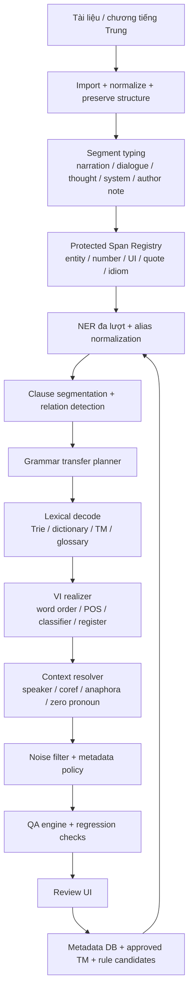
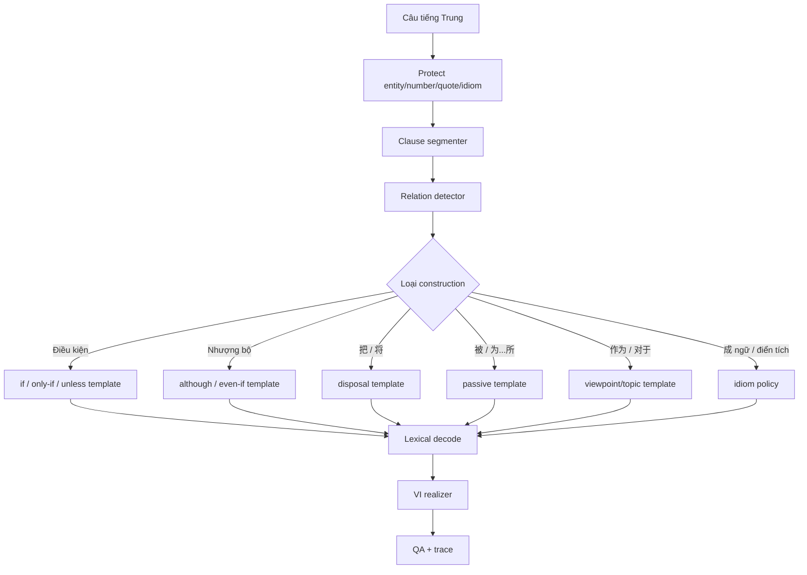
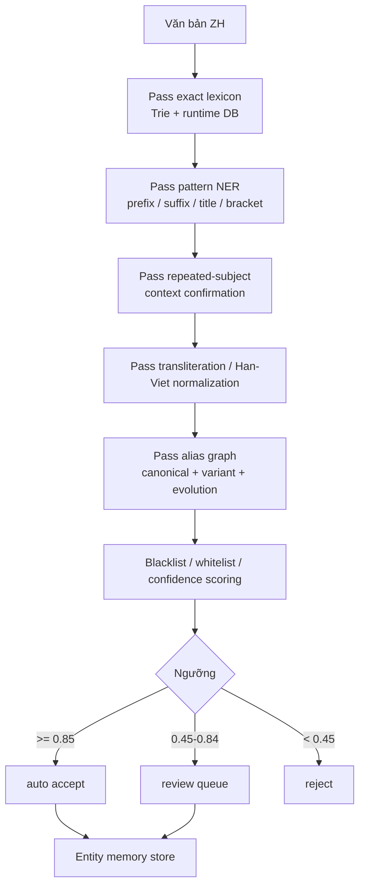
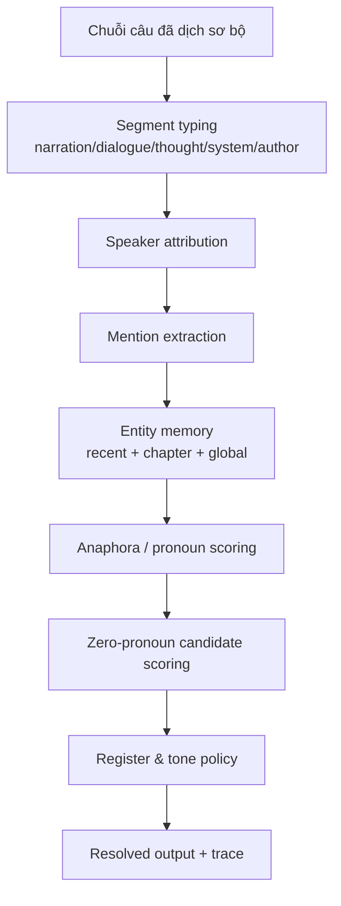

# Báo cáo đánh giá và kế hoạch hoàn thiện lõi dịch Trung–Việt cho converter-drduc

## Executive summary

Kho mã trên entity["company","GitHub","code hosting platform"] cho thấy `converter-drduc` không phải một prototype nhỏ lẻ, mà đã là một workspace dịch **ZH→VI** theo hướng **deterministic / RBMT lai từ điển**, với trục chạy production bằng Python, lõi từ điển Markdown→SQLite→Trie, luật `LuatNhan`, pipeline tiền xử lý, QA, state/TM và một desktop shell. README tự mô tả Phase 00–07 đã triển khai, Phase 08 có shell React/Tauri; `project_progress.json` còn đi xa hơn khi đánh dấu toàn bộ Phase 00–08 là **DONE 100%**, bao gồm state DB, translation memory, EN→VI baseline và desktop workflow. Cây repo hiện có 2 commits, Python chiếm 80.5% mã nguồn; tests hiện diện cho learning, phase pipelines và translation regressions. citeturn44view0turn44view1turn44view2turn46view0turn19view0turn45view5turn45view1

Điểm mạnh lớn nhất của repo là **nền móng hệ thống** đã khá rõ: production boundary được xác định tách bạch giữa Python production và JavaScript prototype; `RBMTTranslator` đã nối các thành phần như structure preservation, Traditional→Simplified, pinyin, number conversion, context, emotion/pronoun, Chinese rewriter, Vietnamese rewriter và translation memory; `entity_scanner.py` đã có trie lookup kết hợp fallback heuristics cho tên người và địa danh; các rewriter tiếng Trung/tiếng Việt đã có nhiều phase xử lý modifier, possessive, 把/被, classifier, demonstrative, reordering và possessive transfer. Nói ngắn: “khung chạy” đã có thật, không phải chỉ là tài liệu. citeturn44view1turn11view0turn11view1turn28view0turn28view2turn29view4turn30view0turn33view0turn33view1turn33view2turn33view3turn14view3turn14view4

Điểm yếu quan trọng lại nằm ở **độ sâu thuật toán**. Hiện trạng code nhìn thấy cho thấy grammar transfer vẫn thiên về regex/phased rewrites và hard-coded patterns; NER hiện mới là trie + heuristic name/location mining, chưa thấy tuyến sản xuất đầy đủ cho alias hierarchy, transliteration engine, review exporter và entity memory promotion; `ContextManager` đang là bộ nhớ cửa sổ ngắn chứ chưa phải resolver đúng nghĩa; và nghiêm trọng hơn, `RBMTTranslator` hiện có logic đẩy đầu ra RBMT vào TM với score `0.92`, provenance `rbmt`, trạng thái `verified`, tức là có rủi ro tự khuếch đại lỗi nếu không tách vùng “machine suggestion” với “human-approved memory”. Ngoài ra README và progress tracker đang lệch nhau ở mức xác minh build/test — README ghi `98 passed` và native Tauri chưa xác minh ở môi trường đó, trong khi progress tracker ghi `99 passed`, có `tauri build` và Windows smoke launch thành công — đây là dấu hiệu docs drift cần xử lý ngay. citeturn12view0turn13view0turn44view3turn45view0turn45view1

Từ các kế hoạch đã tải lên, hướng đi nội bộ thực ra khá đúng: ClauseSegmenter, logic relation detection, entity-aware transfer, alias hierarchy, transliteration map, common-word blacklist, review thresholds, metadata-aware segment typing và entity memory persistence đều đã được nghĩ tới. Vấn đề không còn là “nghĩ ra gì nữa”, mà là **đưa toàn bộ đặc tả đó thành một Python production pipeline thống nhất**, có benchmark, gold data, CI, human-in-the-loop và learning loop an toàn. Thống kê nội bộ từ 5 truyện mẫu tải lên cho thấy khoảng **20.0 triệu ký tự** và khoảng **6,741 chương**; riêng các marker như `被`, `把`, `作为`, `一旦`, `哪怕`, `就连` xuất hiện rất dày, xác nhận rằng bốn ưu tiên đúng nhất hiện nay là: **grammar transfer theo quan hệ mệnh đề**, **NER/alias/transliteration**, **context resolution**, và **noise filter/metadata boundary**.

## Hiện trạng repo

README, cây repo và progress tracker cho thấy production path hiện tại được repo tự xác định khá rõ: Python là runtime chính; JavaScript/TypeScript dưới `src/preprocessor/`, `src/parser/`, `src/rules/`, `src/learning/` chỉ là prototype/reference; repo cũng tự xác nhận có pipeline import/chapter split/structure preservation/entity scan, EAPEE, QA, state/TM, EN→VI baseline, UI sidecar và desktop shell. Đồng thời, dependency production đang khá gọn: `jieba`, `regex`, `python-Levenshtein`, `pdfplumber`, `python-docx`, `watchdog`, chứ chưa có dấu hiệu rõ về parser/NER/coreference học sâu trong runtime dependency. citeturn44view0turn44view1turn17view0turn18view0turn18view1turn18view2

Bảng dưới đây tổng hợp các file/mô-đun chính đã thấy trực tiếp trong cây repo hoặc được README/progress tracker tự xác nhận. Tôi dùng **implemented** khi file/thư mục hiện hữu trong tree hoặc được repo mô tả là đã có baseline; dùng **không xác định** khi nội dung chi tiết không đọc được đầy đủ trong phiên này.

| File / mô-đun | Vai trò | Trạng thái |
|---|---|---|
| `README.md` | Mô tả production boundary, baseline, lệnh verify | implemented |
| `project_progress.json` | Tracker task, milestone, phase status, philosophy incremental learning | implemented |
| `src/core/md_dictionary_compiler.py` | Biên dịch từ điển Markdown sang SQLite | implemented |
| `src/core/trie_engine.py` | Runtime trie lookup, priority handling | implemented |
| `src/core/luat_nhan_engine.py` | Áp luật ngữ pháp/disambiguation | implemented |
| `src/core/pos_rewrite_engine.py` | POS / rewrite hỗ trợ lõi | implemented |
| `src/core/runtime_support.py` | Runtime dictionary accessor / support utilities | implemented |
| `src/engine/rbmt_translator.py` | Orchestrator dịch chính ZH→VI | implemented |
| `src/engine/zh_structure_rewriter.py` | Rewriter cấu trúc câu tiếng Trung trước dịch | implemented |
| `src/engine/vi_grammar_rewriter.py` | Rewriter hậu xử lý ngữ pháp tiếng Việt | implemented |
| `src/pipeline/document_importer.py` | Import tài liệu | implemented |
| `src/pipeline/chapter_splitter.py` | Tách chương | implemented |
| `src/pipeline/entity_scanner.py` | Quét entity/term ứng viên | implemented |
| `src/pipeline/pretranslation_pipeline.py` | Pipeline tiền xử lý tổng | implemented |
| `src/pipeline/relationship_builder.py` | Xây relation giữa thực thể/chapter artifact | implemented |
| `src/pipeline/terminology_suggester.py` | Gợi ý thuật ngữ | implemented |
| `src/eapee/*` | Emotion detector, pronoun resolver, expression bank | implemented |
| `src/qa/*` | QA terminology, pronoun, emotion, structure, untranslated, length | implemented |
| `src/state/*` | Project manager, state DB, SQLite TM, candidate workflow, runtime stats | implemented |
| `src/en_vi/en_vi_translator.py` | EN→VI baseline | implemented |
| `src/ui/*` | Sidecar command protocol cho desktop app | implemented |
| `desktop/*` | React shell, Tauri scaffold | implemented |
| `src/learning/*` | Prototype/reference learning layer theo README, không phải runtime authoritative | implemented |
| `.github/workflows/*` | CI/CD workflow | không xác định |
| Gold benchmark / eval set ZH→VI trong repo | Dữ liệu chuẩn để đo BLEU/F1/human eval | không xác định |

Về mặt kỹ thuật, đây là ba điểm đáng ghi nhận nhất.

Thứ nhất, repo có **khung xử lý từ điển–dịch–kiểm thử–desktop** tương đối đầy đủ. README mô tả rõ compiler, trie, LuatNhan, number conversion, pipeline, EAPEE, RBMT, QA, state/TM, EN→VI engine, UI và desktop; tracker cũng mô tả state DB, translation memory exact/fuzzy lookup và candidate lifecycle là đã triển khai. citeturn44view1turn45view5turn45view1

Thứ hai, `RBMTTranslator` không phải chỉ là một `lookup()` đơn giản. File này khởi tạo trực tiếp `TrieEngine`, `RuntimeDictionaryAccessor`, `LuatNhanEngine`, `StructurePreserver`, Traditional→Simplified converter, `PinyinProcessor`, `SentenceSegmenter`, `NumberConverter`, `ContextManager`, emotion detector, expression bank, pronoun resolver, Chinese structure rewriter, Vietnamese grammar rewriter và TM. Nó cho thấy repo đã có tư duy “dịch như một pipeline có trạng thái”, không phải tách rời từng script. citeturn11view0turn11view1turn11view2turn11view3

Thứ ba, hiện trạng production code vẫn thể hiện dấu vết của một **workspace đang chuyển từ đặc tả sang sản phẩm**. Cây repo có nhiều file plan/debug/diagnose ở root, mới chỉ có 2 commits, và trong tree đã mở không thấy workflow CI kiểu `.github/workflows`; nghĩa là repo rất giàu ý tưởng và scaffold, nhưng còn thiếu bước “đóng gói và kỷ luật hóa” cho production. citeturn46view0turn46view1turn46view2turn46view3

## Khoảng trống còn thiếu

Khoảng trống lớn nhất của repo không phải là thiếu module “vỏ”, mà là thiếu **lõi thuật toán thống nhất** giữa grammar transfer, entity normalization, context resolution và filtering.

Về grammar transfer, phần `zh_structure_rewriter.py` hiện là một pipeline theo phase/category với nhiều pattern trực tiếp cho `Modifier + 的 + Head`, possessive, color+noun, `把/被`, result complements, classifiers, demonstratives, multi-level possessive, generic adjective và simulative syntax; `vi_grammar_rewriter.py` hậu xử lý tiếp location reorder, adjective+noun reorder, possession, pronoun naturalization, measure/preposition/misc fixes. Đây là nền tảng tốt, nhưng hình thức hiện tại vẫn là **rule pack cục bộ**, chưa phải một grammar-transfer engine thật sự dựa trên clause graph, relation graph và rule priority toàn cục. Khi corpus chuyển sang câu dài có nhiều quan hệ như điều kiện, nhượng bộ, nguyên nhân–kết quả, viewpoint frame, idiom/allusion, hệ rule hiện tại sẽ dễ bị rule-sprawl và xung đột thứ tự áp dụng. citeturn33view0turn33view1turn33view2turn33view3turn14view3turn14view4

Về entity scanning, `entity_scanner.py` hiện làm ba việc rõ ràng: tra trie/SQLite trước, map entity type theo category, rồi fallback sang heuristic name mining và location mining. Code cho thấy có blacklist prefix như `有/和/能/...`, có suffix fragments cho trường học/công ty/ngân hàng/v.v., có repeated positions/count, có Han-Viet fallback qua `get_han_viet_for_text`, và có heuristic location suffixes như `城/县/镇/村/市/...`. Nhưng những thứ quyết định cho chất lượng truyện dài — **alias chain, entity memory cross-chapter, transliteration engine, review thresholds, review exporter, conflict resolution giữa canonical và alias** — chưa thấy xuất hiện trong production path đã mở. Nói cách khác: module này hiện là **entity candidate extractor**, chưa phải **entity normalization system** hoàn chỉnh. citeturn28view0turn28view2turn29view1turn29view4turn29view5turn30view0turn30view2turn30view3turn30view4

Về context, `ContextManager` hiện lưu `recent_entities`, `recent_sentences`, `recent_speakers`, `emotion_history`, `chapter_entities`, `genre_context`, cùng `window_size=5` và `max_active_entities=20`. Đây là một hữu ích cho cache và local consistency, nhưng chưa đủ để giải quyết **coreference/anaphora/zero pronoun** trong truyện dài. Nghiên cứu về Chinese zero pronoun cho thấy việc dùng thông tin antecedent theo chuỗi quyết định là quan trọng; các công trình mới hơn còn giải đồng thời zero pronoun và non-zero coreference, hoặc dùng incremental entity memory với mất mát F1 rất nhỏ. So với chuẩn đó, context layer hiện thời của repo còn ở mức “recent context memory”, chưa phải discourse resolver. citeturn13view0turn49view0turn50view0turn48view1

Về learning loop, repo đã có tư tưởng đúng trong tracker: “improve through project state, translation memory, candidate rules, and reviewer-approved upgrades”. Tuy vậy, implementation hiện nhìn thấy lại có một điểm rất rủi ro: trong `RBMTTranslator`, TM lookup ưu tiên exact rồi fuzzy (ngưỡng 0.88), và đầu ra RBMT sạch có thể được append vào translation memory với nhãn `verified`. Nếu không tách **machine-generated memory** khỏi **human-approved memory**, hệ sẽ tự học lại lỗi ngữ pháp, lỗi entity và lỗi register rất nhanh. Đây là nơi cần sửa kiến trúc trước cả khi mở rộng rule. citeturn45view5turn12view0

Về kiểm thử và vận hành, tests hiện diện khá tốt về breadth — có `test_phase*`, `test_translation_regressions.py`, `test_learning_engine.py`, `test_natural_feedback_engine.py` — nhưng trong repo mở được chưa thấy rõ gold parallel set, benchmark dashboard, CI workflow, regression gating theo metrics hoặc dữ liệu review chuẩn hóa. Nghĩa là repo có **nhiều test unit/integration**, nhưng chưa thấy đầy đủ **test governance** cho một hệ dịch truyện dài. citeturn19view0turn46view0

Các kế hoạch tải lên trong phiên này củng cố kết luận trên: nhiều tài liệu đã mô tả ClauseSegmenter, LogicRelationDetector, entity suffix classifier, long nominal detector, transliteration map, alias hierarchy, review thresholds `0.45/0.85`, review exporter, entity memory SQLite, segment typing cho `AUTHOR_NOTE/FORUM_POST/SYSTEM_PROMPT`, cùng một loạt grammar packs từ `只要...就...`, `除非...否则...`, `为...所...`, `一边...一边...`, `就连...也...`, `所谓`, `哪怕`, `X罢了/而已`. Điều này cho thấy **roadmap nội bộ đã đúng hướng**, nhưng phần production code vẫn chưa đồng bộ hoàn toàn với đặc tả đó.

## Kiến trúc thuật toán đề xuất

Nguyên tắc của tôi là **không thay triết lý deterministic core của repo**, mà nâng nó từ “nhiều rule riêng lẻ” thành **một pipeline lõi có registry span, clause graph, entity memory, metadata DB và human-in-the-loop promotion**. Cách làm này khớp với triết lý repo: deterministic core, phrase-first but not phrase-only, hot/cold dictionary separation và explicit provenance. citeturn44view1



### Thuật toán chuyển đổi ngữ pháp Trung→Việt

Hiện trạng production đang mạnh ở rewriters cục bộ; bước còn thiếu là một **Grammar Transfer Planner** làm việc trên **clause graph** thay vì chỉ re.sub tuần tự. Với corpora truyện dài, cấu trúc phải xử lý đầu tiên không phải từ đơn mà là **quan hệ giữa các mệnh đề**: condition, concession, cause-result, contrast, disposal, passive, serial verb, viewpoint, evidential, simile, idiom/allusion, dialogue/system. Các tài nguyên cú pháp từ entity["organization","Universal Dependencies","multilingual treebank project"] cho tiếng Trung giản thể và tiếng Việt có thể làm chuẩn nhãn tham chiếu cho POS/dependency nhẹ, còn nghiên cứu generation tiếng Việt và low-resource MT cho thấy ở ngôn ngữ ít tài nguyên, khâu structural generation ở target side vẫn là nút quan trọng. citeturn37search3turn36search0turn36search2turn43search7turn43search4

Tôi đề xuất lõi grammar transfer gồm sáu lớp:

1. **Protected spans trước, grammar sau**: tên riêng, item/system label, số-đơn vị, quote, idiom phải được khóa trước khi tách clause.
2. **Clause segmentation có awareness về quote/entity**: chỉ tách mềm ở `，、：` khi gặp boundary marker ngữ pháp.
3. **Relation detector**: gắn nhãn điều kiện, nhượng bộ, tương phản, nguyên nhân, kết quả, thời gian, passive/disposal, viewpoint.
4. **Template-driven transfer**: mỗi construction sinh ra một template tiếng Việt và trace.
5. **Lexical decode với register**: cùng một marker có surface khác nhau giữa cổ trang, tiên hiệp, hiện đại, system/game.
6. **Vietnamese realizer**: sắp trật tự danh–tính, sở hữu, classifier, bổ ngữ kết quả, trợ từ tình thái.

Pseudo-code lõi nên đi theo hướng sau:

```python
def translate_sentence_zh_vi(sentence, state, resources):
    seg_type = classify_segment(sentence)
    spans = protect_spans(
        sentence,
        entities=state.entity_memory,
        dict_glossary=resources.glossary,
        number_patterns=resources.number_rules,
        ui_patterns=resources.system_patterns,
        idioms=resources.idiom_lexicon,
    )

    clauses = clause_segment(sentence, protected_spans=spans)
    relations = detect_relations(clauses, protected_spans=spans)

    vi_clauses = []
    for clause in topological_order(relations):
        frame = detect_frame(
            clause,
            rules=resources.grammar_rules,
            register=state.register,
            seg_type=seg_type,
        )

        tokens = lattice_tokenize(clause, protected_spans=spans)
        pos_tags = light_pos_tag(tokens, trie=resources.trie, ud_hints=resources.ud_hints)
        decoded = lexical_decode(tokens, resources, state)
        transferred = apply_transfer_template(decoded, frame, pos_tags, state)
        vi_clause = realize_vietnamese(transferred, register=state.register)
        vi_clauses.append(vi_clause)

    draft = assemble_clauses(vi_clauses, relations, seg_type)
    draft = resolve_local_coref(draft, state)
    clean = post_edit_vi(draft, seg_type=seg_type, register=state.register)
    trace = build_trace(sentence, clean, spans, relations)

    return clean, trace
```

Mermaid cho luồng grammar transfer:



Về **idiom/điển tích**, không nên xử lý chỉ bằng dictionary một tầng. Cần ba mức:
- **literal-forbidden**: cấm dịch từng chữ, buộc dùng bản dịch chuẩn;
- **semi-literal**: cho phép Hán-Việt hoặc diễn ý tùy register;
- **allusion-with-note**: giữ văn phong nhưng có khả năng thêm nghĩa nhẹ ở bản clean nếu cần.

Ví dụ:
- `为众人所知` → “được mọi người biết đến”, không dịch “vì… bị… chỗ…”;
- `哪怕…也…` → “dù cho… cũng…”, không chỉ map sang “cho dù” máy móc;
- `所谓` → “cái gọi là / điều được gọi là”, tùy phong cách câu định nghĩa;
- `一边X一边Y` phải phân biệt **đồng thời hành động** với **đối chiếu hai vế**.

### Thuật toán quét và chuẩn hóa tên riêng

Nghiên cứu NER tiếng Trung nhấn mạnh rằng **word-boundary ambiguity** là một trở ngại lớn, và việc tận dụng lexical knowledge giúp cải thiện rõ rệt; còn toolkit tiếng Việt như VnCoreNLP chứng minh một pipeline gộp segmentation/POS/NER/dependency là hướng thực dụng cho vận hành. Dữ liệu NER tiếng Việt của entity["organization","VLSP","vn language processing workshop"] cung cấp 16,858 câu train và 14,918 thực thể cho PER/ORG/LOC; dataset M-CNER cung cấp corpus Chinese NER đa miền; đây là hai nguồn rất phù hợp để calibrate heuristics và threshold cho scanner của repo. citeturn48view0turn47view2turn40search0turn40search1turn37search6

Tôi đề xuất NER/normalization gồm bảy pass, tương thích với tinh thần các plan v22 nhưng đóng lại thành Python production:



Cụ thể:

**Pass exact lexicon**  
Dùng trie/SQLite hiện có để bắt span dài nhất, giữ priority/source_dict/category. Đây là thứ repo đã làm tốt.

**Pass pattern NER**  
Bổ sung:
- chức danh + tên (`将军X`, `X阁下`, `舰长X`, `掌门X`);
- hậu tố tổ chức/địa điểm/chủng tộc/faction (`集团`, `联盟`, `宗`, `派`, `族`, `星域`, `帝国`);
- dạng bracket/system label (`【奇迹之冠冕号】`);
- long nominal entity (`血红玫瑰冒险团`, `商业联盟`, `主神空间`).

**Pass repeated-subject / discourse confirmation**  
Một cụm 2–8 chữ Hán lặp lại như subject nhiều lần trong đoạn/chương sẽ được tăng confidence. Đây là cách cực hiệu quả cho truyện dài mà không cần model nặng.

**Pass transliteration**  
Nếu term không ra nghĩa Hán-Việt ổn định, dùng decision tree:
- ưu tiên glossary/canonical map;
- nếu nằm trong translit char map thì dựng Latin/Vietnamized form;
- nếu là tên franchise/kỹ thuật kiểu sci-fi thì có thể giữ dạng Latin hóa;
- còn lại fallback Hán-Việt có kiểm soát register.

**Pass alias graph**  
Bắt các trigger:
- identity: `又叫`, `也叫`, `被称为`, `号称`, `名为`, `化名`;
- evolution/state: `升级为`, `进化为`, `点化成`, `蜕变成`;
- role/title: `以X之名`, `作为X`, `世人称其为X`.

Khung dữ liệu nên là đồ thị chứ không phải map phẳng:

```python
EntityRecord(
    canonical="李宇",
    vi_form="Lý Vũ",
    entity_type="PERSON",
    aliases=[
        AliasEdge("龙尊", type="TITLE_ALIAS", confidence=0.88),
        AliasEdge("超越者", type="EVOLUTION", confidence=0.91),
        AliasEdge("圣·天尊", type="ASCENDED_TITLE", confidence=0.93),
    ],
    first_chapter=12,
    last_chapter=980,
    occurrences=351
)
```

**Normalization policy**  
- `PERSON`: canonical một tên, alias map nhiều nhánh;
- `LOC`: ưu tiên Hán-Việt nhất quán;
- `ORG/FACTION`: không tách tự động các danh ngữ dài nếu suffix classifier báo entity;
- `ITEM/TECHNIQUE`: protected span không cho grammar rewriter đảo danh–tính lung tung;
- `SYSTEM/UI`: giữ đúng surface hoặc glossary standardized form.

### Xử lý ngữ cảnh

Nghiên cứu về zero pronoun tiếng Trung và coreference chỉ ra rằng quyết định antecedent cần dùng **thông tin chuỗi trước đó**, không nên xử lý từng điểm cục bộ độc lập; các mô hình incremental memory cũng cho thấy có thể giữ entity memory gọn mà không hi sinh nhiều F1. Vì vậy, tôi khuyến nghị repo đi theo **incremental context resolver** thay vì cố nhảy thẳng lên full-document transformer nặng. citeturn49view0turn50view0turn48view1turn41search1turn41search2turn37search9

Mermaid cho context resolver:



Thuật toán nên gồm bốn tầng:

**Tầng ranh câu và segment type**  
Mỗi đoạn trước hết phải được gán loại:
- `NARRATION`
- `DIALOGUE`
- `THOUGHT`
- `SYSTEM_PROMPT`
- `FORUM_POST`
- `AUTHOR_NOTE`
- `CHAPTER_TITLE`

Đây là chốt chặn quyết định có áp grammar rule “đảo tự nhiên” hay không. `SYSTEM_PROMPT` và `FORUM_POST` phải ưu tiên literal + glossary; `AUTHOR_NOTE` có thể drop; `DIALOGUE` phải preserve tone/punctuation.

**Tầng speaker state**  
Gắn `current_speaker`, `last_explicit_speaker`, `dialogue_group` để câu sau như “hắn nói / nàng hỏi / ta nghĩ” không bị mù tham chiếu.

**Tầng mention memory**  
Mỗi entity active lưu:
- canonical
- alias gần nhất
- gender/number nếu biết
- vai trò diễn ngôn gần nhất: subject/object/topic/speaker
- last_seen_sentence
- salience score

**Tầng anaphora / zero pronoun**  
Đối với tiếng Trung truyện dài, heuristic thực dụng nhất là:
- ưu tiên antecedent cùng speaker/near subject trong `window=3–5` câu;
- phạt mạnh nếu không khớp role semantics;
- thưởng nếu cùng event chain hoặc same entity cluster;
- nếu confidence thấp thì giữ đại từ trung tính thay vì “bịa” resolve.

Pseudo-code:

```python
def resolve_context(sentence_vi, sentence_zh, state):
    seg_type = state.segment_type
    mentions = extract_mentions(sentence_vi, state.entity_memory)

    if seg_type == "DIALOGUE":
        speaker = infer_speaker(sentence_zh, state)
        state.current_speaker = speaker

    pronouns = detect_pronouns(sentence_vi)
    for p in pronouns:
        candidates = score_antecedents(
            pronoun=p,
            memory=state.entity_memory,
            speaker=state.current_speaker,
            recent_sentences=state.recent_sentences,
        )
        if top_confidence(candidates) >= 0.82:
            sentence_vi = apply_resolution(sentence_vi, p, top(candidates))

    zero_slots = detect_zero_pronoun_slots(sentence_zh)
    for z in zero_slots:
        candidates = score_zero_pronoun(z, state)
        if top_confidence(candidates) >= 0.86:
            sentence_vi = inject_if_needed(sentence_vi, z, top(candidates))

    sentence_vi = preserve_register(sentence_vi, seg_type, state.genre)
    update_state(state, mentions, speaker=state.current_speaker)
    return sentence_vi
```

### Bộ lọc cụm từ rác

Đây là phần repo hiện chưa cho thấy một production module rõ ràng, trong khi corpus truyện tải lên có rất nhiều `PS`, `求月票/求订阅`, title/forum-like phrase, system UI, fan-service bracket text và promo notes. Bộ lọc cần hoạt động sau **segment typing** chứ không được làm regex “chặt bừa”, vì `【时钟塔】` hay `【奇迹之冠冕号】` là entity thật, còn `（ps：中午12点左右一更...）` mới là noise.

Tôi đề xuất noise filter theo ba lớp:

**Lớp pattern cứng**  
Regex cho:
- `PS[:：]`
- `求月票|求推荐|求订阅|求收藏`
- `本章完|未完待续|请假条`
- forum metadata lặp mẫu
- timestamp/log header nếu không thuộc system UI chính thức

**Lớp whitelist**  
Cho phép:
- bracket chứa item/skill/ship/system label trong glossary;
- title/chapter lines hợp lệ;
- `【...】` nếu score entity đủ cao;
- system prompt đã classify.

**Lớp scoring/threshold**  
Mỗi segment có score:
- `noise_score`
- `metadata_score`
- `entity_score`
- `ui_score`

Quy tắc quyết định:
- `noise_score >= 0.80` và `entity_score < 0.30` → drop
- `metadata_score >= 0.70` → chuyển metadata mode
- `ui_score >= 0.70` → preserve literal
- còn lại → đưa sang transfer

Pseudo-code:

```python
def filter_noise(segment, seg_type, registry, db):
    if seg_type in {"AUTHOR_NOTE", "ADVERTISEMENT"}:
        return DROP

    score = 0.0
    if regex_match(segment, db.stop_phrase_patterns):
        score += 0.55
    if regex_match(segment, db.chapter_end_patterns):
        score += 0.40
    if regex_match(segment, db.author_note_patterns):
        score += 0.50

    if registry.has_entity(segment):
        score -= 0.60
    if registry.has_system_ui(segment):
        score -= 0.70
    if segment in db.noise_whitelist:
        score -= 1.00

    if score >= 0.80:
        return DROP
    if 0.45 <= score < 0.80:
        return REVIEW
    return KEEP
```

### Metadata DB và learning loop

Repo đã có state DB/TM/candidate workflow theo README và progress tracker; vì vậy việc đúng nhất không phải thêm một “AI learner” mơ hồ, mà mở rộng thành **metadata database có hai ngăn nhớ**: `raw machine memory` và `approved memory`. citeturn44view1turn45view5

Tôi đề xuất schema tối thiểu như sau:

| Bảng | Mục đích | Ghi chú |
|---|---|---|
| `entities` | canonical, vi_form, entity_type, confidence, first/last_chapter | mở rộng từ entity memory store |
| `alias_map` | alias → canonical, alias_type, confidence | hỗ trợ chain và conflict resolution |
| `entity_occurrences` | chapter_id, sentence_id, surface, canonical, context | phục vụ review/corpus mining |
| `translation_memory_raw` | source, target, score, provenance, model_version | **không** tự coi là verified |
| `translation_memory_approved` | source, target, reviewer_id, approved_at | chỉ lookup ưu tiên từ bảng này |
| `rule_candidates` | trigger span, proposed rule, support_count, precision_est | nơi “tự hoàn thiện” được staged |
| `noise_patterns` | regex/text, class, precision, whitelist_flag | bộ lọc rác |
| `human_reviews` | diff trước/sau, loại lỗi, quyết định promote/reject | lõi human-in-the-loop |
| `evaluation_runs` | run_id, corpus, BLEU/chrF/COMET/F1, regression_status | dashboard benchmark |

Learning loop nên vận hành như sau:

```python
def post_review_learning(review_batch):
    diffs = extract_diffs(review_batch)

    for diff in diffs:
        if diff.type == "entity_fix":
            propose_entity_update(diff)
        elif diff.type == "alias_fix":
            propose_alias_edge(diff)
        elif diff.type == "grammar_fix":
            propose_rule_candidate(diff)
        elif diff.type == "noise_drop":
            propose_noise_pattern(diff)

    score_candidates()
    run_regression_suite()

    for candidate in accepted_candidates():
        if candidate.kind == "entity":
            promote_to_entities(candidate)
        elif candidate.kind == "alias":
            promote_to_alias_map(candidate)
        elif candidate.kind == "rule":
            promote_to_rule_pack(candidate)
        elif candidate.kind == "noise":
            promote_to_noise_patterns(candidate)

    update_benchmark_dashboard()
```

Nguyên tắc quan trọng nhất: **không bao giờ promote trực tiếp từ output RBMT sang approved TM** nếu chưa qua human review hoặc regression gate.

## Dữ liệu và metrics

Phần dữ liệu ngoài repo nên tách thành ba lớp: **gold nội bộ cho task chính ZH→VI**, **corpora phụ cho subtask**, và **benchmark công khai để calibrate labels/POS/NER/coref**. Với tiếng Việt, VnCoreNLP cho thấy pipeline word segmentation/POS/NER/dependency là thực dụng; VLSP 2016 NER có dữ liệu chuẩn cho PER/ORG/LOC và dùng Precision/Recall/F1 làm thước đo; với tiếng Trung, UD Chinese GSDSimp/Chinese GSD có treebank cú pháp, M-CNER là corpus NER đa miền, còn OntoNotes 5.0 là chuẩn cho coreference/zero pronoun. Các paper gốc về MT metric từ entity["organization","ACL Anthology","nlp paper archive"] cũng khuyến nghị không dựa vào một metric duy nhất: BLEU, chrF, COMET/xCOMET và human eval nên được dùng cùng nhau. citeturn47view2turn40search0turn40search1turn37search3turn36search0turn37search6turn41search1turn49view0turn50view0turn36search1turn42search2turn42search1turn42search0turn42search3

Thống kê nội bộ từ 5 truyện mẫu tải lên trong phiên này cho thấy nguồn dữ liệu đem lại lợi ích rất lớn cho domain truyện dài: khoảng **20,020,468 ký tự**, khoảng **6,741 chương**, và tần suất cực cao của các marker như `被`, `把`, `作为`, `一旦`, `哪怕`, `就连`, `一边`. Điều đó đủ để xây một gold/dev/test set domain-specific mà không cần chờ corpora công khai hoàn hảo.

### Bảng dữ liệu huấn luyện/kiểm thử cần thu thập

| File name đề xuất | Nguồn | Kích thước đề xuất | Mục tiêu |
|---|---|---:|---|
| `zh_vi_parallel_train.jsonl` | 5 truyện mẫu đã upload, align thủ công theo câu/mệnh đề | 40k–60k cặp câu | train/tune grammar transfer |
| `zh_vi_parallel_dev.jsonl` | cùng nguồn, khác chương | 5k cặp câu | tune rule priority / threshold |
| `zh_vi_parallel_test.jsonl` | holdout theo truyện/chương | 5k cặp câu | final MT evaluation |
| `grammar_patterns_gold.yaml` | câu mẫu nội bộ + mining từ corpus | 2k–3k cases | đo đúng/sai từng construction |
| `idiom_allusion_lexicon.tsv` | truyện mẫu + biên soạn thủ công | 2k–3k entries | idiom/điển tích |
| `entity_seed_glossary.csv` | từ điển repo + truyện mẫu | 15k–30k entities | seed glossary |
| `alias_edges_seed.csv` | annotation thủ công theo arc truyện | 2k–5k edges | alias/evolution chain |
| `segment_type_gold.jsonl` | annotate đoạn thành narration/dialogue/system/author/forum | 8k–10k segments | segment typing + noise filter |
| `noise_patterns_seed.yml` | PS, promo, note, boilerplate | 500–1,000 patterns | regex/blacklist/whitelist |
| `ud_zh_gsdsimp.conllu` | UD Chinese GSDSimp citeturn37search3 | full | tham chiếu POS/dependency |
| `ud_vi_vtb.conllu` | UD Vietnamese VTB citeturn36search0 | full | target-side order/POS |
| `vlsp2016_ner` | trang chính thức entity["organization","VLSP","vn language processing workshop"] 2016 NER citeturn40search0turn40search1 | 16,858 câu train | calibrate F1 / label policy |
| `m_cner_zh` | M-CNER corpus citeturn37search6 | full | Chinese NER multi-domain |
| `ontonotes5_zh_coref` | LDC OntoNotes 5.0 citeturn41search1 | full | coref / zero pronoun |
| `vncorenlp_reference_benchmark` | paper/toolkit VnCoreNLP citeturn47view2 | full | đối chiếu segmentation/POS/NER |

### Metrics đánh giá

| Hạng mục | Metrics chính | Mục đích |
|---|---|---|
| NER span detection | Precision / Recall / F1 strict span | đúng biên entity |
| Entity normalization | canonical accuracy, alias resolution accuracy | đúng tên chuẩn tiếng Việt |
| Protected spans | protected-span precision / leakage rate | tránh phá entity, number, UI |
| Grammar transfer | construction accuracy theo rule pack | đúng `只要...就`, `被...所`, `一边...一边`, `作为...` |
| MT tổng thể | BLEU, chrF, COMET, xCOMET | chất lượng dịch câu/đoạn |
| Context | mention F1, B³/CEAF/MUC hoặc ít nhất antecedent accuracy, speaker consistency | đúng coref/anaphora |
| Noise filter | precision@drop, recall@noise, false-drop rate | không cắt nhầm nội dung thật |
| Human eval | adequacy, fluency, entity consistency, tone/register preservation, idiom fidelity | đánh giá cuối cùng cho truyện |

Tôi khuyến nghị bộ metrics tối thiểu để vận hành hằng ngày là:
- **NER**: strict span F1 + canonical accuracy
- **Grammar**: construction accuracy theo pack
- **MT**: BLEU + chrF + COMET
- **Context**: antecedent accuracy + speaker consistency
- **Noise**: drop precision
- **Human**: MQM-lite hoặc rubric 1–5 cho adequacy / naturalness / entity consistency / style

BLEU là metric nền tảng, nhưng bản thân các nghiên cứu mới hơn cho thấy nên kết hợp metric lexical như chrF với learned metrics như COMET/xCOMET để tránh mù các lỗi entity, hallucination hay localized critical errors. citeturn36search1turn42search2turn42search1turn42search0turn42search3

## Milestones và timeline

Vì repo đã có scaffold mạnh, timeline hợp lý không phải 6–9 tháng, mà là khoảng **16–18 tuần** để đóng lõi thuật toán, benchmark và learning loop. Mốc dưới đây giả định một nhánh Python production độc lập, không dàn trải sang UI ngoại trừ những gì cần cho review.

| Milestone | Thời lượng ước lượng | Deliverables |
|---|---:|---|
| Audit khóa baseline và benchmark | 1.5 tuần | freeze rule hiện có, benchmark runner, seed dev/test set, tách `TM_raw` và `TM_approved` |
| Segment typing và noise filter | 2 tuần | classifier cho narration/dialogue/system/author/forum, regex packs, whitelist, review queue |
| NER đa lượt và metadata DB | 3 tuần | exact+pattern+repeated-subject NER, suffix classifier, alias graph, transliteration engine v1, schema `entities/alias_map/entity_occurrences` |
| Grammar transfer pack nền | 4 tuần | ClauseSegmenter, RelationDetector, transfer packs cho condition/concession/passive/disposal/viewpoint/simile/idiom |
| Context resolver | 3 tuần | speaker tracker, mention memory, pronoun/anaphora scoring, zero-pronoun heuristics, register policy |
| Learning loop an toàn | 2 tuần | rule candidates, review exporter, regression gate, promote pipeline, dashboard metrics |
| Cứng hóa vận hành | 2 tuần | CI, golden regressions, chapter batch runner, release notes, data/versioning policy |

Nếu cần chia nhỏ hơn theo kỹ thuật, tôi đề xuất thứ tự công việc như sau.

Trước hết, phải sửa **state/TM architecture** trước khi “cho hệ học”. Tách `translation_memory_raw` khỏi `translation_memory_approved`, đổi mọi insert tự động từ `verified` sang `suggested`, và chỉ lookup ưu tiên từ approved TM. Đây là việc vừa nhỏ vừa có đòn bẩy rất lớn.

Tiếp theo, khóa **segment typing + protected span registry**. Nếu chưa có bước này, mọi rule grammar về sau sẽ tiếp tục chạm sai vào `PS`, `forum post`, system UI, long entity, number-unit spans.

Sau đó mới làm **NER + alias + transliteration**, vì grammar transfer tốt đến đâu mà entity vẫn lung tung thì chất lượng truyện dài vẫn thất bại ở cấp độ người đọc.

Sau NER mới nên làm **ClauseSegmenter + RelationDetector + Grammar packs**, vì grammar transfer chỉ ổn khi entity/number/UI/idiom đã được khóa span trước.

Cuối cùng mới là **context resolver** và **learning loop**, vì hai phần này cần đầu ra tương đối ổn để tránh học sai.

## Test cases và ví dụ

Bảng dưới đây là **diagnostic examples** dựa trên truyện mẫu tải lên và các cấu trúc ưu tiên nêu trong kế hoạch. Cột “đầu ra hiện dễ lỗi” là kiểu lỗi có khả năng xảy ra theo hiện trạng rule-based hiện có; đây không phải log chạy trực tiếp của repo trong phiên này.

| Nguồn ZH | Đầu ra hiện dễ lỗi | Đầu ra mục tiêu | Quy tắc cần có |
|---|---|---|---|
| `作为主魂的涂山君当即就领悟了这道法术的能力。` | `Là chủ hồn của Đồ Sơn Quân lập tức lĩnh ngộ...` | `Đồ Sơn Quân, với tư cách chủ hồn, lập tức lĩnh ngộ năng lực của đạo pháp thuật này.` | viewpoint/topic frame `作为` |
| `十来岁的学徒一边整理被褥一边回应。` | `một bên chỉnh chăn đệm một bên đáp lời` | `Cậu học việc chừng mười mấy tuổi vừa sửa lại chăn đệm vừa đáp.` | simultaneous action `一边...一边...` |
| `导致他们都没有真正的走上修行的道路，全都被世俗所累。` | `... đều bị thế tục chỗ mệt` | `... đều bị thế tục ràng buộc.` | classical passive `被...所...` |
| `只要能够度过试炼空间，轮回小队成员自然是开始变强。` | `chỉ cần có thể độ qua... tự nhiên là bắt đầu mạnh lên` | `Chỉ cần vượt qua không gian thử luyện, thành viên tiểu đội luân hồi tự nhiên sẽ bắt đầu mạnh lên.` | sufficient condition `只要...就/便...` |
| `就连总在家躺着的赖汉也都活动了起来。` | `ngay cả ... cũng đều hoạt động dậy` | `Ngay cả gã vô lại suốt ngày nằm nhà cũng bắt đầu hoạt động.` | emphatic inclusion `就连...也...` |
| `哪怕已经无法动弹了，也要继续向前。` | `cho dù đã không thể động đậy, cũng muốn...` | `Dù đã không thể cử động, vẫn phải tiếp tục tiến lên.` | strong concession `哪怕...也...` |
| `商业联盟` / `血红玫瑰冒险团` | tách rời thành common nouns | normalize thành `Liên minh Thương nghiệp` / `Mạo hiểm đoàn Hồng Mân Côi Máu` hoặc glossary chuẩn | organization/faction detector |
| `李宇又叫龙尊，后世称其为圣·天尊。` | coi là ba entity độc lập | canonical `Lý Vũ`; alias `Long Tôn`; title `Thánh · Thiên Tôn` | alias hierarchy |
| `（ps：中午12点左右一更……）` | dịch thô vào thân truyện | drop hoặc chuyển metadata mode | noise filter / segment typing |
| `【奇迹之冠冕号】启动完成。` | cắt bỏ vì nghĩ là bracket noise | `【Kỳ Tích Chi Quan Miện Hào】 đã khởi động hoàn tất.` hoặc form glossary | UI/entity whitelist |

Bộ test regression nên chia thành bốn lớp:

- **Grammar pack tests**: mỗi pattern có 10–30 test cases dương tính và 10–20 counterexamples.
- **Entity tests**: span detection, canonicalization, alias, transliteration, protected spans.
- **Context tests**: speaker turn, pronoun continuity, zero-pronoun insertion/không chèn.
- **Noise tests**: drop note thật, giữ bracket entity thật, giữ system prompt, không drop chapter title.

Pseudo-code test skeleton:

```python
def test_rule_wei_suo_passive():
    assert transfer("为众人所知") == "được mọi người biết đến"
    assert transfer("被命运所捉弄") == "bị số phận đùa giỡn"

def test_entity_alias_chain():
    memory = scan_entities("李宇又叫龙尊，后世称其为圣·天尊。")
    assert memory.canonical_of("龙尊") == "李宇"
    assert memory.canonical_of("圣·天尊") == "李宇"

def test_author_note_dropped():
    seg = classify_segment("（ps：中午12点左右一更……）")
    assert seg == "AUTHOR_NOTE"
    assert filter_noise(seg) == DROP

def test_bracket_entity_preserved():
    seg = "【奇迹之冠冕号】启动完成。"
    assert filter_noise(seg) == KEEP
```

## Open questions

Một số phần trong repo vẫn phải ghi **không xác định** vì trong phiên này tôi không mở đọc được đầy đủ nội dung từng file bên trong `src/state/*`, `src/qa/*`, `src/ui/*` và toàn bộ các module prototype dưới `src/learning/*`. README và progress tracker đều nói các phần này đã có, nhưng mức độ hoàn thiện thuật toán chi tiết chưa thể xác nhận hết chỉ từ cây repo và vài file đã mở. citeturn44view1turn45view5

Ngoài ra, repo hiện thể hiện độ lệch tài liệu nội bộ: README ghi `98 passed` và nói native Tauri packaging chưa được xác minh trong môi trường đó, còn progress tracker ghi `99 passed`, `tauri build` và Windows smoke launch đã chạy. Trước khi triển khai nhánh hoàn thiện thuật toán, nên làm một bước “single source of truth” cho status và benchmark. citeturn44view3turn45view0turn45view1

Cuối cùng, chưa thấy rõ trong cây repo đã mở một **gold ZH→VI benchmark set** và cũng chưa xác minh được chính sách bản quyền/khả năng dùng lâu dài của toàn bộ truyện mẫu cho mục đích benchmark đóng gói. Vì vậy, mọi số liệu timeline và kế hoạch benchmark ở trên nên được hiểu là **khả thi và nên làm ngay**, nhưng phần pháp lý/packaging dữ liệu vẫn cần một quyết định quản trị riêng.