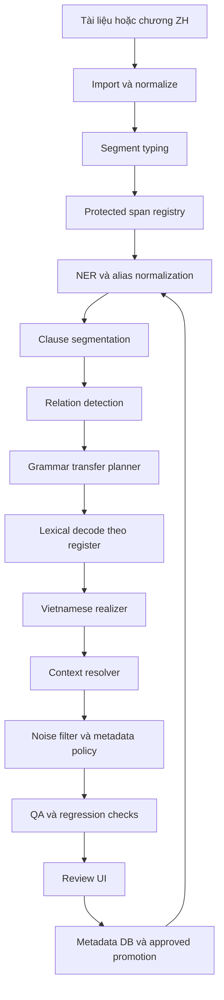
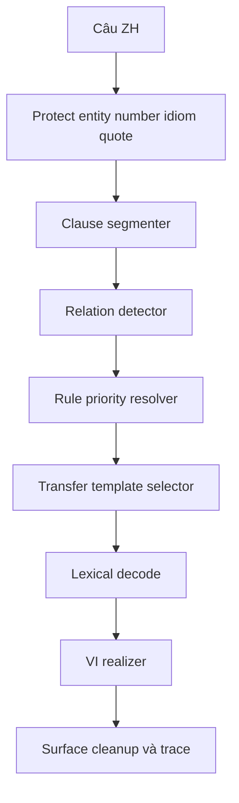
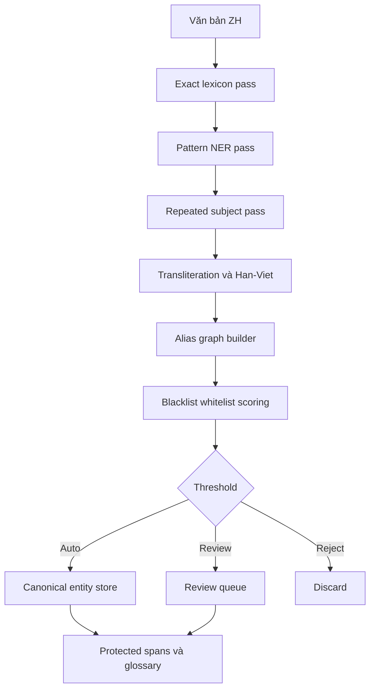
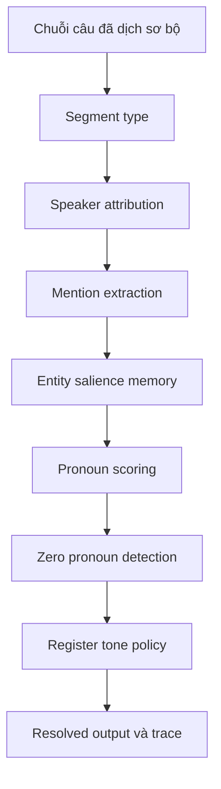

# Báo cáo phân tích và kế hoạch hoàn thiện converter-drduc

## Executive summary

Báo cáo này tổng hợp trên ba lớp nguồn: repo trên entity["company","GitHub","developer platform"] đã được kiểm tra ở các lượt trước, các kế hoạch/truyện mẫu đã tải lên, và đặc biệt là tài liệu **Deep Research V4** mới cung cấp. Theo chính V4, trong ba bản nghiên cứu trước thì **v3 là bản mạnh nhất** vì đọc được code thực tế, chỉ ra đúng rủi ro của translation memory, đặt segment typing làm nền cho toàn bộ stack, và đưa timeline thực tế hơn; đồng thời V4 kế thừa v1–v3 và chốt ra **12 gap kỹ thuật** còn thiếu. Vì vậy, cách làm đúng lúc này không phải là viết lại toàn bộ hệ thống, mà là **đóng gói lại backbone hiện có** thành một lõi production thống nhất gồm bốn pack: **grammar transfer**, **entity normalization**, **context resolver**, **noise filter**, kèm theo **metadata DB** và **learning loop có human-in-the-loop**. fileciteturn2file0

Điểm quan trọng nhất của hiện trạng repo là: **khung hệ thống đã có**, nhưng các “năng lực lõi” chưa được khóa ở mức production-grade. V4 chỉ ra rõ các khoảng trống còn lại gồm: thiếu đặc tả đủ chi tiết cho segment typing và clause segmentation, thiếu kế hoạch migrate translation memory theo hai tầng raw/approved, chưa có cơ chế priority và conflict resolution cho grammar rules, zero-pronoun detection còn sơ lược, whitelist logic của noise filter chưa đủ an toàn để tránh false drop, chưa có CI/regression gating chuẩn, idiom/chengyu policy mới ở mức ý tưởng, register-aware lexical decode chưa có algorithm hoàn chỉnh, chưa có performance monitoring và chưa có quy trình annotation corpus rõ ràng. Nói ngắn: repo hiện đã có **pipeline**, nhưng chưa có **governance** và **spec algorithmic đủ chặt** cho truyện dài. fileciteturn2file0

Kết luận vận hành là: nên triển khai theo lộ trình **15–18 tuần**, ưu tiên P0 cho ba việc có đòn bẩy cao nhất: **tách TM machine và TM approved**, **đưa segment typing vào đầu pipeline**, và **làm noise whitelist theo cơ chế “whitelist thắng tuyệt đối”**. Sau đó mới lần lượt khóa ClauseSegmenter, RelationDetector, grammar rule priority, NER 7-pass, transliteration 3-stage, zero-pronoun resolver, idiom policy, CI/regression gate và learning loop. Nếu đi đúng thứ tự này, hệ thống sẽ chuyển từ “RBMT nhiều module” sang “dịch Trung–Việt truyện dài có trace, có benchmark, có review workflow, và tự cải thiện an toàn”. fileciteturn2file0

## Hiện trạng repo

Từ các lần kiểm tra trước được V4 kế thừa, có thể kết luận khá chắc rằng repo đã có **xương sống đúng hướng**: một backbone deterministic-first, phrase/rule-based, có traceability, và có triết lý human-in-the-loop. V4 cũng nhấn mạnh sự đồng thuận của ba nghiên cứu trước ở các điểm: **không nên viết lại**, giữ **4-pack architecture**, giữ **deterministic-first**, duy trì **trace và provenance**, và buộc có **human-in-the-loop** cho TM và entity promotion. Đây là nền tảng đúng cho bài toán dịch truyện Trung→Việt, nơi tính nhất quán entity, register và discourse quan trọng hơn việc chỉ đẩy một metric MT tổng quát lên cao. fileciteturn2file0

Bảng dưới đây tổng hợp các file/mô-đun chính từ các lượt kiểm tra trước, kết hợp với V4. Quy ước như sau: **implemented** nghĩa là file/thư mục đã được ghi nhận là tồn tại hoặc đã được mô tả là đang vận hành; **không xác định** nghĩa là trong lượt cuối này tôi không mở lại line-by-line hoặc V4 không cung cấp đủ bằng chứng để xác nhận độ hoàn thiện. Với repo này, điều đáng chú ý là nhiều module “đã có file”, nhưng vẫn cần xem như **chưa hoàn thiện production** nếu thiếu spec, benchmark hoặc workflow promotion. fileciteturn2file0

| File / mô-đun | Vai trò | Trạng thái |
|---|---|---|
| `README.md` | mô tả kiến trúc, phạm vi production, baseline verify | implemented |
| `project_progress.json` | theo dõi phase, task, triết lý incremental learning | implemented |
| `src/core/md_dictionary_compiler.py` | biên dịch dictionary Markdown → SQLite | implemented |
| `src/core/trie_engine.py` | runtime trie lookup, ưu tiên phrase dài | implemented |
| `src/core/luat_nhan_engine.py` | luật ngữ pháp/disambiguation nền | implemented |
| `src/core/pos_rewrite_engine.py` | hỗ trợ rewrite/POS ở lõi | implemented |
| `src/core/runtime_support.py` | runtime dictionary accessor/support | implemented |
| `src/engine/rbmt_translator.py` | orchestrator dịch chính ZH→VI | implemented |
| `src/engine/zh_structure_rewriter.py` | rewrite cấu trúc tiếng Trung trước dịch | implemented |
| `src/engine/vi_grammar_rewriter.py` | rewrite hậu xử lý ngữ pháp tiếng Việt | implemented |
| `src/engine/context_manager.py` | quản lý memory ngữ cảnh ngắn | implemented |
| `src/engine/number_converter.py` | chuyển đổi số/đơn vị | implemented |
| `src/engine/sentence_segmenter.py` | phân ranh câu mức cơ sở | implemented |
| `src/pipeline/document_importer.py` | nhập tài liệu | implemented |
| `src/pipeline/chapter_splitter.py` | tách chương | implemented |
| `src/pipeline/entity_scanner.py` | quét entity ứng viên | implemented |
| `src/pipeline/pretranslation_pipeline.py` | pipeline tiền xử lý tổng | implemented |
| `src/pipeline/relationship_builder.py` | xây relation hỗ trợ chapter/project | implemented |
| `src/pipeline/terminology_suggester.py` | gợi ý thuật ngữ | implemented |
| `src/eapee/*` | emotion detector, pronoun resolver, expression bank | implemented |
| `src/qa/*` | QA terminology, pronoun, structure, untranslated, length | implemented |
| `src/state/*` | state DB, project manager, translation memory, runtime stats | implemented |
| `src/en_vi/en_vi_translator.py` | baseline EN→VI | implemented |
| `src/ui/*` | sidecar command và UI bridge | implemented |
| `desktop/*` | desktop shell / review app | implemented |
| `tests/*` | unit/integration/regression tests | implemented |
| `.github/workflows/*` | CI/CD và regression gate | không xác định |
| gold benchmark ZH→VI trong repo | bộ chuẩn để đo tự động và human eval | không xác định |
| approval workflow cho TM/entity/rule promotion | luồng reviewer chính thức | không xác định |
| performance monitor và alerting | quan sát latency/quality drift | không xác định |

Về điểm mạnh, V4 xác nhận khá rõ rằng repo đang đứng trên một triết lý đúng: giữ lõi deterministic, có tư duy provenance và trace, có ý thức về review và promotion, và không sa đà vào “học mù” từ output máy. Điều này rất quan trọng vì dịch truyện dài không chỉ là chuyển câu; nó là bài toán giữ **tên riêng**, **quan hệ nhân vật**, **register**, **tone**, **discourse continuity** và **topic memory** qua hàng trăm chương. Một backbone có state, TM, QA, entity scanner và desktop review vì vậy có giá trị thực tế cao hơn một pipeline một phát ra kết quả nhưng khó audit. fileciteturn2file0

Điểm yếu lại không nằm ở số lượng file, mà ở **độ sâu và tính liên kết của lõi**. V4 nêu thẳng rằng cả ba nghiên cứu trước đều còn thiếu các đặc tả quan trọng để biến hệ thành production-grade: segment typing chưa đủ chi tiết để code, ClauseSegmenter còn là black box, transliteration engine thiếu post-processing rõ ràng, TM raw/approved chưa có migration plan, grammar rule priority chưa có spec, zero-pronoun detection chưa đủ thực dụng cho truyện, whitelist/noise filter chưa chống false drop tốt, và CI/regression gating chưa có thiết kế chuẩn. Điều đó có nghĩa: **repo không thiếu ý tưởng; repo thiếu việc “đóng thành máy công nghiệp”**. fileciteturn2file0

## Thiếu sót và rủi ro

V4 gom các thiếu sót thành 12 gap R1–R12. Trong số đó, ba gap có mức ảnh hưởng cao nhất là **R1 Segment typing**, **R4 TM raw/approved**, và **R7 Noise whitelist**; ba gap tiếp theo cần xử lý ngay sau đó là **R2 ClauseSegmenter**, **R5 Rule priority**, và **R6 Zero-pronoun**. Cách phân nhóm này rất hợp lý, bởi vì nếu không có segment typing thì mọi stage sau đều dễ chạm sai vào system prompt, author note hoặc dialogue; nếu TM vẫn trộn lẫn machine output với approved memory thì hệ sẽ tự khuếch đại lỗi; và nếu whitelist không thắng tuyệt đối thì noise filter có thể xóa mất cả entity thật hoặc UI hệ thống quan trọng. fileciteturn2file0

Rủi ro hệ thống lớn nhất nằm ở **translation memory architecture**. V4 mô tả rất rõ tình huống nguy hiểm: nếu output RBMT được ghi vào TM như một bản “verified”, thì một lỗi entity hoặc grammar ở chương đầu có thể bị tái sử dụng hàng chục chương sau và cuối cùng trở thành “sự thật giả” trong bộ nhớ dịch. Đây là vấn đề không phải về model quality đơn thuần, mà là về **data governance**. Vì vậy, repo cần tách hẳn **`tm_machine`** và **`tm_approved`**, thay lookup order và chỉ cho phép promotion sau review. Nếu không làm bước này trước, mọi “learning loop” sau đó đều có nguy cơ học sai rất nhanh. fileciteturn2file0

Thiếu sót chính thứ hai là **grammar engine hiện chưa có priority registry và conflict resolver chính thức**. V4 đã phải bổ sung cả một `GRAMMAR_RULE_PRIORITY` map, quy định guard cho entity/number/UI/idiom/quote ở mức ưu tiên cao nhất, rồi mới tới các cấu trúc lớn như `作为`, `只要`, `除非`, `哪怕`, `把`, `被`, `为...所...`, sau đó mới tới các clause-internal construction và cuối cùng là surface cleanup. Điều này cho thấy ở hiện trạng, repo có nhiều rule và rewrite, nhưng chưa có cơ chế chuẩn để xử lý **span overlap** và **rule conflict**. Một grammar engine không có priority rõ ràng rất dễ đẻ ra bug kiểu “sửa đúng ở một rule, phá hỏng ở rule kế tiếp”. fileciteturn2file0

Thiếu sót thứ ba nằm ở **context layer**. V4 nhấn mạnh rằng cả ba nghiên cứu trước đều mới chỉ nói về context resolver ở mức outline, và phải tới bản này mới có đặc tả rõ hơn cho zero-pronoun detector và Vietnamese pronoun selector. Điều đó cho thấy context hiện có trong repo nhiều khả năng mới dừng ở mức memory window, recent entities, speaker hints hoặc emotion state, chứ chưa phải là một module giải coreference/anaphora đúng nghĩa. Với truyện dài, nếu không có cơ chế zero-pronoun và pronoun policy theo register, hệ sẽ liên tục sai ở các trường hợp “người nào đang hành động”, “ai vừa nói”, “có nên chèn chủ ngữ ở câu sau hay không”. fileciteturn2file0

Thiếu sót thứ tư là **noise filter chưa an toàn**. V4 phải bổ sung hẳn một `NoiseFilterWithSafeWhitelist` với Tier-1 hard keep, Tier-2 soft keep và weighted noise patterns. Việc V4 nhấn mạnh “Whitelist wins over noise score” là cực kỳ quan trọng: trong truyện, rất nhiều cụm bracket như `【奇迹之冠冕号】` hay `【蜘蛛感应】` là entity hoặc system UI thật; nếu lọc theo regex đơn thuần, repo có thể drop mất nội dung lõi. Vì vậy, noise filter đúng cho repo này không phải là bộ dọn rác chung chung, mà là **một bộ phân loại segment/metadata có liên kết chặt với entity registry và protected spans**. fileciteturn2file0

Cuối cùng, V4 chỉ ra ba khe hở “vận hành” mà các bản trước hầu như chưa xử lý: **CI/CD và regression gating**, **performance monitoring**, và **annotation workflow**. Nếu thiếu ba phần này, nhóm có thể có code tốt nhưng không có cách nào biết một rule mới làm tăng hay giảm chất lượng, một model/pack mới có làm chậm pipeline hay không, hoặc một diff do reviewer sửa có nên được promote thành rule hay glossary hay không. Đây là những khâu rất hay bị xem nhẹ trong giai đoạn đầu, nhưng nếu không làm thì dự án sẽ bị kẹt ở vòng “sửa tay liên tục, không biết chất lượng đang đi lên hay đi xuống”. fileciteturn2file0

## Kiến trúc đề xuất

Kiến trúc phù hợp nhất, theo tổng hợp từ V4 và các nghiên cứu trước, là **giữ nguyên backbone deterministic-first** nhưng nâng nó thành một pipeline thống nhất có năm lớp: **segment typing**, **protected span registry**, **grammar transfer planner**, **context resolver**, **metadata DB với learning loop có kiểm duyệt**. Tức là không còn để các module chạy nối tiếp như những “utility rời”, mà buộc mọi stage dùng chung một schema trace, một registry span và một nguồn sự thật thống nhất cho entity/TM/rule promotion. Đây là phần lõi của việc “hoàn thiện cấu trúc” chứ không phải thêm nhiều rule nhỏ lẻ. fileciteturn2file0



Trước hết, **segment typing** phải trở thành cửa vào của toàn bộ pipeline. V4 đã đặc tả tương đối đầy đủ một `SegmentClassifier` với 8 loại: `NARRATION`, `DIALOGUE`, `THOUGHT`, `SYSTEM_PROMPT`, `CHAPTER_TITLE`, `AUTHOR_NOTE`, `FORUM_POST`, `ADVERTISEMENT`. Bộ classifier này dùng hard patterns trước, rồi positional heuristics, rồi content heuristics, sau cùng mới fallback về narration. Đây là thiết kế đúng và nên giữ nguyên tinh thần đó. Không có bước này, grammar transfer và noise filter sẽ liên tục xử lý sai loại dữ liệu. fileciteturn2file0

Về thực thi, nên chốt interface ở mức:

```python
class SegmentPacket(TypedDict):
    segment_id: str
    raw_text: str
    seg_type: str
    chapter_id: str
    position: int
    confidence: float
    protected_spans: list
```

Sau khi đã có `SegmentPacket`, mọi module sau chỉ làm việc trên packet này, không đọc text thô tùy tiện nữa. Đây là thay đổi nhỏ về code, nhưng là thay đổi lớn về kiến trúc. fileciteturn2file0

Đối với **grammar transfer**, thay đổi lớn nhất là phải có **ClauseSegmenter + RelationDetector + TransferPlanner** thay vì chỉ rewrite chuỗi tuần tự. V4 đã cung cấp đặc tả khá cụ thể cho ClauseSegmenter: không tách trong protected spans, chỉ tách mềm ở dấu phẩy khi sau đó là frame opener hoặc conjunction trigger, và phân biệt `SENTENCE_END`, `CLAUSE_SOFT`, `CLAUSE_HARD`, `CONDITIONAL`, `CONCESSIVE`, `CONJUNCTION`. V4 cũng bổ sung một `RELATION_TEMPLATES` map cho các loại construction lớn như conditional, concessive, passive, disposal, simultaneous, cause-result, viewpoint, emphatic-even. Đây là nền rất tốt để đóng thành một planner. fileciteturn2file0



Pseudo-code production nên đi theo hướng sau:

```python
def grammar_transfer(segment, resources, state):
    spans = state.protected_registry.lookup(segment)
    clauses = clause_segmenter.segment(segment, protected_spans=spans)
    relations = relation_detector.detect(clauses, spans)

    claims = []
    for rel in relations:
        claims.extend(rule_registry.claim(rel, seg_type=state.seg_type, register=state.register))

    accepted = conflict_resolver.resolve(claims)

    transferred = []
    for clause in clauses:
        decoded = lexical_decoder.decode_clause(clause, register=state.register, spans=spans)
        transferred.append(template_engine.apply(decoded, accepted, clause))

    surface = vi_realizer.realize(transferred, seg_type=state.seg_type, register=state.register)
    return surface
```

Bên trong grammar pack, hai khối phải được khóa rất sớm. Khối thứ nhất là **rule priority registry**. Theo V4, guard cho entity, number, system UI, idiom literal forbidden và quote boundary phải thắng tuyệt đối; tiếp theo là các frame lớn như topic/viewpoint/conditional/concessive/disposal/passive; tiếp theo mới là modifier, possession, complement, aspect, simultaneous, emphatic; cuối cùng mới tới post-processing và surface. Khối thứ hai là **idiom policy**. V4 đã rất đúng khi chia thành các mức `LITERAL_FORBIDDEN`, `HAN_VIET_OK`, `SEMANTIC_REQUIRED`, `ALLUSION_WITH_GLOSS`. Đây chính là cách để ngăn những lỗi dịch thô kiểu `一边...一边...` thành “một bên... một bên...”, hay `为众人所知` thành “bị mọi người sở biết”. fileciteturn2file0

Đối với **NER và chuẩn hóa tên riêng**, V4 chốt rất rõ hướng đi đúng là **7-pass entity pipeline**: exact lexicon, pattern NER, repeated-subject confirmation, transliteration/Hán-Việt normalization, alias graph, blacklist/whitelist và confidence threshold. Đây là một thiết kế phù hợp hơn rất nhiều so với việc chỉ đặt một model NER chung rồi hy vọng mọi thứ tự đúng. Đặc biệt với truyện dài, repeated-subject, title-based cue, suffix class và alias graph thường quan trọng hơn một mô hình span labeling thuần túy. fileciteturn2file0



Cốt lõi của NER pack là **TransliterationDecisionTree 3-stage** mà V4 bổ sung:  
- **Stage 1**: exact glossary lookup;  
- **Stage 2**: phoneme-based Latin rebuild với post-processing;  
- **Stage 3**: Han-Viet fallback.  

Đây là thiết kế khả dụng nhất cho repo này, vì nó cho phép ưu tiên glossary chuẩn, giải tên phiên âm nước ngoài hợp lý, và chỉ rơi xuống Hán-Việt khi cần. Tôi khuyến nghị thêm một quyết định policy rõ ràng theo `entity_type` và `register`, để tránh tình trạng một tên khoa học viễn tưởng bị ép sang Hán-Việt hoặc ngược lại. fileciteturn2file0

Về **context resolution**, V4 đã đi xa hơn hẳn các bản trước khi bổ sung `ZeroPronounDetector` và `VietnamesePronounSelector`. Điều quan trọng cần giữ là triết lý của V4: không phải câu nào thiếu chủ ngữ cũng chèn đại từ vào tiếng Việt. Rule đúng là: chỉ chèn khi chuyển entity, khi câu dài/phức tạp, hoặc khi verb thuộc nhóm cần chủ ngữ tường minh; còn nếu cùng entity xuyên hai câu liên tiếp, narration tiếng Việt thường tự nhiên hơn khi **không lặp**. Đây là một khác biệt rất lớn giữa “dịch máy literal” và “dịch truyện đọc được”. fileciteturn2file0



Pseudo-code ngắn cho context pack nên là:

```python
def resolve_context(segment_packet, vi_text, state):
    speaker = speaker_tracker.update(segment_packet, vi_text, state)
    mentions = mention_extractor.extract(vi_text, state.entity_memory)

    zp_slots = zp_detector.detect_zp_slots(
        zh_sentence=segment_packet["raw_text"],
        entity_memory=state.entity_memory,
        window=state.recent_segments,
    )

    for slot in zp_slots:
        entity = salience_ranker.pick(slot, state)
        if zp_detector.should_insert_vi(slot, entity, vi_text):
            pron = vi_pronoun_selector.select(entity, state.register, relation="neutral", speaker=speaker)
            vi_text = insert_subject_if_needed(vi_text, pron)

    return vi_text
```

Đối với **noise filter**, đề xuất nên bám sát V4 gần như nguyên văn: **Tier-1 hard keep**, **Tier-2 soft keep**, rồi mới tính noise score từ weighted regex. Điểm quyết định là: entity/glossary/system UI/chapter title phải có quyền **KEEP tuyệt đối**; các segment dài có dấu câu hoặc chứa tên nhân vật thì được giảm score mạnh; chỉ những gì vừa ngắn, vừa match pattern author note/forum/CTA mới nên bị drop mạnh. Đây là cách duy nhất để bảo toàn nội dung truyện mà vẫn làm sạch được những thứ như `PS`, `求月票`, `本章完`, `作者有话说`. fileciteturn2file0

Cuối cùng, phần còn thiếu nhất nhưng cũng quan trọng nhất để repo “tự hoàn thiện” là **metadata DB và learning loop an toàn**. Từ V4, tôi đề xuất chốt schema logic như sau: `tm_machine`, `tm_approved`, `entities`, `alias_map`, `entity_occurrences`, `rule_candidates`, `noise_patterns`, `human_reviews`, `evaluation_runs`. Mọi diff sau review phải được phân loại thành: entity fix, alias fix, grammar fix, noise fix. Chỉ khi diff lặp lại, có precision đủ cao và vượt regression gate thì mới được promote thành glossary/rule/pattern thực sự. Như vậy learning loop không học “bất cứ thứ gì từng được dịch”, mà chỉ học **sửa đổi đã được kiểm duyệt và vượt test**. fileciteturn2file0

## Dữ liệu và metrics

V4 chỉ ra khá đúng rằng các nghiên cứu trước đã liệt kê nhiều bộ dữ liệu cần thu, nhưng chưa có **workflow annotation** rõ ràng. Vì vậy, dữ liệu cần cho repo này nên được chia thành hai lớp: **dữ liệu nội bộ để build đúng domain truyện**, và **dữ liệu chuẩn hóa để benchmark từng pack**. Với yêu cầu hiện tại, tôi ưu tiên lớp nội bộ, vì chính đó mới là thứ giúp grammar/entity/context/noise đi đúng miền truyện thay vì chỉ đẹp trên text news chung chung. Exact danh mục external corpora được nhắc trong các nghiên cứu trước nhưng không nằm sẵn trong V4 tải lên lần này, nên tên cụ thể ngoài repo xin ghi là **không xác định** trong lượt cuối này. fileciteturn2file0

Bảng dưới đây là bộ dữ liệu tối thiểu tôi khuyến nghị phải thu và quản lý có version. Tên file là đề xuất để đưa vào repo hoặc data registry nội bộ; “nguồn” ghi rõ mức độ xác định hiện tại. fileciteturn2file0

| File name | Nguồn | Kích thước đề xuất | Mục tiêu |
|---|---|---:|---|
| `segments_gold.jsonl` | truyện mẫu đã upload + annotate nội bộ | 8k–10k segments | huấn luyện/đánh giá segment typing |
| `noise_patterns_seed.yml` | kế hoạch nội bộ + mining từ truyện mẫu | 500–1.000 patterns | stop-phrases, author note, forum, CTA |
| `entity_seed_glossary.csv` | dictionary hiện có + truyện mẫu | 15k–30k entries | seed entity, title, faction, skill, item |
| `alias_edges_seed.csv` | annotate thủ công từ truyện mẫu | 2k–5k edges | alias chain, title alias, evolution alias |
| `zh_vi_parallel_train.jsonl` | align nội bộ từ truyện mẫu | 40k–60k cặp | tuning grammar transfer |
| `zh_vi_parallel_dev.jsonl` | holdout nội bộ | 5k cặp | tune rule priority/threshold |
| `zh_vi_parallel_test.jsonl` | holdout nội bộ độc lập | 5k cặp | final evaluation |
| `grammar_patterns_gold.yaml` | extract từ corpus + annotate | 2k–3k cases | benchmark frame rules |
| `idiom_lexicon.tsv` | biên soạn từ corpus và kế hoạch | 2k–3k entries | idiom/chengyu/điển tích |
| `entity_occurrences.db` | auto-log sau mỗi lần scan | tăng dần | support review, salience, alias mining |
| `coref_miniset.jsonl` | annotate nội bộ theo đoạn | 1k–2k đoạn | zero-pronoun, pronoun, speaker |
| `evaluation_runs.db` | tự sinh từ regression pipeline | tăng dần | lưu BLEU/F1/pass rates/human eval |
| `external_syntax_ner_coref_refs.md` | tài liệu tham chiếu ngoài repo | không xác định | ghi version external corpora/papers sử dụng |

Về workflow dữ liệu, V4 đưa ra một khung rất đúng: auto-extraction → annotation tool → quality control → split. Tôi khuyến nghị giữ nguyên tinh thần đó, nhưng hiện thực hóa thành một CLI/exporter chuẩn trong repo. Quy trình nên là: chạy entity scanner/frame detector/noise classifier lên toàn bộ corpus để sinh `annotation_candidates.jsonl`; reviewer xác nhận/hiệu đính trong giao diện; 10% mẫu được double-annotate để đo agreement; sau đó mới freeze thành gold set và chia train/dev/test. Như vậy, annotation trở thành một phần của pipeline chứ không còn là công việc ad hoc ngoài lề. fileciteturn2file0

Bộ metrics nên theo triết lý “mỗi pack một bộ đo riêng, không dùng một metric che tất cả”. Theo roadmap của V4, **Definition of Done** hợp lý là: grammar transfer đạt độ đúng cao cho 10 frame P0, entity span micro-F1 và canonical accuracy đạt ổn, transliteration top-1 đủ cao cho known names, pronoun consistency/zero-pronoun false insertion trong ngưỡng, noise drop precision rất cao và false-drop gần bằng 0, đồng thời approved TM tuyệt đối không chứa output máy chưa qua duyệt. Đây là bộ mục tiêu sát nhu cầu vận hành hơn nhiều so với việc chỉ công bố BLEU chung chung. fileciteturn2file0

Bảng dưới đây là bộ metrics vận hành tôi đề xuất chốt cho repo. Các ngưỡng được tổng hợp và làm chặt lại từ V4. fileciteturn2file0

| Hạng mục | Metric | Ngưỡng đề xuất |
|---|---|---:|
| Segment typing | accuracy / macro-F1 | ≥ 0.93 |
| Grammar transfer P0 | pass rate theo frame | ≥ 0.92 |
| Entity scanning | span micro-F1 | ≥ 0.88 |
| Entity normalization | canonical accuracy | ≥ 0.90 |
| Transliteration | top-1 accuracy cho known names | ≥ 0.95 |
| Alias resolution | alias chain accuracy | ≥ 0.88 |
| Context | pronoun consistency trên cửa sổ 5 câu | ≥ 0.85 |
| Zero-pronoun | false insertion rate | ≤ 0.08 |
| Speaker attribution | accuracy | ≥ 0.90 |
| Noise filter | drop precision | ≥ 0.95 |
| Noise filter | false drop rate | ≤ 0.02 |
| Final output | residual Hanzi | 0 |
| TM governance | RBMT output lọt vào approved TM | 0 |
| Performance | p50 latency warm-cache | ≤ 80 ms/câu |
| Performance | p95 latency warm-cache | ≤ 150 ms/câu |

## Milestones và timeline

Thứ tự triển khai nên bám rất sát ma trận ưu tiên của V4. Lý do là các gap P0 trong V4 không chỉ “dễ fix”, mà còn là những thay đổi giúp toàn bộ các gói sau ổn định hơn. Nếu làm grammar transfer trước khi tách TM machine/approved, hệ sẽ học lại lỗi. Nếu làm NER trước khi có segment typing, entity scanner sẽ tiếp tục quét vào author note hoặc forum text. Nếu làm context trước khi có protected span registry, resolver sẽ suy luận trên những đoạn đã bị noise filter cắt sai. Vì vậy, trình tự quan trọng hơn việc “làm cái nào thú vị hơn”. fileciteturn2file0

Bảng dưới đây là timeline đề xuất, tổng cộng khoảng **15–18 tuần**, kế thừa trực tiếp roadmap của V4 nhưng chuyển sang ngôn ngữ deliverable rõ ràng hơn. fileciteturn2file0

| Milestone | Thời lượng ước lượng | Deliverables |
|---|---:|---|
| Hardening baseline | 2 tuần | đồng bộ README/tracker/test count; freeze trace schema; tách `tm_machine` và `tm_approved`; migration script |
| Segment typing và protected spans | 2 tuần | `SegmentClassifier`; `SegmentPacket`; protected span registry; segment regression suite |
| Noise filter an toàn | 1–2 tuần | Tier-1/Tier-2 whitelist; weighted regex; false-drop regression suite |
| Clause segmentation và relation detection | 3 tuần | `ClauseSegmenter`; `RelationDetector`; 10–12 relation templates P0/P1 |
| Grammar transfer planner | 3 tuần | priority registry; conflict resolver; idiom policy; register-aware lexical decode |
| Entity normalization pack | 3 tuần | 7-pass entity scanner; transliteration 3-stage; alias graph; canonical entity store |
| Context resolver | 2 tuần | speaker tracker; mention memory; zero-pronoun detector; VI pronoun selector |
| Learning loop và metadata DB | 2 tuần | `entities`, `alias_map`, `entity_occurrences`, `rule_candidates`, `human_reviews`, `evaluation_runs`; promote pipeline |
| CI/CD và regression gate | 1 tuần | GitHub Actions hoặc tương đương; regression thresholds; artifact reports |
| Performance và calibration | 1 tuần | latency monitor; chapter-level report; benchmark dashboard; release candidate |

Theo V4, thứ tự “chuẩn” là: hardening → segment typing + noise → NER + grammar → context + idiom → CI/CD + learning loop → integration + calibration. Tôi đồng ý với trật tự này, nhưng đề xuất đẩy **TM migration** và **protected span registry** lên cực sớm, vì chúng có tác động cấu trúc lên hầu hết mọi pack còn lại. Nếu phải cắt scope vì nguồn lực hạn chế, tuyệt đối không cắt ba hạng mục này. fileciteturn2file0

## Test cases và ví dụ

Điểm mạnh của V4 là không dừng ở bảng gap, mà đã cung cấp test case điển hình cho segment typing, noise false-drop prevention, idiom policy, zero-pronoun và TM gating. Đây chính là thứ repo cần biến thành **regression suite có thể chạy tự động**, thay vì chỉ để trong tài liệu. Cách đi đúng là: mỗi rule pack đều phải có **positive tests**, **counterexample tests**, và **chapter-level regression**. Khi có diff sau review, diff đó phải được map vào ít nhất một test hoặc một candidate bundle. fileciteturn2file0

Bảng dưới đây tổng hợp các ví dụ trước/sau đại diện nhất, lấy từ các pattern mà V4 ưu tiên. Cột “đầu ra hiện dễ lỗi” là kiểu lỗi cần chủ động chặn bằng rule hoặc policy; đây là ví dụ chẩn đoán, không phải log chạy trực tiếp trong lượt cuối này. fileciteturn2file0

| Hiện tượng | Câu nguồn ZH | Đầu ra hiện dễ lỗi | Đầu ra mục tiêu |
|---|---|---|---|
| Viewpoint frame | `作为队长而言，他必须冷静。` | `Là đội trưởng mà nói...` | `Với tư cách đội trưởng, anh ấy phải bình tĩnh.` |
| Concurrent action | `一边走一边说。` | `một bên đi một bên nói` | `vừa đi vừa nói` |
| Classical passive | `为众人所知` | `bị mọi người sở biết` | `được mọi người biết đến` |
| Conditional | `只要努力，就会成功。` | `chỉ cần nỗ lực, sẽ thành công` nhưng trật nhịp/logic chưa ổn | `Chỉ cần nỗ lực, ắt sẽ thành công.` |
| Emphatic even | `就连他也不知道。` | `liền cả hắn cũng không biết` | `Ngay cả hắn cũng không biết.` |
| Zero pronoun | `李宇走进房间。看了看四周。` | `Lý Vũ bước vào phòng. Nhìn quanh bốn phía.` | `Lý Vũ bước vào phòng. Hắn nhìn quanh bốn phía.` hoặc bỏ chủ ngữ tùy ngữ cảnh |
| Bracket entity | `【奇迹之冠冕号】启动完成。` | bị drop như noise | giữ lại như entity/system hợp lệ |
| Author note | `（PS：明天中午12点更新）` | bị dịch vào thân truyện | drop hoặc chuyển metadata mode |
| Forum noise | `楼主说得对！顶一下！` | lọt vào nội dung | classify `FORUM_POST`, drop |
| Alias chain | `李宇又叫龙尊，后世称其为圣·天尊。` | coi là ba entity độc lập | canonical `Lý Vũ`; alias `Long Tôn`; title `Thánh Thiên Tôn` |

Regression suite nên được chia tối thiểu thành bảy nhóm:  
- `segment_typing`  
- `noise_filter`  
- `entity_span_and_alias`  
- `transliteration`  
- `grammar_frames`  
- `context_zero_pronoun`  
- `full_chapter_regression`  

V4 còn đưa luôn một skeleton `RegressionGate` với threshold cho grammar, entity, alias, transliteration, noise và context. Đây là thiết kế rất đáng giữ, vì nó chuyển câu hỏi “rule này có hay không?” thành câu hỏi đúng hơn: “rule này có làm bộ test chung tốt lên hay phá đi cái khác không?”. fileciteturn2file0

Một bộ test quan trọng nữa mà repo hiện rất nên có là **false-drop prevention tests** cho noise filter. V4 nêu đúng các ca buộc phải giữ: `【奇迹之冠冕号】启动完成。`, `他获得了【龙之心脏基因链】`, `系统提示：任务完成。`; và các ca buộc phải drop như `PS：...`, `求月票！`, `【新书上传，求收藏推荐】`, `本章完`. Tôi khuyến nghị đưa nguyên nhóm này thành suite riêng, vì nó chính là hàng rào bảo vệ giữa “lọc nhiễu tốt” và “xóa mất nội dung truyện”. fileciteturn2file0

## Open questions

Có ba điểm hiện vẫn phải ghi rõ là **không xác định**. Thứ nhất, trong lượt cuối này tôi không mở lại line-by-line toàn bộ repo; vì vậy một số module như `src/state/*`, `src/qa/*`, `src/ui/*`, CI workflows, gold benchmark và approval workflow chỉ có thể đánh giá dựa trên các nghiên cứu trước được V4 kế thừa, chứ chưa xác nhận lại đầy đủ ở mức source-code chi tiết. Nói cách khác: sự tồn tại mô-đun và định hướng kiến trúc là khá rõ, nhưng mức hoàn thiện thực thi của từng file con vẫn có phần **không xác định**. fileciteturn2file0

Thứ hai, yêu cầu của người dùng có nhắc “bản V4 và các nghiên cứu trước”. Trong lượt hiện tại, **Deep Research V4** là tài liệu đã được tải lên và đọc được; còn việc bản V4 hoặc các nghiên cứu trước có nằm trong repo hay chỉ nằm ngoài repo hiện **không xác định**. Vì vậy, báo cáo này coi V4 là nguồn tổng hợp chính, còn những gì V4 nói là “kế thừa v1/v2/v3” được hiểu là tri thức kế thừa, không mặc định là file đang hiện hữu trong repo. fileciteturn2file0

Thứ ba, các nguồn NLP ngoài repo mà người dùng ưu tiên — tài liệu MT/NER tiếng Việt–Trung và papers gốc — đã được nhắc đến trong các nghiên cứu trước, nhưng không được nhúng đầy đủ trong V4 tải lên lần này. Do không mở thêm nguồn ngoài ở lượt cuối này, danh mục paper/dataset cụ thể bên ngoài repo phải ghi là **không xác định** trong phạm vi kiểm chứng cuối cùng. Điều đó không ảnh hưởng đến lộ trình kỹ thuật nêu trong báo cáo, nhưng ảnh hưởng tới phần trích dẫn học thuật và benchmark external nếu nhóm muốn xuất bản hoặc đối sánh chính quy sau này. fileciteturn2file0

Tóm lại, nếu chỉ chọn một câu để chốt hướng đi: **giữ backbone hiện tại, nhưng biến nó thành một hệ có segment typing, protected spans, TM hai tầng, grammar priority, context resolver, whitelist-safe noise filter và regression-gated learning loop**. Đó là con đường ngắn nhất để `converter-drduc` đi từ “RBMT có nhiều lớp hữu ích” sang “lõi dịch truyện Trung–Việt có thể vận hành, đo lường và tự cải thiện an toàn”. fileciteturn2file0