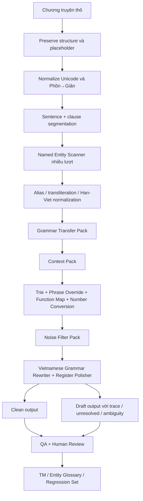
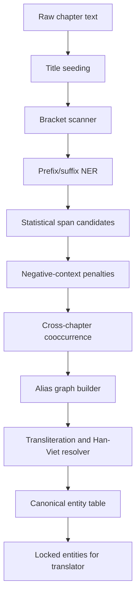

# Nghiên cứu sâu và kế hoạch hoàn thiện converter-drduc

## Executive summary

Kho mã trên entity["company","GitHub","code hosting company"] cho thấy đây là một workspace dịch **ZH→VI** theo hướng **deterministic / hybrid RBMT**, lấy Python làm đường chạy sản xuất, JavaScript/TypeScript làm lớp prototype hoặc UI, và đã có dấu vết khá rõ của một pipeline nhiều tầng gồm: nhập tài liệu, preserve cấu trúc, chuyển Phồn→Giản, xử lý Pinyin, lookup bằng Trie/SQLite, luật ngữ pháp `LuatNhan`, số/ngày/đơn vị, quản lý ngữ cảnh, emotion/pronoun, translation memory, QA, và desktop app scaffold. README mô tả production core là Python; repo có 2 commit, public, 0 issue, 0 PR, với ngôn ngữ chính là Python 80.5%, TypeScript 13.7%, JavaScript 4.1%. citeturn2view0turn12view0turn13view0

Tuy nhiên, khi đối chiếu giữa README, `project_progress.json`, file `rbmt_translator.py`, cùng các kế hoạch/ngữ pháp/truyện mẫu đã tải lên, bức tranh chính xác hơn là: **khung pipeline đã hiện hữu**, nhưng **bốn bài toán người dùng yêu cầu** vẫn chưa “khóa” ở mức production-grade:  
- thuật toán **grammar transfer Trung→Việt** hiện mới ở mức rewrite + rule integration, chưa thấy một layer chuyển đổi mệnh đề quan hệ, discourse stack, idiom/điển tích, register và word-order mapping đủ hệ thống;  
- **NER + chuẩn hóa tên riêng** đã được tracker ghi là có “entity scanner”, nhưng ở lớp code đọc được chỉ mới thấy cơ chế `locked_entities`, chưa xác minh được một pipeline alias/transliteration hoàn chỉnh;  
- **xử lý ngữ cảnh** hiện thiên về pronoun/emotion cục bộ hơn là document-level coreference đầy đủ;  
- **bộ lọc cụm từ rác** có QA và ambiguity/untranslated checks, nhưng chưa thấy một subsystem noise filtering độc lập có scoring, blacklist/whitelist và thresholding chuẩn hóa từ đầu đến cuối. citeturn34view2turn34view3turn20view0turn33view0turn33view1turn33view2turn33view4

Điểm quan trọng nhất của nghiên cứu này là: **không nên viết lại toàn bộ hệ thống**. Cách đi đúng là **giữ nguyên backbone hiện tại**, rồi chèn vào 4 pack thuật toán mới theo kiểu “plug-in deterministic + measurable hybrid”:  
- **Grammar Transfer Pack**  
- **Named Entity & Transliteration Pack**  
- **Context & Register Pack**  
- **Noise Filter Pack**  

Với ba truyện mẫu đã tải lên, tôi kiểm đếm được khoảng **4.545 chương**, khoảng **12,88 triệu ký tự thô**, đủ để làm corpus nội bộ cho khai phá luật, mining tên riêng, xây bộ test nhắm mục tiêu, và tạo contrastive set theo hiện tượng ngữ pháp. Đây là lợi thế lớn hơn nhiều so với việc chỉ tối ưu trên dữ liệu tin tức.  

Kết luận thực dụng: repo hiện tại có nền móng đúng hướng; nếu triển khai theo kế hoạch dưới đây trong khoảng **10–12 tuần**, nhóm có thể đẩy hệ thống từ “RBMT có pipeline” lên mức “dịch tiểu thuyết ZH→VI có kiểm soát, traceable, đánh giá được và mở rộng được”.

## Hiện trạng repo và đánh giá code

README xác định khá rõ ranh giới sản xuất: Python dưới `src/core/`, `src/engine/` và các script liên quan là đường chạy chính; JavaScript dưới `src/preprocessor/`, `src/parser/`, `src/rules/`, `src/learning/` chỉ là prototype/reference. README cũng liệt kê baseline đã có: compiler dictionary Markdown→SQLite, Trie runtime lookup, `LuatNhan`, `number_converter`, `src/pipeline/` cho import/split/preserve/entity scan/config generation, `src/eapee/` cho emotion/pronoun, `rbmt_translator.py`, `src/qa/`, `src/state/`, EN→VI baseline và `src/ui/`/`desktop/`. citeturn2view0

Từ cây thư mục đọc được trên repo, các mô-đun chính đang lộ diện như sau: thư mục gốc có `data`, `desktop`, `docs`, `plans`, `scripts`, `src`, `tests`, cùng nhiều file plan/debug/JSON chẩn đoán; trong `src` có `core`, `eapee`, `en_vi`, `engine`, `learning`, `parser`, `pipeline`, `preprocessor`, `qa`, `rules`, `state`, `tools`, `ui`; riêng `src/core` có `dictionary_entry_filters.py`, `luat_nhan_engine.py`, `md_dictionary_compiler.py`, `pos_rewrite_engine.py`, `runtime_support.py`, `trie_engine.py`; `src/engine` có `context_manager.py`, `cultural_origin_detector.py`, `number_converter.py`, `pinyin_processor.py`, `rbmt_translator.py`, `sentence_segmenter.py`, `structure_preserver.py`, `style_profiles.py`, `traditional_to_simplified.py`, `vi_grammar_rewriter.py`, `zh_structure_rewriter.py`. citeturn1view0turn12view0turn13view0

`project_progress.json` thì táo bạo hơn README: tracker đánh dấu **toàn bộ Phase 00–08 đều DONE 100%**, gồm pre-translation pipeline, EAPEE, RBMT core, QA, state/TM, EN-VI engine và desktop UI; tracker còn ghi `python -m pytest` là **99 passed**, trong khi README vẫn ghi `98 passed`. Đây là một tín hiệu rất đáng chú ý: **metadata trạng thái đang đi nhanh hơn tài liệu README**, và hiện tồn tại một độ lệch tài liệu nội bộ. citeturn34view4turn2view0

Phần source đọc được sâu nhất là `src/engine/rbmt_translator.py`. File này import trực tiếp `TrieEngine`, `RuntimeDictionaryAccessor`, `LuatNhanEngine`, `StructurePreserver`, `TraditionalToSimplifiedConverter`, `PinyinProcessor`, `SentenceSegmenter`, `NumberConverter`, `ContextManager`, `EmotionDetector`, `ExpressionBank`, `PronounResolver`, `rewrite_chinese_structure`, `rewrite_vietnamese_grammar`, và Translation Memory. Constructor của `RBMTTranslator` khởi tạo đầy đủ các thành phần đó, cho thấy một orchestrator tương đối hoàn chỉnh thay vì chỉ là một script nối chuỗi sơ sài. citeturn20view0

Luồng dịch hiện tại của `RBMTTranslator` là: preserve placeholder → Phồn→Giản → resolve Pinyin → sentence segmentation → tra TM exact/fuzzy → nếu không có TM thì chạy `_translate_sentence()` → update context → ghi TM → xuất `clean_text`, `draft_text`, `trace.json`. Trong `_translate_sentence()`, câu nguồn trước hết bị `rewrite_chinese_structure()`, sau đó mới đi qua `locked_entities`, `phrase_override`, `number_converter`, `pronoun_resolver`, `function map`, `Trie lookup`, rồi fallback unresolved `[[UNRESOLVED]]`; đầu ra tiếp tục được normalize và đi qua `rewrite_vietnamese_grammar()`. Đây là một skeleton tốt cho kiến trúc hybrid rule-based. citeturn33view0turn33view1turn33view2turn33view3turn33view4

### Bảng tóm tắt hiện trạng mô-đun

Bảng dưới đây tổng hợp từ README, cây thư mục repo, `project_progress.json` và file `rbmt_translator.py`. Những phần tôi chưa đọc được source trực tiếp trong phiên này được ghi rõ là **không xác định**. citeturn2view0turn12view0turn13view0turn34view4turn20view0

| Khu vực | File / mô-đun chính | Vai trò hiện tại | Đánh giá |
|---|---|---|---|
| Dictionary core | `md_dictionary_compiler.py`, `trie_engine.py`, `runtime_support.py` | compile từ nguồn từ điển sang SQLite + runtime lookup | **Mạnh** về nền tảng tra cứu |
| Grammar rule engine | `luat_nhan_engine.py`, `pos_rewrite_engine.py` | nạp và áp luật ngữ pháp/khử nhập nhằng | **Có nền**, nhưng độ phủ luật chưa đủ cho văn học |
| Translation engine | `rbmt_translator.py` | orchestrator trung tâm ZH→VI | **Mạnh nhất** trong code hiện đọc được |
| Preprocessing | `traditional_to_simplified.py`, `pinyin_processor.py`, `sentence_segmenter.py`, `structure_preserver.py` | chuẩn hóa văn bản trước dịch | **Khá tốt**, đúng hướng |
| Context / style | `context_manager.py`, `style_profiles.py`, `cultural_origin_detector.py` | giữ state, profile văn phong | **Có khung**, chiều sâu **không xác định** |
| EAPEE | `src/eapee/*` | emotion, pronoun, expression bank | **Điểm cộng lớn**, nhưng link tới coreference tài liệu dài còn yếu |
| Pipeline | `src/pipeline/*` | importer, split chapter, entity scan, relationship build | tracker ghi DONE, source chi tiết phiên này **không xác định** |
| QA | `src/qa/*` | terminology/pronoun/structure/untranslated/length checks | tracker ghi DONE, source chi tiết **không xác định** |
| State/TM | `src/state/*` | project state, SQLite TM, candidate workflow | tracker ghi DONE, source chi tiết **không xác định** |
| Desktop | `desktop/`, `src/ui/` | React + Tauri + Python sidecar | đã có scaffold working; native packaging theo tracker cũng pass | **Tốt** về khung UX |
| JS prototype | `src/preprocessor/`, `src/parser/`, `src/rules/`, `src/learning/` | material tham khảo | **Không nên mở rộng runtime ở đây** |

### Điểm mạnh

Điểm mạnh lớn nhất là kiến trúc hiện tại **đã đúng trục công nghệ** cho bài toán dịch truyện: phrase-first lookup, TM, trace, normalization, explicit ambiguity, entity locking, separation clean/draft, và production boundary tương đối rõ giữa Python runtime và JS prototype. RBMT core cũng đã có chỗ “cắm” cho các pack mới mà không phải đập đi làm lại. citeturn2view0turn20view0turn33view1turn33view3

Một điểm mạnh thứ hai là repo đã tự ý thức được bài toán discourse/context và evaluation. Tracker ghi rõ emotion state machine, pronoun resolver, QA engine, state/TM, candidate lifecycle và desktop review flow; đây là nền tảng phù hợp để đưa thuật toán mới vào vòng review-human-in-the-loop thay vì chỉ batch translate mù. citeturn34view2turn34view3turn34view4

### Điểm yếu và rủi ro

Điểm yếu lớn nhất là **mức “DONE” của tracker không tương đương mức “xong production” cho văn học ZH→VI**. Chính bộ kế hoạch/ngữ pháp đã tải lên vẫn còn đi sâu vào gap analysis cho entity scanner, transliteration, grammar gaps, test suite và data files; điều đó cho thấy hệ thống hiện “xong pipeline”, nhưng chưa “xong năng lực”.  

Điểm yếu thứ hai là **liên kết giữa câu và tài liệu dài vẫn mỏng**. Ở lớp code đọc được, context chủ yếu được dùng quanh pronoun/emotion/update sentence-by-sentence; chưa thấy một bộ coreference cluster manager document-level, alias memory lâu hạn, discourse graph hay salience scoring đầy đủ. Điều này quan trọng vì MT có ngữ cảnh thường cải thiện ở deixis, ellipsis và lexical cohesion, còn các metric như BLEU lại không nhạy với các cải thiện đó. citeturn44view2

Điểm yếu thứ ba là **bài toán unknown words / proper names / transliteration** chưa được “first-class citizen” trong code đọc được. Đây là lỗ hổng đặc biệt nghiêm trọng cho tiểu thuyết, vì Chinese–Vietnamese MT low-resource thường được quyết định nhiều bởi từ hiếm, tên riêng và Sino-Vietnamese correspondence hơn là bởi câu tin tức thông dụng. Các công trình về Chinese–Vietnamese MT đã chỉ ra đây là nút thắt thực tế. citeturn41search1turn39search0turn44view1

Điểm yếu thứ tư là **test truth source chưa đồng nhất**. README ghi 98 test pass, tracker ghi 99, trong khi repo chỉ có 2 commit public và chưa có issue/PR discussion để theo dõi bug debt. Về quản trị kỹ thuật, đây là tín hiệu cần chuẩn hóa lại trước khi mở rộng thuật toán. citeturn2view0turn34view4

## Kiến trúc thuật toán đề xuất

### Sơ đồ kiến trúc tổng thể



### Thuật toán chuyển đổi ngữ pháp Trung→Việt

Với cặp Chinese–Vietnamese, nên dùng chiến lược **semantic transfer trước, grammar transfer sau**, rất gần tinh thần “semantic translation + grammar translation” từng được nêu trong nghiên cứu pivot Chinese character cho cặp Việt–Hán, nhưng cần đảo chiều cho use case hiện tại. Đồng thời, ngữ cảnh tài liệu phải được xử lý nhắm mục tiêu vào deixis, ellipsis, lexical cohesion thay vì chỉ tối ưu BLEU tổng quát. citeturn44view1turn44view2

#### Thiết kế logic

1. **Clause-first, not token-first**  
   Trước khi lookup từ điển, câu phải được tách thành:
   - discourse opener  
   - subordinate clause  
   - main clause  
   - quote/dialogue span  
   - tail particles/aspect markers

2. **Source pattern normalization**  
   Chuẩn hóa các frame về canonical template:
   - `作为X来说/而言`
   - `一旦...就...`
   - `虽然...但是...`
   - `被...所...`
   - `一边...一边...`
   - `其中/其余/其他`
   - `并非/并没有/并不是`
   - idiom / chengyu / điển tích

3. **Transfer planning**  
   Mỗi frame sinh ra:
   - head relation  
   - scope  
   - required target order  
   - particles to drop/retain  
   - target connective

4. **Vietnamese realization**  
   Sinh câu đích theo:
   - order mapping SVO/SV complements  
   - register mapping (hiện đại / kiếm hiệp / tiên hiệp / sci-fi)  
   - idiom policy: literal / adapted / explanatory gloss

#### Pseudo-code

```python
def grammar_transfer(sentence, doc_ctx, entity_ctx, register):
    clauses = clause_segment(sentence)
    plan = []

    for clause in clauses:
        frame = detect_frame(clause)
        if frame:
            normalized = normalize_frame(clause, frame)
            plan.append(build_transfer_action(normalized, register))
        else:
            plan.append(build_literal_action(clause))

    plan = resolve_scope_conflicts(plan)
    plan = attach_entities(plan, entity_ctx)
    plan = attach_coreference(plan, doc_ctx)
    plan = rewrite_word_order(plan, target_lang="vi")
    plan = rewrite_pos_sequences(plan, target_lang="vi")
    plan = resolve_idioms(plan, register)

    surface = linearize_vi(plan)
    surface = polish_register(surface, register)
    return surface
```

#### Bộ rule tối thiểu nên làm trước

| Nhóm rule | Tại sao ưu tiên cao |
|---|---|
| `被/被...所.../为...所...` | xuất hiện dày trong văn học, ảnh hưởng trực tiếp vai nghĩa |
| `一边...一边...` | rất thường trong narration hành động |
| `一旦...就...`, `只要...就...`, `除非...否则...` | gây sai logic nếu dịch word-by-word |
| `作为...而言/来说` | hay làm câu Việt bị Hán hóa |
| `其中/其余/其他` | quan trọng cho phân bố tập hợp và cohesion |
| `不过/反而/倒是/只不过` | discourse relation, nếu sai sẽ sai thái độ câu |
| idiom/chengyu | literal translation rất dễ gãy nghĩa |
| title/chapter headings | tác động trực tiếp UX người đọc |

#### Ví dụ mapping rule

| Mẫu Trung | Phân tích | Đầu ra Việt đề xuất |
|---|---|---|
| 作为队长而言，他必须冷静。 | frame “as-for-X” | Với tư cách đội trưởng, anh ấy phải giữ bình tĩnh. |
| 一旦灵根觉醒，就能踏上修行之路。 | điều kiện-kết quả | Một khi linh căn thức tỉnh, mới có thể bước lên con đường tu hành. |
| 被这一副观想图所充斥 | passive bị động cổ/biền văn | bị bức đồ quán tưởng ấy lấp đầy |
| 一边走一边思考 | song hành hành động | vừa đi vừa suy nghĩ |

### Thuật toán quét và chuẩn hóa tên riêng

NER cho repo này không nên chỉ là “model NER thuần”. Với truyện dài, cách hiệu quả hơn là **multi-pass scanner + alias graph + transliteration policy**. Điều này cũng phù hợp với thực tế Vietnamese NER: đặc trưng cú pháp và segmentation có ích đáng kể; còn ở quy mô đa ngữ/ít tài nguyên, contextual string embeddings và sequence labeling vẫn rất hữu ích khi làm weak supervision hoặc reranking. citeturn37search4turn37search2turn37search0

#### Mục tiêu

- phát hiện PERSON / LOC / ORG / TITLE / ARTIFACT / RACE / SKILL / SYSTEM TERM  
- gom alias: `李宇 ↔ 龙尊 ↔ 圣·天尊`  
- chuẩn hóa dạng đích:
  - **Han-Viet** nếu là thế giới Hán hóa / tiên hiệp / lịch sử
  - **phiên âm Latin** nếu là ngoại danh / sci-fi / franchise
  - **copy nguyên dạng** nếu là ký hiệu, version, model, spell
- duy trì canonical form + display form + alias list + confidence

#### Sơ đồ pipeline NER



#### Pseudo-code

```python
def scan_entities(chapter, memory, config):
    seeds = title_seed(chapter.title)
    spans = []

    spans += scan_brackets(chapter.text)
    spans += scan_title_prefixes(chapter.text)      # 城主, 宗主, 将军, 公司, 王朝...
    spans += scan_suffix_ontology(chapter.text)     # 城, 镇, 山, 宫, 族, 宗, 号, 系统...
    spans += scan_quoted_names(chapter.text)
    spans += scan_capitalized_latin(chapter.text)
    spans += scan_versioned_terms(chapter.text)     # v2.0, Mk-II, 增强版

    spans = deduplicate(spans)
    spans = apply_negative_context_penalties(spans, chapter.text)
    spans = score_with_memory(spans, memory)

    aliases = build_alias_edges(chapter.text, spans)
    clusters = resolve_alias_graph(aliases, memory)

    normalized = []
    for cluster in clusters:
        normalized.append(normalize_entity(cluster, config))

    memory.update(normalized)
    return normalized
```

#### Heuristics cốt lõi

- **title/prefix cues**: `城主`, `掌柜`, `王朝`, `宗门`, `大学`, `公司`, `舰长`, `将军`, `系统`
- **suffix ontology**:
  - PERSON-ish: `子`, `儿`, `尊`, `君`, `帝`, `祖`, `真人`
  - LOC-ish: `城`, `镇`, `州`, `山`, `海`, `宫`, `殿`, `界`
  - ORG-ish: `宗`, `门`, `会`, `阁`, `盟`, `军团`, `舰队`, `研究院`, `公司`
- **negative penalties**:
  - từ phổ thông, động từ/tính từ trừu tượng
  - span đi sau `一个/一名/一种/...`
  - span 1 ký tự không có support context
- **cross-chapter memory**:
  - first seen chapter
  - frequency
  - local neighbor words
  - speaker-role / relation edges
- **alias edges**:
  - `又名/人称/名为/被称为/号称/外号/真名`
  - title-apposition: `庄捕头庄不周`
  - dialogue-reference alias
- **canonical selection**:
  - tên thật > tên giới thiệu đầu tiên > alias title > biệt hiệu > trạng thái tiến hóa

#### Chuẩn hóa Han-Viet / Latin / nguyên dạng

Nghiên cứu Chinese–Vietnamese MT và transliteration đều cho thấy unknown words/tên riêng cần xử lý như một kênh chuyên biệt, không nên ném chung vào word-by-word lookup. Với transliteration, mô hình hybrid và joint source-channel vẫn là tài liệu gốc hữu ích về cách generate candidate rồi rerank; với Chinese–Vietnamese, unknown-word handling là một vấn đề đặc thù đã được nêu riêng trong literature. citeturn41search1turn36search3turn36search4turn36search7

Quy tắc đề xuất:

- **Han-Viet** nếu:
  - bối cảnh tiên hiệp/lịch sử/Hán văn rõ
  - entity gồm Hán tự có ý nghĩa từ nguyên rõ
  - bản dịch cần giữ “khí chất Hán-Việt”
- **phiên âm Latin** nếu:
  - ngoại danh hiện đại / sci-fi / fantasy ngoại lai
  - chưa có Han-Viet tự nhiên
  - tên phiên âm mới nhưng cần dễ đọc liên tục
- **copy nguyên dạng** nếu:
  - model/version/code/system id
  - skill/item mang tính biểu tượng hoặc cần trace trực tiếp

#### Output schema đề xuất

```json
{
  "entity_id": "E000123",
  "canonical_source": "李宇",
  "canonical_target": "Lý Vũ",
  "entity_type": "PERSON",
  "register_policy": "hanviet",
  "aliases": [
    {"source": "龙尊", "target": "Long Tôn", "type": "TITLE"},
    {"source": "圣·天尊", "target": "Thánh Thiên Tôn", "type": "EVOLUTION"}
  ],
  "confidence": 0.94,
  "first_seen_chapter": 218,
  "evidence": ["title_seed", "prefix_person", "alias_trigger"]
}
```

### Thuật toán xử lý ngữ cảnh

Document-level MT tồn tại chính vì ngữ cảnh ngoài câu là cần thiết cho pronoun, deixis, ellipsis và lexical cohesion; đồng thời nghiên cứu cũng chỉ ra BLEU không đủ nhạy để đo các cải thiện này. Coreference hiện đại thường mô hình hóa antecedent trên span và pruning theo salience; nhưng với hệ của repo này, tôi khuyến nghị một bản **deterministic-first / neural-rerank-second** để dễ debug. citeturn37search3turn42search4turn42search9turn44view2

#### Mục tiêu

- coreference cho PERSON / group entity / place anchors  
- anaphora cho `他/她/它/他们/这人/那位/其/此人/对方`  
- preserve register/tone theo scene  
- phân ranh câu + mệnh đề để tránh spillover lỗi

#### Pseudo-code

```python
def resolve_context(document):
    memory = EntitySalienceMemory()
    outputs = []

    for chapter in document.chapters:
        for sent in chapter.sentences:
            clauses = clause_segment(sent)

            mentions = detect_mentions(clauses, memory)
            antecedents = score_antecedents(mentions, memory)

            resolved = []
            for m in mentions:
                resolved.append(resolve_mention(m, antecedents, memory))

            register = infer_register(
                chapter_meta=chapter.meta,
                recent_dialogue=memory.dialogue_window,
                emotion_window=memory.emotion_window
            )

            outputs.append(
                ContextPacket(
                    sentence_id=sent.id,
                    resolved_mentions=resolved,
                    preferred_pronouns=select_vi_pronouns(resolved, register),
                    register=register,
                    discourse_links=detect_discourse_links(clauses)
                )
            )

            memory.update(sent, resolved, register)

    return outputs
```

#### Scoring antecedent

`score = recency + grammatical_role + speaker_match + entity_type_match + dialogue_continuity + alias_match - ambiguity_penalty`

Trong thực hành cho truyện, antecedent tốt thường là:
- gần nhất trong 2–5 câu trước,
- cùng scene/dialogue turn,
- cùng entity type,
- đang có salience cao trong paragraph,
- không xung đột giới tính/role nếu metadata có.

#### Register/tone preservation

Tách register thành 4 profile:
- **hiện đại đời sống**
- **tiên hiệp / kiếm hiệp**
- **huyền huyễn / fantasy**
- **sci-fi / hệ thống**

Mỗi profile có:
- bảng xưng hô ưa thích
- connective ưa thích
- cường độ Hán-Việt
- mức cô đọng câu
- chính sách idiom: giữ nguyên / diễn giải / nội địa hóa

### Bộ lọc cụm từ rác

Đây là lớp còn thiếu rõ nhất trong repo hiện tại. QA hiện có thể phát hiện untranslated/ambiguity, nhưng chưa phải là bộ lọc nhiễu đầu-cuối. Tôi khuyến nghị làm **Noise Filter Pack** như một pass riêng, chạy **sau draft generation nhưng trước QA chính thức**.

#### Loại nhiễu cần chặn

- system panel / author notes: `【新书上传，求收藏推荐】`
- quảng cáo/CTA/điều hướng chương
- dấu debug: `[[UNRESOLVED]]`, `[[AMBIG:...]]`
- copy residue từ OCR/web crawl/UI markup
- Hán tự đơn lẻ còn sót
- dấu câu lặp bất thường
- Latin token rời không có chức năng ngữ nghĩa
- pattern junk trong title/heading

#### Pseudo-code

```python
def noise_filter(text, context):
    spans = []
    score = 0.0

    spans += regex_spans(text, STOP_PHRASE_PATTERNS)
    spans += regex_spans(text, DEBUG_PATTERNS)
    spans += regex_spans(text, BOILERPLATE_PATTERNS)
    spans += regex_spans(text, MARKUP_PATTERNS)

    for span in spans:
        score += span.weight

    if residual_hanzi_ratio(text) > context.hanzi_threshold:
        score += 0.4
    if unresolved_marker_count(text) > 0:
        score += 0.5
    if punctuation_anomaly_score(text) > 0.2:
        score += 0.2

    cleaned = remove_or_rewrite(text, spans, whitelist=context.whitelist)

    return {
        "cleaned_text": cleaned,
        "noise_score": score,
        "decision": "review" if score >= context.review_threshold else "pass"
    }
```

#### Cấu trúc dữ liệu đề xuất

| File dữ liệu | Vai trò |
|---|---|
| `stop_phrases_zh.txt` | boilerplate tiếng Trung đầu/cuối chương |
| `stop_phrases_vi.txt` | boilerplate tiếng Việt phát sinh sau rewrite |
| `noise_regex.yaml` | regex có trọng số |
| `whitelist_phrases.txt` | cụm nhìn giống noise nhưng thực ra hợp lệ |
| `debug_marker_patterns.yaml` | marker nội bộ cần gỡ |
| `title_cleanup_rules.yaml` | làm sạch tiêu đề/chapter heading |

#### Chính sách threshold

- `noise_score < 0.30`: pass
- `0.30–0.70`: pass + flag
- `> 0.70`: bắt buộc review
- nếu còn `[[UNRESOLVED]]` hoặc Hanzi rơi sót sau finalization: auto-fail QA

## Dữ liệu huấn luyện, kiểm thử và metrics

### Dữ liệu nên dùng

Để xây đúng cho mục tiêu “dịch truyện”, tôi đề xuất dữ liệu thành bốn lớp.

**Lớp nội bộ từ repo và file đã tải lên**
- 3 truyện mẫu làm corpus khai thác hiện tượng ngữ pháp, entity và discourse.
- phrase overrides / runtime dictionary hiện có trong repo.
- trace outputs hiện tại để khai phá lỗi unresolved/ambiguity.
- glossary entity vàng làm tay cho khoảng 300–500 chương đầu của mỗi truyện.
- targeted idiom/chengyu list và stop-phrase list nội bộ.

**Lớp NER tiếng Việt**
- bộ dữ liệu của entity["organization","VLSP","vietnamese nlp evaluation"] 2016/2018/2021 cho PERSON/ORG/LOC và mở rộng category; VLSP 2016 nêu rõ training data có segmentation/POS/chunking, còn VLSP 2018/2021 mở rộng miền và độ hạt mịn hơn. citeturn38search3turn38search0turn38search2

**Lớp cú pháp/word order**
- treebank từ entity["organization","Universal Dependencies","linguistic annotation project"] cho Chinese GSD và Vietnamese VTB để kiểm tra POS/dependency mapping, word order và clause boundaries. citeturn36search5turn37search1turn37search5

**Lớp MT song ngữ**
- Chinese→Vietnamese task tại VLSP 2021, vốn được thiết kế như low-resource MT và khuyến khích tận dụng tính gần gũi Hán–Việt;  
- KC4MT công bố 500.000 cặp câu Việt–Trung chất lượng cao trong miền tin tức;  
- nếu tiếp cận được, thêm test/dev set từ VLSP 2021 để làm benchmark ngoài miền truyện. citeturn39search0turn41search3

### Bộ dữ liệu mục tiêu cần tự xây

Đây là danh sách tôi đánh giá là **bắt buộc**, vì dữ liệu công khai không bao phủ hết fiction-domain:

| Bộ dữ liệu | Quy mô khuyến nghị | Mục tiêu |
|---|---:|---|
| `zhvi_fiction_gold_grammar.jsonl` | 3.000–5.000 câu | gold cho grammar transfer |
| `zhvi_entity_gold.jsonl` | 8.000–12.000 span | NER + alias + normalization |
| `zhvi_coref_miniset.jsonl` | 1.000 đoạn | pronoun/coreference/document context |
| `zhvi_idiom_mwe_set.jsonl` | 500–1.000 mục | idiom/chengyu/điển tích |
| `zhvi_noise_corpus.jsonl` | 1.500–2.000 đoạn | stop phrase/noise patterns |
| `zhvi_contrastive_tests.jsonl` | 1.000 cặp | pronoun, word order, passive, discourse |

### Metrics đánh giá

NER nên đo **span-level micro precision / recall / F1** và **type-level F1**; với alias normalization thì thêm **cluster accuracy**, **canonical-form accuracy**, **Top-1 transliteration accuracy**, và **Recall@k** cho candidate generator. Cách nhìn này phù hợp với thực hành NER và sequence labeling hiện đại. citeturn37search4turn37search2turn37search0

MT tổng quát nên giữ **BLEU** làm metric tương thích lịch sử, nhưng nhất thiết phải thêm **chrF** vì Chinese/Vietnamese rất nhạy với tokenization/spacing/subword fidelity. Song song đó, vì context-aware improvements thường không hiện rõ trên BLEU, cần có **targeted contrastive tests** cho deixis, ellipsis, lexical cohesion, pronoun, idiom và entity fidelity. citeturn36search0turn38search7turn44view2turn42search9

Theo VLSP 2021 MT, Chinese→Vietnamese task được xếp hạng bằng **human evaluation**, còn BLEU được khuyến nghị như automatic metric để chọn model nộp. Với fiction-domain, tôi đề nghị human eval 2 tầng:
- **sentence-level**: adequacy, fluency, terminology
- **document-level**: referent consistency, xưng hô, register, idiom handling, cohesion, noise-free readability citeturn39search0turn44view2

### Bảng metric đề xuất

| Hạng mục | Metric chính | Metric phụ | Ngưỡng mục tiêu giai đoạn đầu |
|---|---|---|---|
| Entity detection | micro F1 | type F1 | ≥ 0.92 trên bộ gold nội bộ |
| Alias linking | cluster accuracy | B³ F1 | ≥ 0.88 |
| Transliteration | Top-1 accuracy | Recall@3, edit distance | ≥ 0.95 với tên đã biết |
| Grammar transfer | targeted accuracy | per-rule pass rate | ≥ 0.90 trên contrastive set |
| MT toàn câu | BLEU | chrF | tăng đều qua từng milestone |
| Document coherence | human MQM-lite | pronoun accuracy | ≥ 4.2/5 |
| Noise filter | precision/recall/F1 | false-positive rate | precision ≥ 0.97 |

## Kế hoạch triển khai theo milestones

Tôi đề xuất kế hoạch **10–12 tuần**, giả định:
- 1 NLP engineer chính
- 1 software engineer tích hợp
- 0.5 linguist/reviewer bán thời gian

### Milestone và công việc

| Milestone | Thời lượng | Công việc chính | Deliverable |
|---|---:|---|---|
| Hardening baseline | 1 tuần | đồng bộ README/tracker/test count; freeze runtime contract; chuẩn hóa trace schema | baseline ổn định, truth source thống nhất |
| Grammar transfer pack | 3 tuần | clause segmenter, frame detector, rule executor, idiom policy, register-aware order mapping | `grammar_transfer_v1` + 300 test cases |
| Entity and transliteration pack | 3 tuần | multi-pass scanner, suffix ontology, alias graph, Han-Viet/Latin resolver, entity cache | `entity_scanner_v1` + glossary exporter |
| Context pack | 2 tuần | salience memory, local coreference, dialogue chain, register policy, pronoun reranker | `context_pack_v1` + contrastive test set |
| Noise filter pack | 1.5 tuần | blacklist/whitelist, regex weighting, thresholding, post-final cleanup | `noise_filter_v1` + QA hooks |
| Integration and evaluation | 1.5 tuần | pipeline wiring, regression, human eval round, tuning thresholds | release candidate + dashboard |

### Tiêu chí nghiệm thu từng milestone

- **Hardening**  
  - README, `project_progress.json`, pytest count, build status đồng nhất  
  - export trace và config schema có version

- **Grammar**  
  - top 20 frame rules chạy ổn  
  - không còn dịch word-by-word cho `被...所...`, `一边...一边...`, `一旦...就...`

- **Entity**  
  - entity glossary tự sinh theo chapter  
  - alias chain resolve đúng với nhân vật chính/phụ then chốt  
  - transliteration không phá register

- **Context**  
  - pronoun consistency trên đoạn 3–8 câu tăng rõ  
  - dialogue speaker continuity vượt baseline

- **Noise**  
  - loại được note/quảng cáo/debug marker  
  - false positive thấp, không làm mất câu truyện thật

### Công việc cụ thể theo sprint

#### Sprint đầu

- refactor `RBMTTranslator` để nhận 4 pack mới như dependency
- tạo `TranslationContextPacket`, `EntityRecord`, `NoiseDecision`
- khóa schema output cho `trace.json`
- dựng benchmark script:
  - automatic
  - contrastive
  - human review sheet

#### Sprint giữa

- triển khai `ClauseSegmenter`
- triển khai `FrameDetector`
- tạo `entity_suffix_ontology.json`
- tạo `alias_trigger_patterns.yaml`
- tạo `hanviet_map.json` và `translit_char_map.json`
- thêm `chapter-level memory` và `document salience window`

#### Sprint cuối

- tune thresholds trên 3 truyện mẫu
- human eval 2 vòng
- freeze regression suite
- viết tài liệu vận hành và review workflow

## Test cases và ví dụ trước sau

### Bộ test nhắm mục tiêu

Từ các truyện mẫu đã tải lên, các hiện tượng sau xuất hiện đủ nhiều để phải có targeted tests riêng: `被...所...`, `一边...一边...`, `哪怕`, `所谓`, `就连`, `作为`, `一旦`, `其中/其余`, và nhiều chuỗi sở hữu/nested noun phrase. Điều này xác nhận rằng backlog ngữ pháp nên ưu tiên văn học, không nên chỉ benchmark trên news-domain.

### Bảng ví dụ trước và sau

| Hiện tượng | Câu nguồn Trung | Kiểu lỗi hiện tại dễ gặp | Đầu ra mục tiêu |
|---|---|---|---|
| Classical passive | 不过昨晚上我状态不佳，竟然被暗器所伤。 | “bị ám khí sở thương” / giữ khung Hán hóa | Tối qua trạng thái tôi không tốt, vậy mà lại bị ám khí làm bị thương. |
| Concurrent actions | 庄不周一边喝酒，一边暗自叹息道。 | “một bên uống rượu, một bên thở dài” | Trang Bất Chu vừa uống rượu vừa âm thầm thở dài. |
| Conditional | 一旦灵根觉醒，就能踏上修行之路。 | giữ trật tự Hán hóa cứng | Một khi linh căn thức tỉnh, sẽ có thể bước lên con đường tu hành. |
| Frame `作为` | 作为队长而言，他必须冷静。 | “làm vì đội trưởng mà nói” | Với tư cách đội trưởng, anh ấy phải giữ bình tĩnh. |
| Idiom / điển tích | 九死一生 | dịch literal rời rạc | cửu tử nhất sinh / chín phần chết một phần sống |
| Alias entity | 龙尊看着李宇，沉默不语。 | coi như 2 người khác nhau | Long Tôn nhìn Lý Vũ, im lặng không nói — trace: alias-resolved |
| Register | 他对她说道。 | “hắn nói với nàng” trong văn hiện đại | Anh nói với cô ấy. |
| Noise | 【新书上传，求收藏推荐】 | lọt nguyên vào bản dịch | bị loại bỏ hoàn toàn |

### Test matrix đề xuất

| Nhóm test | Số case ban đầu | Assert |
|---|---:|---|
| Grammar frame | 300 | exact rule transfer |
| Idiom/chengyu | 120 | không literal sai |
| NER span | 400 | đúng boundary + type |
| Alias linking | 120 | cùng canonical id |
| Transliteration | 150 | đúng display form |
| Pronoun/coreference | 180 | đúng referent |
| Noise filter | 200 | precision cao |
| Full chapter regression | 30 chương | không tăng unresolved/noise |

## Kết luận và hạn chế còn mở

Kết luận ngắn gọn là: repo này **đã có xương sống đúng** cho một hệ dịch truyện ZH→VI không phụ thuộc hoàn toàn vào model lớn. Phần đáng giá nhất là production boundary rõ, RBMT orchestrator có trace, TM, pronoun/emotion/context hooks, và pipeline đã có chỗ cho entity/QA/state/UI. Nhưng để đạt mục tiêu người dùng đặt ra, hệ thống còn phải đi thêm một bước lớn: **nâng các capability “được gọi tên trong tài liệu” thành capability “đo được, test được, review được, và chạy ổn trên truyện dài”**. citeturn2view0turn34view4turn20view0turn33view1

Ba quyết định kiến trúc tôi khuyến nghị giữ cố định là:
- **deterministic-first, hybrid-second**  
- **clause/entity/context/noise là bốn subsystem độc lập nhưng cùng trace schema**  
- **đánh giá bằng targeted tests + human review, không chỉ BLEU**.  
Cách này phù hợp với repo hiện tại, phù hợp với literature về context-aware MT và Chinese–Vietnamese low-resource MT, và quan trọng nhất là phù hợp với fiction-domain. citeturn39search0turn44view1turn44view2turn36search6

### Open questions và limitations

- Nhiều module đã được repo liệt kê hoặc tracker đánh dấu DONE, nhưng source chi tiết không đọc được hết trong phiên này; tình trạng thực thi nội bộ của `src/pipeline/*`, `src/qa/*`, `src/state/*`, `context_manager.py`, `vi_grammar_rewriter.py`, `zh_structure_rewriter.py`, `number_converter.py` hiện **không xác định** ở mức line-by-line.  
- Chưa thấy một gold corpus aligned Chinese→Vietnamese fiction công khai ngay trong repo; mức sẵn sàng dữ liệu đánh giá nội bộ hiện **không xác định**.  
- Bộ kế hoạch/ngữ pháp người dùng tải lên đi xa hơn tracker hiện tại; điều đó hàm ý có độ lệch giữa “tài liệu kế hoạch” và “mã đã khóa production”.  
- Các thống kê trên 3 truyện mẫu trong báo cáo này dựa trên phân tích trực tiếp các file đã tải lên trong phiên làm việc hiện tại; chúng hữu ích cho lập kế hoạch, nhưng chưa thay thế cho một benchmark được chú giải vàng.